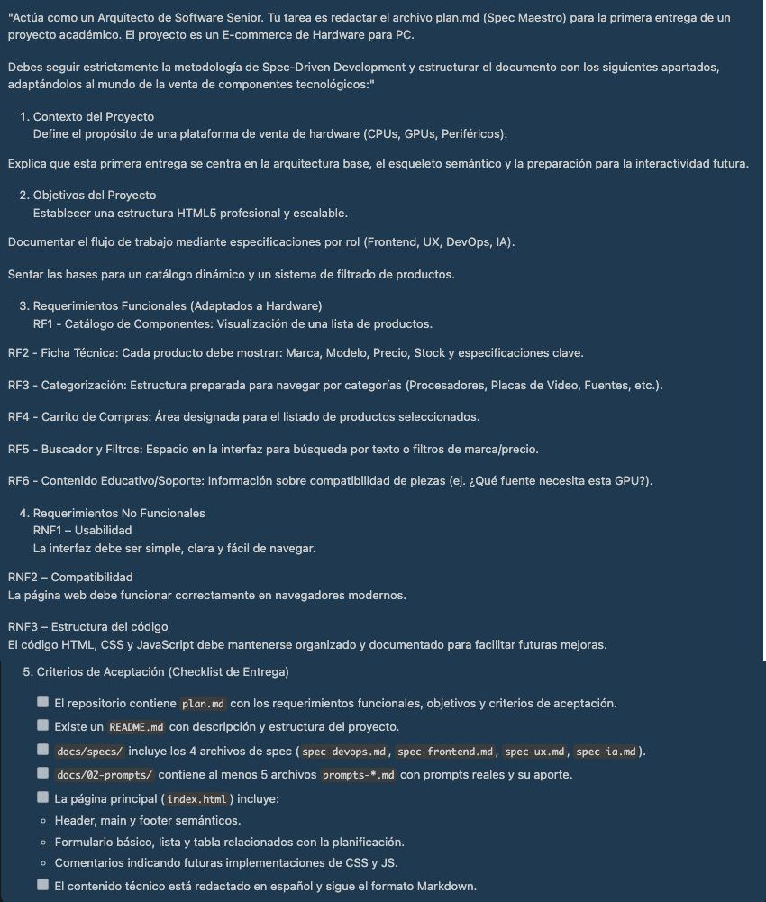
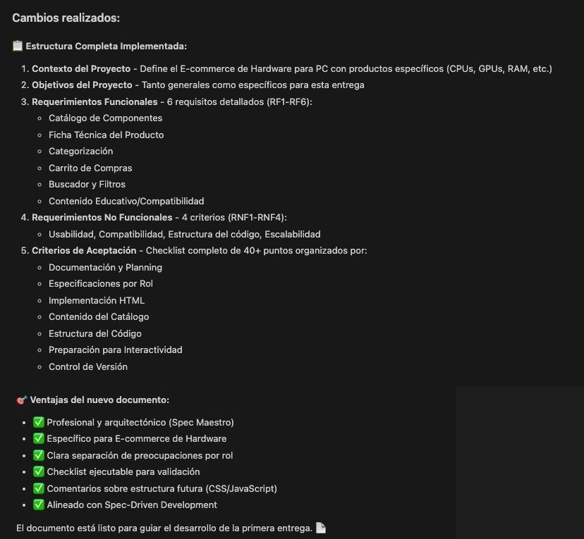

# Prompt 1: Generación del Plan Maestro (Spec Maestro)

- **Rol:** Coordinador / DevOps (@GonzaloBarbano)
- **Modelo de IA utilizado:** GPT-4o
- **Método / Técnica:** *Role Prompting* (Asignación de rol experto) + *Zero-Shot*.
- **Contexto Proveído:** Se definió la temática exacta del proyecto (E-commerce de Hardware para PC) y la estructura obligatoria requerida por la cátedra.

## Prompt Exacto

```
Actúa como un Arquitecto de Software Senior. Tu tarea es redactar el archivo plan.md (Spec Maestro) para la primera entrega de un proyecto académico. El proyecto es un E-commerce de Hardware para PC.

Debes seguir estrictamente la metodología de Spec-Driven Development y estructurar el documento con los siguientes apartados, adaptándolos al mundo de la venta de componentes tecnológicos:"

1. Contexto del Proyecto
Define el propósito de una plataforma de venta de hardware (CPUs, GPUs, Periféricos).

Explica que esta primera entrega se centra en la arquitectura base, el esqueleto semántico y la preparación para la interactividad futura.

2. Objetivos del Proyecto
Establecer una estructura HTML5 profesional y escalable.

Documentar el flujo de trabajo mediante especificaciones por rol (Frontend, UX, DevOps, IA).

Sentar las bases para un catálogo dinámico y un sistema de filtrado de productos.

3. Requerimientos Funcionales (Adaptados a Hardware)
RF1 - Catálogo de Componentes: Visualización de una lista de productos.

RF2 - Ficha Técnica: Cada producto debe mostrar: Marca, Modelo, Precio, Stock y especificaciones clave.

RF3 - Categorización: Estructura preparada para navegar por categorías (Procesadores, Placas de Video, Fuentes, etc.).

RF4 - Carrito de Compras: Área designada para el listado de productos seleccionados.

RF5 - Buscador y Filtros: Espacio en la interfaz para búsqueda por texto o filtros de marca/precio.

RF6 - Contenido Educativo/Soporte: Información sobre compatibilidad de piezas (ej. ¿Qué fuente necesita esta GPU?).

4. Requerimientos No Funcionales
RNF1 – Usabilidad
La interfaz debe ser simple, clara y fácil de navegar.

RNF2 – Compatibilidad
La página web debe funcionar correctamente en navegadores modernos.

RNF3 – Estructura del código
El código HTML, CSS y JavaScript debe mantenerse organizado y documentado para facilitar futuras mejoras.

5. Criterios de Aceptación (Checklist de Entrega)
- [ ] El repositorio contiene plan.md con los requerimientos funcionales, objetivos y criterios de aceptación.
- [ ] Existe un README.md con descripción y estructura del proyecto.
- [ ] docs/specs/ incluye los 4 archivos de spec (spec-devops.md, spec-frontend.md, spec-ux.md, spec-ia.md).
- [ ] docs/02-prompts/ contiene al menos 5 archivos prompts-*.md con prompts reales y su aporte.
- [ ] La página principal (index.html) incluye:
  - Header, main y footer semánticos.
  - Formulario básico, lista y tabla relacionados con la planificación.
  - Comentarios indicando futuras implementaciones de CSS y JS.
- [ ] El contenido técnico está redactado en español y sigue el formato Markdown.
```
## 📸 Captura de pantalla


---

## Resultado Esperado
- Un archivo plan.md completo, formateado en Markdown, que sirva como guía estructurada para que el resto del equipo redacte sus propios Specs.

---

## Resultado Obtenido 
- La IA generó un documento profesional, adaptando los requerimientos genéricos de la materia a un caso de uso real de venta de hardware.

## 📸 Captura de pantalla


---

## Correcciones Manuales
- Se revisó la estructura final y se ajustaron detalles de formato para alinearlos con el repositorio del equipo.

---

## Archivo o parte del proyecto donde se aplicó

- Se genero el archivo `plan.md`
