# Prompt 2: Generación de Estructura Visual y Layout (Mockup)

- **Rol:** Diseño UX/UI (@LucasFUces)
- **Modelo de IA utilizado:** Claude 3.5 Sonnet
- **Método / Técnica:** *Context Injection* (Inyección de contexto) + *Task-oriented Prompting*.
- **Contexto Proveído:** Se le indicó a la IA que tome como base los requerimientos previamente definidos en el `plan.md` para un E-commerce de Hardware de PC.

## Prompt Exacto
```
Tomando como base el archivo plan.md de este proyecto, proponé una estructura visual inicial para una página web tipo e-commerce de Harware de PC. Necesito sugerencias de layout general, secciones principales, navegación y jerarquía visual para luego diseñar un mockup simple en Figma.
```

## 📸 Captura de pantalla
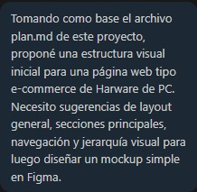

---

## Resultado Esperado
Una propuesta clara de estructura visual conceptual (wireframe en texto) con sugerencias de layout, secciones principales y jerarquía visual que sirva como mapa directo para diseñar en Figma.

---

## Resultado Obtenido
La IA generó un desglose detallado por secciones (Header, Hero, Catálogo, Footer), recomendando tamaños de tipografía, ubicaciones estratégicas para los botones (CTAs) y una distribución en grilla para los componentes de hardware.

📸 Captura de pantalla
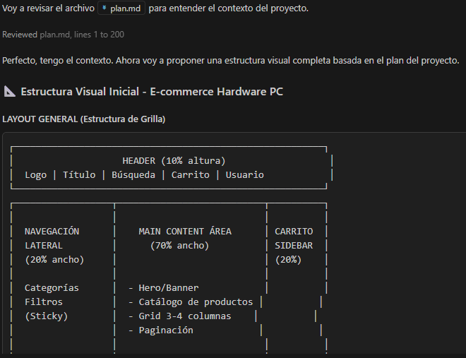
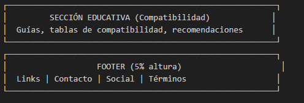
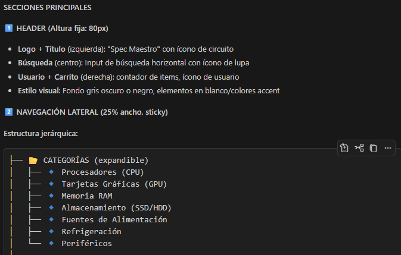
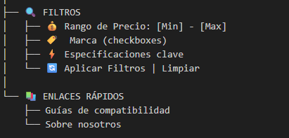
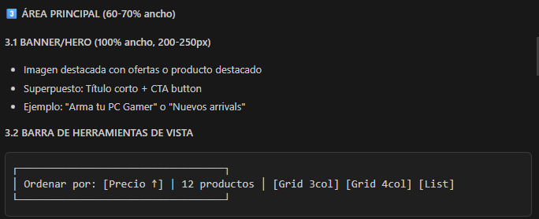
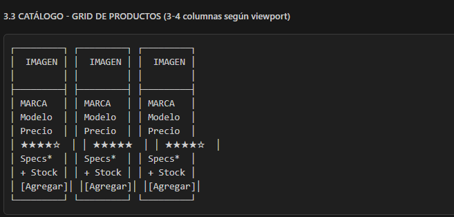
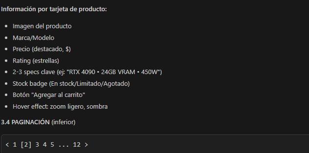
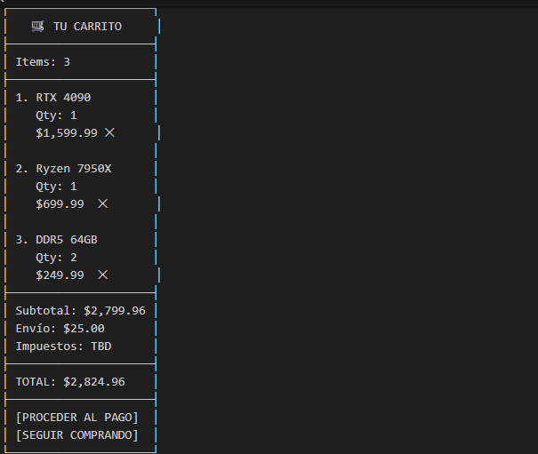
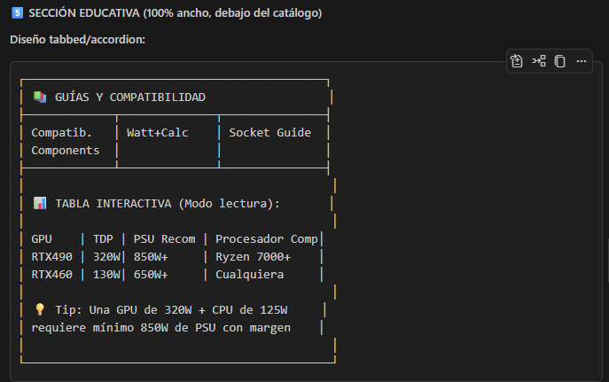
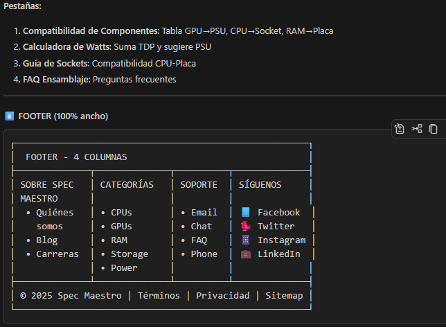
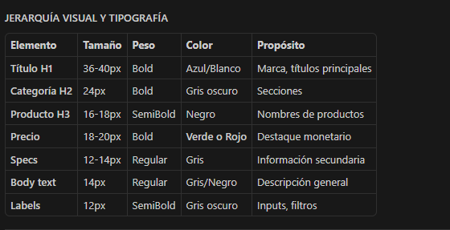
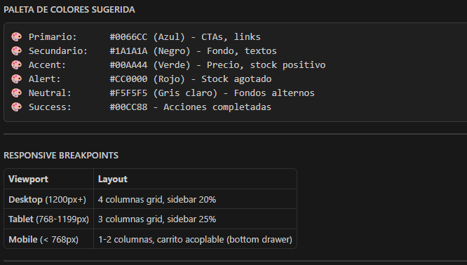
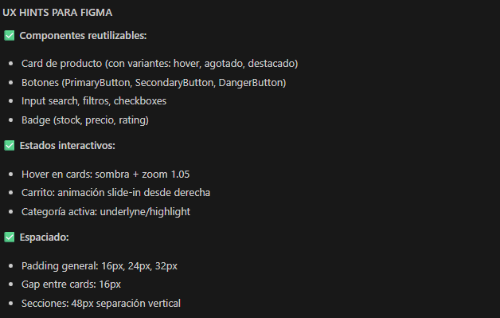

---

## Correcciones Manuales
Se descartaron algunas sugerencias de componentes interactivos complejos (que requerían JavaScript avanzado) para mantener el diseño alineado a los límites de la primera entrega (solo HTML).

---

## Archivo o parte del proyecto donde se aplicó 
Se utilizó como base para la creación de los diseños en docs/01-mockup/ y para la redacción del archivo spec-ux.md.