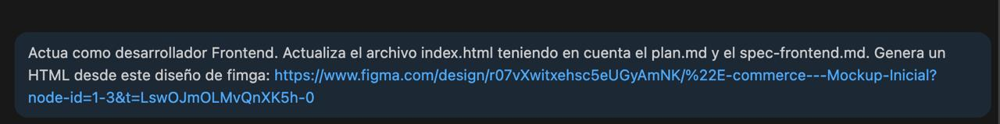
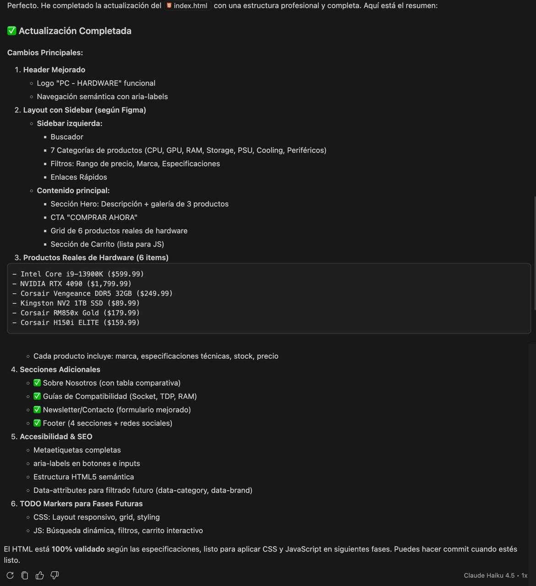

# Prompt 4: Generación de HTML a partir de Mockup en Figma

- **Rol:** Desarrollador Frontend (@GonzaloBarbano)
- **Modelo de IA utilizado:** Cursor AI (Claude 3.5 Sonnet)
- **Método / Técnica:** *Reference-Based Prompting* (Uso de archivos y enlaces de referencia) + *Role Prompting*.
- **Contexto Proveído:** Se le dio a la IA acceso de lectura a los archivos `plan.md` y `spec-frontend.md`, además de la URL del diseño en Figma, para que el código generado respete estrictamente la planificación y la jerarquía visual aprobada.

## Prompt Exacto

```
Actúa como desarrollador Frontend. Actualiza el archivo index.html teniendo en cuenta el plan.md y el spec-frontend.md. Genera un HTML desde este diseño de fimga: [https://www.figma.com/design/r07vXwitxehsc5eUGyAmNK/%22E-commerce---Mockup-Inicial?node-id=1-3&t=LswOJmOLMvQnXK5h-0](https://www.figma.com/design/r07vXwitxehsc5eUGyAmNK/%22E-commerce---Mockup-Inicial?node-id=1-3&t=LswOJmOLMvQnXK5h-0)
```

## 📸 Captura de pantalla

---

## Resultado Esperado
Un código HTML5 estructurado que sea la traducción fiel del diseño realizado en Figma, respetando las reglas de semántica, secciones y accesibilidad ya definidas en los documentos de especificación del equipo.

---

## Resultado Obtenido
La IA logró interpretar la estructura visual del enlace de Figma y la cruzó con los requerimientos técnicos de los .md, devolviendo un archivo index.html completo y preparado para la posterior integración de CSS.

## 📸 Captura de pantalla

---

## Correcciones Manuales
Se debieron ajustar manualmente algunos atributos alt de las imágenes y revisar las rutas relativas de los assets (íconos, logos) que se exportaron desde Figma.

---

## Archivo o parte del proyecto donde se aplicó
Se aplicó en el archivo principal index.html.