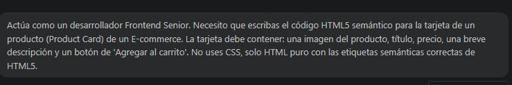
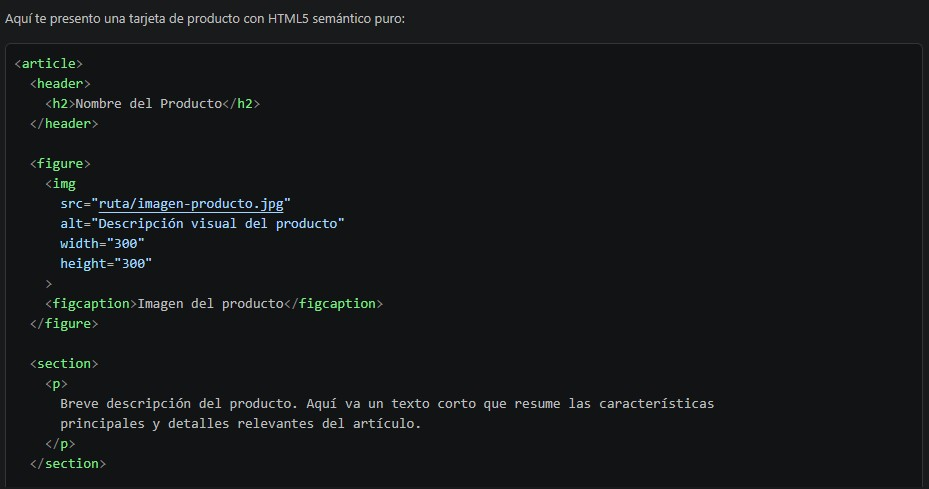
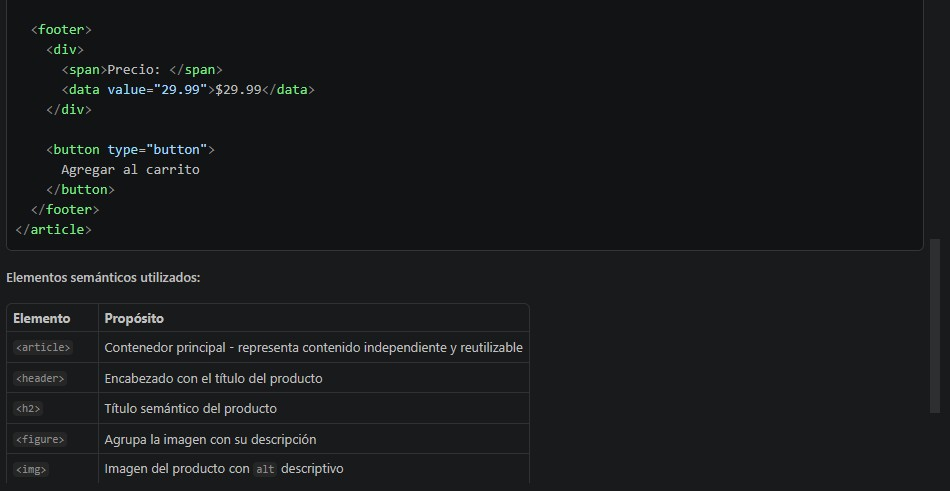
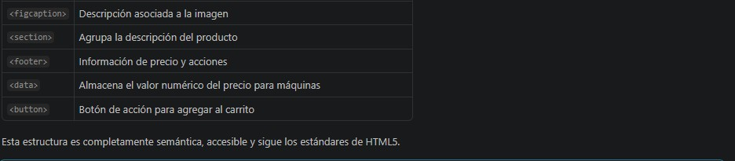

# Prompt 5: Generación de Componente (Product Card) para Comparativa

- **Rol:** Especialista en IA / Prompt Engineering (@Naguirre0102)
- **Modelos de IA utilizados:** Gemini 1.5 Pro y Claude 3.5 Sonnet *(Auditados en paralelo)*
- **Método / Técnica:** *Role Prompting* (Asignación de rol) + *Constraint Prompting* (Restricciones explícitas: "No uses CSS").
- **Contexto Proveído:** Se aisló la creación de un componente específico (Product Card) estableciendo restricciones técnicas claras para poder medir y comparar la calidad semántica generada por dos modelos distintos.

## Prompt Exacto

```
Actúa como un desarrollador Frontend Senior. Necesito que escribas el código HTML5 semántico para la tarjeta de un producto (Product Card) de un E-commerce. La tarjeta debe contener: una imagen del producto, título, precio, una breve descripción y un botón de 'Agregar al carrito'. No uses CSS, solo HTML puro con las etiquetas semánticas correctas de HTML5.
```
## 📸 Captura de pantalla


## Resultado Esperado
Un bloque de código HTML5 puramente semántico (<article>, <figure>, , <h3>, <p>, <button>) sin estilos en línea ni clases innecesarias, ideal para auditar la accesibilidad de la estructura base.

## Resultado Obtenido
Ambos modelos generaron el componente, permitiendo realizar el análisis técnico documentado en el archivo comparativa-modelos.md. Claude estructuró mejor las etiquetas <figure>, mientras que Gemini optó por una estructura más modular con atributos ARIA para accesibilidad.

## 📸 Captura de pantalla




## Correcciones Manuales
Se extrajo lo mejor de ambos modelos resultantes de la comparativa y se unificó en un solo componente estandarizado para que el equipo Frontend lo implemente en el catálogo.

## Archivo o parte del proyecto donde se aplicó
Se utilizó como base para redactar el análisis técnico en comparativa-modelos.md y como componente estructural en la sección de productos del index.html.
