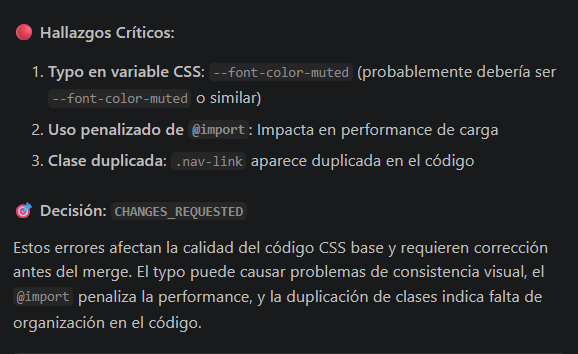
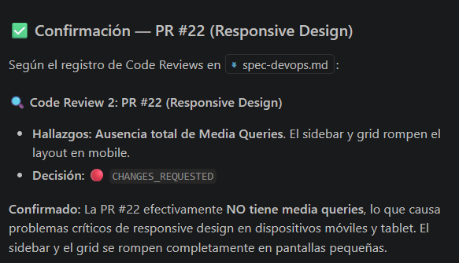
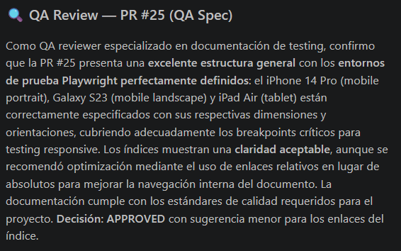
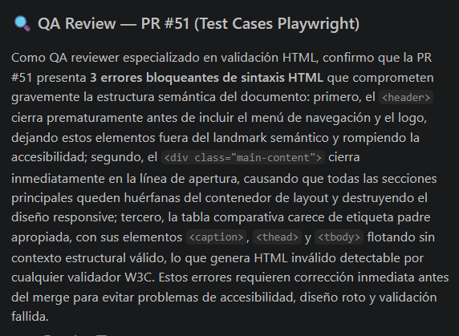

# Especificación Técnica: Coordinador / DevOps (Actividad 2)

- **Rol:** Coordinador / DevOps (@Naguirre0102)
- **Objetivo Principal:** Orquestar la integración de CSS y diseño responsivo, asegurar la calidad del código mediante Code Reviews con IA (Copilot), gestionar el flujo de ramas (GitFlow) y realizar el despliegue en GitHub Pages.

## 1. Responsabilidades Planificadas

- Gestionar los Request Changes y el Backport de la Actividad 1.
- Estandarizar las Pull Requests mediante un template (`pull_request_template.md`).
- Supervisar que cada PR tenga al menos 1 revisión aprobada y un Issue vinculado.
- Realizar un mínimo de 4 Code Reviews asistidos por IA (Copilot) directamente en los diffs de las PRs.
- Gestionar la rama `release/actividad-obligatoria-2` y publicar el proyecto en GitHub Pages.

## 2. Herramientas y Entorno

- **Control de Versiones:** Git & GitHub (GitFlow).
- **Code Review & IA:** GitHub Pull Requests and Issues (Extensión VS Code), GitHub Copilot Chat.
- **Despliegue:** GitHub Pages.

## 3. Registro de Code Reviews con IA

_(Esta sección se completará al final del sprint con la evidencia y prompts usados)_

### 🔍 Code Review 1: PR #21 (CSS Styles base)
- **Herramienta:** GitHub Copilot en VS Code
- **Prompt:** `Revisar el diff de la PR #21. Foco en: variables CSS desde :root, principios DRY y performance (@import).`
- **Hallazgos:** Typo en `--font-color-muted`, uso penalizado de `@import` y clase `.nav-link` duplicada.
- **Decisión:** 🔴 `CHANGES_REQUESTED`
- **Evidencia:** 

### 🔍 Code Review 2: PR #22 (Responsive Design)
- **Herramienta:** GitHub Copilot en VS Code
- **Prompt:** `Analiza el diff de la PR #22. Foco crítico en: ¿Existen media queries para mobile y tablet según plan.md?`
- **Hallazgos:** Ausencia total de Media Queries. El sidebar y grid rompen el layout en mobile.
- **Decisión:** 🔴 `CHANGES_REQUESTED`
- **Evidencia:** 

### 🔍 Code Review 3: PR #25 (QA Spec)
- **Herramienta:** GitHub Copilot en VS Code
- **Prompt:** `Revisa PR #25. Verifica: entornos de prueba Playwright y claridad de índices.`
- **Hallazgos:** Buena estructura. Dispositivos definidos. Se sugirió usar enlaces relativos en el índice.
- **Decisión:** 🟢 `APPROVED`
- **Evidencia:** 

### 🔍 Code Review 4: PR #51 (Test Cases Playwright)
- **Herramienta:** GitHub Copilot en VS Code
- **Prompt:** `Analiza PR #51 sobre casos M2. Foco en validación de errores HTML (header, main, table).`
- **Hallazgos:** Reporte Playwright bien volcado. 3 errores bloqueantes de sintaxis detectados y documentados.
- **Decisión:** 🟢 `APPROVED`
- **Evidencia:** 

## 4. Obstáculos y Resoluciones

_(Se documentarán los problemas encontrados en el flujo y cómo se resolvieron)_

## 5. Criterios de Aceptación (Checklist DevOps)

- [ ] Este archivo `spec-devops.md` fue commiteado antes que los cambios de código.
- [ ] Se resolvió el Backport de la Actividad 1 hacia `develop`.
- [ ] Todas las PRs tienen 1 aprobación y están vinculadas a un Issue.
- [ ] Se realizaron y documentaron 4 Code Reviews con Copilot Agent.
- [ ] La rama `release` está creada y GitHub Pages está activo y accesible.
