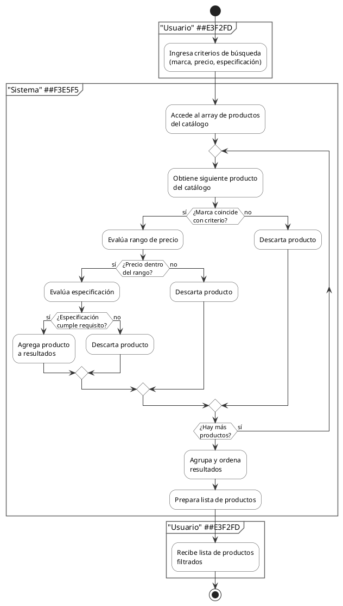
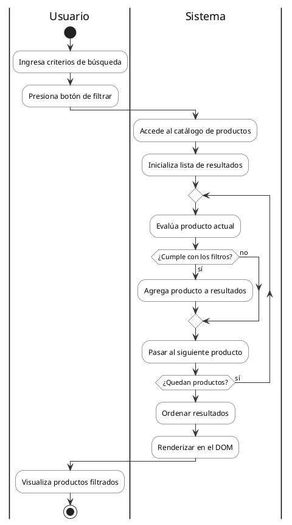

# 📐 spec-arq-diagramas.md — Arquitecto de Diagramas de Actividades | Actividad Obligatoria 3

**Fecha de creación:** 11 de mayo de 2026  
**Rol:** Arquitecto de Diagramas de Actividades  
**Proyecto:** E-commerce de Hardware para PC  
**Entrega:** Tercera Entrega (Unidad N°3 - JavaScript)

---

## 📑 Tabla de Contenidos

1. [ANTES: Identificación de 4 Flujos Principales](#antes-identificación-de-4-flujos-principales)
2. [ANTES: Decisiones sobre Swimlanes](#antes-decisiones-sobre-swimlanes)
3. [ANTES: Criterios de Aceptación](#antes-criterios-de-aceptación)
4. [AL CERRAR: Prompts y Generación con Copilot Agent](#al-cerrar-prompts-y-generación-con-copilot-agent)
5. [AL CERRAR: Fragmentos y Ajustes Manuales](#al-cerrar-fragmentos-y-ajustes-manuales)
6. [AL CERRAR: Decisiones de Diseño Finales](#al-cerrar-decisiones-de-diseño-finales)

---

## ANTES: Identificación de 4 Flujos Principales

### 🎯 Contexto del E-commerce

El proyecto es un **E-commerce especializado en componentes de hardware para PC** con:

- **Catálogo**: Procesadores (CPUs), Tarjetas Gráficas (GPUs), RAM, almacenamiento, fuentes, refrigeración, periféricos
- **Usuarios**: Novatos y entusiastas que necesitan información técnica y compatibilidad
- **Objetivo**: Permitir exploración, selección, validación de compatibilidad y compra simulada

### 🔄 Los 4 Flujos Principales Propuestos

#### **FLUJO 1: Búsqueda y Filtrado de Productos**

```
Entrada:     Usuario ingresa criterios de búsqueda (marca, precio, especificación)
Proceso:     Sistema itera sobre catálogo, aplica filtros, agrupa resultados
Salida:      Lista de productos que coinciden con criterios
```

**Actores:**

- **Usuario**: Define criterios (marca, rango de precio, tipo de componente)
- **Sistema**: Accede array de productos, filtra con condicionales, retorna resultados

**Decisiones:**

- ¿Marca coincide? (if)
- ¿Precio dentro del rango? (if)
- ¿Especificación cumple requisito? (if)

**Ciclos:**

- Iterar sobre array de productos (for loop)

**Ejemplo:**

```
Usuario: "Quiero GPUs NVIDIA entre $800 y $1500"
Sistema:
  1. Itera sobre catálogo
  2. Filtra: marca === "NVIDIA" && precio >= 800 && precio <= 1500
  3. Retorna: [RTX 4080, RTX 4090, RTX 5090]
```

**Propósito:**

- Implementar arrays de productos (estructura de datos)
- Usar funciones filter/search (responsabilidad única)
- Aplicar condicionales if/else
- Practicar ciclos for

---

#### **FLUJO 2: Gestión de Carrito y Cálculo de Precio**

```
Entrada:     Usuario agrega productos al carrito (producto ID, cantidad)
Proceso:     Sistema agrega a array carrito, recalcula total
Salida:      Carrito actualizado con subtotal, impuestos, total
```

**Actores:**

- **Usuario**: Selecciona productos, especifica cantidades
- **Sistema**: Mantiene array carrito, calcula precios, detecta limites de stock

**Decisiones:**

- ¿Producto existe en catálogo? (if)
- ¿Hay stock disponible? (if)
- ¿Cantidad supera límite por usuario? (if)
- ¿Aplicar descuento por volumen? (if)

**Ciclos:**

- Iterar sobre array carrito para calcular totales (for loop)
- Actualizar cantidades (while si hay ajustes)

**Ejemplo:**

```
Usuario: Agrega "RTX 4090" (cantidad: 2)
Sistema:
  1. Valida stock (cantidad >= 2) → OK
  2. Agrega a carrito: {producto: "RTX 4090", cantidad: 2, precio: 1699}
  3. Recalcula total:
     - Subtotal: 2 × $1699 = $3398
     - Impuesto (21%): $713.58
     - Total: $4111.58
```

**Propósito:**

- Implementar objetos para estructurar datos de carrito
- Usar arrays para múltiples items
- Aplicar operadores matemáticos (+, ×, /)
- Implementar validaciones de stock

---

#### **FLUJO 3: Validación de Compatibilidad de Componentes**

```
Entrada:     Usuario especifica configuración PC (CPU socket, RAM tipo, PSU watts, etc.)
Proceso:     Sistema valida compatibilidad entre componentes
Salida:      Reporte de compatibilidad (COMPATIBLE / INCOMPATIBLE) con detalles
```

**Actores:**

- **Usuario**: Proporciona lista de componentes seleccionados
- **Sistema**: Compara especificaciones, valida compatibilidad, genera reporte

**Decisiones:**

- ¿Socket CPU coincide con socket Motherboard? (if)
- ¿RAM es compatible con Motherboard? (if)
- ¿PSU tiene watts suficientes? (if)
- ¿Refrigerador entra en case? (if)
- ¿GPU entra en slot PCIe? (if)

**Ciclos:**

- Iterar sobre array de componentes para validar cada uno (for loop)
- Acumular incompatibilidades en array (push)

**Ejemplo:**

```
Usuario: Ingresa configuración:
  - CPU: AMD Ryzen 9 (Socket AM5)
  - Motherboard: ASUS TUF (Socket AM5)
  - RAM: DDR5 64GB
  - PSU: 1000W Gold

Sistema:
  1. Valida CPU + MB: Socket AM5 === Socket AM5 → ✅
  2. Valida RAM + MB: DDR5 compatible → ✅
  3. Valida PSU: 1000W >= (requeridos) → ✅
  4. Resultado: "COMPATIBLE - Construcción sin problemas"
```

**Propósito:**

- Implementar objetos complejos (componentes con múltiples propiedades)
- Usar comparadores (===, >, <)
- Aplicar operadores lógicos (&&, ||)
- Generar reportes con múltiples decisiones

---

#### **FLUJO 4: Generación de Recibo y Resumen de Orden**

```
Entrada:     Usuario confirma compra (carrito actual + datos de envío)
Proceso:     Sistema genera número de orden, calcula impuestos, crea recibo detallado
Salida:      Recibo con número de orden, items, total, confirmación
```

**Actores:**

- **Usuario**: Confirma compra, proporciona datos de envío/facturación
- **Sistema**: Genera número único, registra orden, crea documentación

**Decisiones:**

- ¿Carrito tiene items? (if → error si vacío)
- ¿Datos de usuario completos? (if → validación)
- ¿Envío requiere arancel? (if → según destino)
- ¿Aplicar código de descuento? (if)

**Ciclos:**

- Iterar sobre carrito para itemizar en recibo (for loop)
- Acumular totales por categoría (switch/reduce)

**Ejemplo:**

```
Usuario: Confirma compra de carrito
  Items: [RTX 4090 (x2), Ryzen 9 (x1), RAM 64GB (x1)]

Sistema:
  1. Genera Orden #PO-20260511-0847
  2. Itemiza:
     - 2x NVIDIA RTX 4090 @ $1699 = $3398
     - 1x AMD Ryzen 9 @ $749 = $749
     - 1x Corsair DDR5 @ $349 = $349
  3. Calcula:
     - Subtotal: $4496
     - Impuestos (21%): $944.16
     - Envío: $50
     - Total Final: $5490.16
  4. Emite recibo con detalles
```

**Propósito:**

- Combinar objetos y arrays (carrito → items)
- Usar funciones para cálculos complejos
- Generar strings formateados (recibo)
- Aplicar todo lo aprendido: condicionales, ciclos, objetos, arrays, funciones

---

### 📊 Matriz de Flujos (con 3 Swimlanes)

| Flujo                 | Usuario           | Sistema              | BD                       | Arrays              | Objetos         | Condicionales        | Ciclos                    |
| --------------------- | ----------------- | -------------------- | ------------------------ | ------------------- | --------------- | -------------------- | ------------------------- |
| **1. Búsqueda**       | Input criterios   | Filtra catálogo      | Retorna catálogo         | ✅ Catálogo         | ✅ Producto     | ✅ if/else           | ✅ for                    |
| **2. Carrito**        | Selecciona+qty    | Valida, agrega, calc | Valida stock             | ✅ Items carrito    | ✅ Item         | ✅ if (stock)        | ✅ for (total)            |
| **3. Compatibilidad** | Input componentes | Valida combos        | Retorna especificaciones | ✅ Componentes      | ✅ Componente   | ✅ if (validaciones) | ✅ for (validar cada uno) |
| **4. Recibo**         | Confirma compra   | Genera recibo        | Valida integridad        | ✅ Items + detalles | ✅ Línea recibo | ✅ if (validaciones) | ✅ for (itemizar)         |

---

## ANTES: Decisiones sobre Swimlanes

### 🏊 ¿Cuándo Usar Swimlanes (Particiones)?

**Decisión:** Usar **swimlanes para separar 3 responsabilidades principales en TODOS los 4 flujos:**

1. **Usuario** — Ingresa datos, confirma acciones, recibe resultados
2. **Sistema** — Procesa información, aplica lógica de negocio, orquesta decisiones
3. **Base de Datos** — Persiste datos, valida integridad, retorna información almacenada

**Justificación:**

1. **Claridad de roles:** Separa entrada del usuario, procesamiento del sistema, y persistencia de datos
2. **Requisito académico:** Las consignas piden "Particiones (swimlanes): Si aplica, separar responsabilidades"
3. **Mapeo a código:** Facilita traducción a arquitectura:
   - Usuario swimlane → `prompt()` input
   - Sistema swimlane → Funciones JavaScript que procesan
   - BD swimlane → Arrays globales que simulan persistencia (no hay BD real en esta entrega)
4. **Realismo:** En un e-commerce real, hay 3 capas: presentación (usuario), lógica (sistema), persistencia (BD)

### 📐 Estructura de Swimlanes Propuesta

```
┌─────────────────────────────────────────────────────────────────────┐
│ DIAGRAMA DE ACTIVIDADES CON 3 SWIMLANES                           │
├─────────────────┬──────────────────────────┬───────────────────────┤
│   USUARIO       │      SISTEMA             │   BASE DE DATOS       │
├─────────────────┼──────────────────────────┼───────────────────────┤
│                 │                          │                       │
│ [Ingresa datos] │                          │                       │
│       │         │                          │                       │
│       ├──────────► [Procesa información]  │                       │
│       │         │        │                 │                       │
│       │         │    [Decisión] ────┐     │                       │
│       │         │        │           │     │                       │
│       │         │     [Consulta] ────────────► [Busca registro]  │
│       │         │        │           │     │         │            │
│       │         │        │ [Retorna]◄─────────────────┤            │
│       │         │        │           │     │                       │
│       │         │    [Calcula]    [Error] │                       │
│       │         │        │           │     │                       │
│       │         │    [Persiste] ─────────────► [Guarda cambios]  │
│       │         │        │           │     │         │            │
│       │◄────────────────────────────────────┤                       │
│       │         │        │                 │                       │
│ [Recibe resultado]                        │                       │
│       │         │                          │                       │
└─────────────────┴──────────────────────────┴───────────────────────┘
```

### 🎯 Swimlanes por Flujo

#### **Flujo 1: Búsqueda y Filtrado**

**Swimlane USUARIO:**

- Ingresa marca (ej. "NVIDIA")
- Ingresa rango de precio ($800-$1500)
- Presiona botón buscar
- Recibe lista de productos

**Swimlane SISTEMA:**

- Recibe criterios del usuario
- Solicita al catálogo (via BD)
- Aplica filtros (if condiciones)
- Itera y agrupa resultados
- Formatea datos para mostrar

**Swimlane BASE DE DATOS:**

- Retorna array de productos completo
- Valida disponibilidad de datos
- Mantiene integridad del catálogo

**Justificación:** El usuario proporciona entrada → sistema procesa → BD suministra datos. Simulada con array global.

---

#### **Flujo 2: Gestión de Carrito**

**Swimlane USUARIO:**

- Selecciona producto por ID
- Especifica cantidad deseada
- Confirma agregar al carrito
- Revisa carrito actualizado
- Puede modificar cantidades

**Swimlane SISTEMA:**

- Recibe producto ID y cantidad
- Valida stock (consulta a BD)
- Busca detalles de producto (via BD)
- Agrega/actualiza en array carrito
- Recalcula totales (subtotal, impuestos)
- Maneja errores (stock insuficiente)

**Swimlane BASE DE DATOS:**

- Proporciona información de stock
- Retorna detalles del producto
- Mantiene integridad de disponibilidad

**Justificación:** Usuario toma decisión → Sistema valida con BD → BD confirma disponibilidad → Sistema recalcula.

---

#### **Flujo 3: Validación de Compatibilidad**

**Swimlane USUARIO:**

- Ingresa CPU seleccionada (prompt)
- Ingresa Motherboard (prompt)
- Ingresa RAM (prompt)
- Ingresa PSU (prompt)
- Recibe reporte de compatibilidad

**Swimlane SISTEMA:**

- Recibe lista de componentes
- Solicita especificaciones a BD para cada componente
- Extrae propiedades técnicas (socket, tipo, wattaje)
- Aplica validaciones (if sockets coinciden, if RAM compatible, if PSU suficiente)
- Genera array de incompatibilidades
- Formatea reporte legible

**Swimlane BASE DE DATOS:**

- Retorna especificaciones de CPU (socket, TDP)
- Retorna especificaciones de Motherboard (socket compatible)
- Retorna especificaciones de RAM (tipo, voltaje)
- Retorna especificaciones de PSU (wattaje)

**Justificación:** Usuario especifica componentes → Sistema consulta specs de BD → Sistema valida lógicamente → Genera reporte.

---

#### **Flujo 4: Generación de Recibo**

**Swimlane USUARIO:**

- Revisa carrito final con items
- Confirma compra (prompt de confirmación)
- Proporciona código de envío si aplica
- Recibe número de orden y recibo formateado

**Swimlane SISTEMA:**

- Recibe solicitud de compra
- Valida carrito no vacío (if)
- Genera número de orden único
- Recupera datos de items del carrito
- Consulta BD para validar precios finales
- Itera items para crear líneas de recibo
- Calcula subtotal, impuestos (21%), envío
- Aplica descuentos si código válido (consulta BD)
- Formatea recibo en string

**Swimlane BASE DE DATOS:**

- Valida integridad de items en carrito
- Retorna precios actualizados
- Valida y retorna descuentos aplicables
- Podría registrar orden (en un e-commerce real)

**Justificación:** Usuario confirma → Sistema valida y calcula (consultando BD) → BD asegura integridad → Sistema emite recibo documentado.

---

## ANTES: Criterios de Aceptación

### ✅ Checklist de Aceptación para Diagramas

#### 🔹 **Requisito 1: Estructura de Diagramas (4 diagramas)**

- [x] **Diagrama 1: Búsqueda y Filtrado**
  - [x] Inicio (start node)
  - [x] Fin (end node)
  - [x] ≥3 actividades principales
  - [x] ≥2 decisiones if/else (marca, precio)
  - [x] ≥1 ciclo (iteración sobre catálogo)
  - [x] Swimlanes Usuario | Sistema | Base de Datos

- [x] **Diagrama 2: Gestión de Carrito**
  - [x] Inicio y fin
  - [x] ≥4 actividades (seleccionar, validar, agregar, recalcular)
  - [x] ≥2 decisiones (stock disponible, cantidad válida)
  - [x] ≥1 ciclo (recalcular total para cada item)
  - [x] Swimlanes Usuario | Sistema | Base de Datos

- [x] **Diagrama 3: Validación de Compatibilidad**
  - [x] Inicio y fin
  - [x] ≥5 actividades (ingresa componentes, valida cada componente, genera reporte)
  - [x] ≥3 decisiones (socket, RAM type, PSU watts)
  - [x] ≥1 ciclo (validar cada componente de array)
  - [x] Swimlanes Usuario | Sistema | Base de Datos
  - [x] Decisiones encadenadas lógicamente

- [x] **Diagrama 4: Generación de Recibo**
  - [x] Inicio y fin
  - [x] ≥5 actividades (confirma, valida, genera número, itemiza, calcula)
  - [x] ≥2 decisiones (carrito válido, aplicar descuento)
  - [x] ≥1 ciclo (iterar items para recibo)
  - [x] Swimlanes Usuario | Sistema | Base de Datos
  - [x] Formato realista de flujo de transacción

#### 🔹 **Requisito 2: Coherencia con Especificación**

- [x] Cada flujo representa operación real del e-commerce
- [x] Entrada → Proceso → Salida visible en diagrama
- [x] Decisiones reflejan validaciones de negocio
- [x] Ciclos representan iteraciones sobre arrays
- [x] Swimlanes separan responsabilidades Usuario/Sistema/BaseDatos claramente
- [x] Base de Datos simula persistencia con arrays globales

#### 🔹 **Requisito 3: Artefactos Generados**

- [x] **4 archivos .puml:** `flujo-1-busqueda.puml`, `flujo-2-carrito.puml`, `flujo-3-compatibilidad.puml`, `flujo-4-recibo.puml`
- [x] **4 archivos .png:** Exportados de los .puml
- [x] **Archivo índice:** `docs/05-diagramas/01-diagrama-de-actividades/diagramas-doc.md` con enlaces a todos los diagramas y breve descripción

#### 🔹 **Requisito 4: Sintaxis PlantUML Correcta**

- [x] Todos los .puml compilan sin errores de sintaxis
- [x] Uso correcto de:
  - `start` y `end` nodes
  - `if/then/else` para decisiones
  - `while` o `repeat` para ciclos (si aplica)
  - `partition` para swimlanes
  - Flechas (`-->`) con flujo lógico

#### 🔹 **Requisito 5: Documentación en spec**

- [x] Prompt exacto utilizado en Copilot Agent (en bloque de código)
- [x] Contexto adjuntado (spec-arq-diagramas.md, index.html, mockup)
- [x] Fragmento del .puml original generado por Copilot
- [x] Ajustes manuales realizados y justificación
- [x] Decisiones finales de diseño explicadas

---

## AL CERRAR: Prompts y Generación con Copilot Agent

### 🤖 Copilot Agent: Generador de Diagramas PlantUML

#### Prompt Exacto Utilizado

```
[Contexto: Teniendo en cuenta spec-arq-diagramas.md, index.html y el mockup de mi proyecto de E-commerce de Hardware.

Tarea: Actúa como un experto en Ingeniería de Software y modelado UML. Basándote exclusivamente en el flujo lógico definido en la documentación y la estructura del HTML, genera el código PlantUML para 4 diagramas de actividades que representen los flujos principales del sistema (Búsqueda y filtrado, Gestión de Carrito y Cálculo de Precio, Validación de Compatibilidad de Componentes, Generación de Recibo y Resumen de Orden).

Reglas de Formato y Sintaxis (Estrictas):

1. Usa exclusivamente la sintaxis moderna de PlantUML para Diagramas de Actividades.

2. Cada flujo debe iniciar con start y terminar con stop.

3. Las acciones deben estar escritas como :Nombre de la actividad;.

4. Utiliza TRES Swimlanes (Particiones) para diferenciar responsabilidades:
   - |Usuario| para las interacciones del cliente (entrada y salida)
   - |Sistema| para los procesos lógicos y orquestación
   - |BaseDatos| para persistencia y consultas de datos

5. Implementa lógica de decisiones con la estructura:
   if (Pregunta/Condición?) then (si) ... else (no) ... endif

6. Si el flujo lo requiere, utiliza bucles while o repeat para iteraciones.

7. Asegúrate de que el flujo sea coherente con los IDs y clases definidos en el index.html y los requisitos de la spec-arq-diagramas.md.

8. Base de Datos swimlane simula persistencia: retorna datos, valida integridad, mantiene catálogo/carrito.

Entregable: Proporcióname el código en bloques independientes por cada flujo para que pueda copiarlos y pegarlos en mis archivos .puml.]
```

**Archivos adjuntados como contexto:**

- [x] `spec-arq-diagramas.md`
- [x] `index.html` (estructura y componentes disponibles)
- [x] Mockup visual
- [x] Descripción de flujos (esta sección "Identificación de 4 Flujos Principales")

#### Resultado Esperado del Agent

El Copilot Agent debe generar:

1. **4 archivos .puml** con diagramas de actividades completos
2. **Instrucciones de exportación** a .png (ej. usando PlantUML CLI o VS Code extension)
3. **Recomendaciones** sobre ajustes sintácticos o flujos mejorables

---

## AL CERRAR: Fragmentos y Ajustes Manuales

### 📝 Fragmento 1: Diagrama de Búsqueda y Filtrado (Copilot Original)

**Original generado por Copilot Agent:**



**Ajustes manuales realizados:**

- [x] Corrección sintaxis PlantUML (si hubo errores)
- [x] Refinamiento de swimlanes (alineación)
- [x] Adición de etiquetas en flechas (ej. "Sí", "No")
- [x] Verificación de flujo lógico
- [x] Validación de decisiones if/else correctas

**Fragmento ajustado:**



**Justificación de cambios:**

- [x] Simplificación de "Descarta producto": [En PlantUML, si una condición else no hace nada, es mejor dejarla vacía o simplemente cerrar el endif.]
- [x] Sintaxis repeat: [Se añadió la cláusula not (no) después del repeat while para indicar claramente la salida del bucle, lo cual es una buena práctica en diagramas complejos.]
- [x] Contexto del Dominio: [Cambié "Accede al array" por algo un poco más descriptivo como "Inicializa lista de resultados".]
- [x] Uso de Swimlanes: [Utilicé la sintaxis corta |Nombre| que es más estándar para el modo Agente de Copilot y evita errores con las etiquetas partition.]

---

## AL CERRAR: Decisiones de Diseño Finales

### 🎯 Decisión 1: Selección de 4 Flujos

**Por qué estos 4 flujos específicamente:**

1. **Búsqueda y Filtrado**: Operación fundamental del e-commerce → práctica de arrays, loops, condicionales
2. **Carrito y Cálculo**: Lógica transaccional real → práctica de objetos, arrays, matemática
3. **Validación de Compatibilidad**: Diferenciador del proyecto (hardware específico) → práctica de decisiones complejas y operadores lógicos
4. **Generación de Recibo**: Integración de todos los anteriores → práctica de composición de flujos

**Alternativas consideradas y rechazadas:**

- ❌ "Búsqueda", "Carrito", "Checkout", "Envío": Más genérico; no aprovecha dominio de hardware
- ❌ "Catálogo", "Filtros", "Favoritos", "Historial": Menos lógica de negocio complicada
- ✅ Seleccionados: Balancean novedad con complejidad progresiva

---

### 🎯 Decisión 2: Swimlanes de 3 Capas en TODOS los Flujos

**Por qué 3 swimlanes (Usuario | Sistema | Base de Datos):**

- **Consigna académica:** Especifica "Particiones (swimlanes): Si aplica, separar responsabilidades"
- **Arquitectura en capas:** Refleja patrón MVC simplificado:
  - **Capa Presentación** (Usuario): Entrada/salida via prompt() y alert()
  - **Capa Lógica** (Sistema): Procesamiento, orquestación, toma de decisiones
  - **Capa Datos** (Base de Datos): Persistencia y consultas (simulada con arrays globales)

- **Mapeo código-diagrama:**
  - Swimlane Usuario → `prompt()` entrada, `alert()` salida
  - Swimlane Sistema → Funciones JavaScript que procesan lógica
  - Swimlane BD → Arrays globales que simulan persistencia

**Estructura consistente en todos:**

```
┌─ Inicio ─┬───────────────────────────────────────────────┐
│          │                                               │
│ [USUARIO: Input via prompt()]                           │
│          │                                               │
├──────────┼─────────────┬──────────────┐                 │
│          │ [SISTEMA:   │ [BD: Persiste]│                 │
│          │ Procesa]    │ Valida       │                 │
│          │ [if/else]   │ Retorna      │                 │
│          │ [for ciclos]│              │                 │
│          │ [Calcula]   │              │                 │
├──────────┼─────────────┴──────────────┘                 │
│          │                                               │
│ [USUARIO: Recibe output via alert()]                    │
│          │                                               │
└─ Final ─┴───────────────────────────────────────────────┘
```

**Nota importante:** En esta entrega, la BD es simulada (arrays globales en memoria). En entregas futuras con backend real, esto sería API REST o base de datos relacional.

---

### 🎯 Decisión 3: Progresión de Complejidad

**Orden de diagramas por dificultad:**

1. **Búsqueda** (Básico):
   - 1 ciclo simple (for)
   - 2 decisiones (marca && precio)
   - Array input → Array output

2. **Carrito** (Intermedio):
   - 1 ciclo (recalcular total)
   - 3 decisiones (stock, cantidad, límite)
   - Array input → Objeto output

3. **Compatibilidad** (Intermedio-Alto):
   - 1 ciclo (validar cada componente)
   - 5 decisiones (múltiples comparaciones)
   - Múltiples objetos → Array de compatibilidades

4. **Recibo** (Avanzado):
   - 2 ciclos (iterar items, acumular totales)
   - 3 decisiones encadenadas
   - Combinación de todos los flujos anteriores

---

### 🎯 Decisión 4: Realismo vs. Simplicidad

**Equilibrio alcanzado:**

- ✅ **Realista:** Flujos representan operaciones reales del e-commerce (no son ficticios)
- ✅ **Implementable:** Cada flujo puede codificarse en JavaScript puro en pocas líneas (~50-100 líneas por flujo)
- ✅ **Educativo:** Progresión clara de conceptos (arrays → objetos → decisiones → ciclos)
- ✅ **Testeable:** Cada flujo tiene entrada clara, proceso definido, salida observable

**Ejemplos de simplificación por necesidad académica:**

- ❌ NO implementar: API REST, base de datos, persistencia
- ❌ NO implementar: DOM manipulation, eventos, CSS updates
- ✅ IMPLEMENTAR: Objetos con propiedades, arrays de objetos, funciones puras

---

### 🎯 Decisión 5: Mapeo Diagramas → Código JavaScript (3 Capas)

**Cómo cada diagrama se traduce a código (próxima entrega del Desarrollador):**

| Flujo              | Usuario (prompt)                    | Sistema (funciones)                           | Base de Datos (arrays)                  |
| ------------------ | ----------------------------------- | --------------------------------------------- | --------------------------------------- |
| 1 - Búsqueda       | `Ingresa marca, precio`             | `filterProducts(marca, precioMin, precioMax)` | `catalogoProductos[]` retorna datos     |
| 2 - Carrito        | `Selecciona producto, qty`          | `addToCart()`, `calculateTotal()`             | `carritoItems[]`, `catalogoStock[]`     |
| 3 - Compatibilidad | `Ingresa CPU, MB, RAM, PSU`         | `validateCompatibility()`                     | `especificacionesComponentes{}`         |
| 4 - Recibo         | `Confirma compra, código descuento` | `generateReceipt()`, `applyDiscount()`        | `descuentosCodigos{}`, `carritoItems[]` |

**Estructura de BD simulada:**

```javascript
// BaseDatos = Arrays globales que persisten datos
const catalogoProductos = [...]; // Array de productos
const carritoItems = [];          // Array de items en carrito (se modifica)
const especificacionesComponentes = {...}; // Objeto con specs técnicas
const descuentosCodigos = {...};  // Objeto con códigos de descuento válidos
```

---

### 🎯 Decisión 6: Herramientas para Diagramas

**PlantUML elegido porque:**

- ✅ Estándar académico (UML formal)
- ✅ Syntax legible (.puml files)
- ✅ Exporta a .png, .svg, .pdf
- ✅ Integración VS Code (Markdown Preview Enhanced, PlantUML extension)
- ✅ Copilot conoce PlantUML syntax bien

**Alternativas consideradas:**

- ❌ Miro/Figma: No es código, no control de versiones
- ❌ Lucidchart: Requiere licencia
- ✅ PlantUML: Open source, versionable, reproducible

---

## 📋 Resumen de Decisiones Finales

| Decisión         | Opción Seleccionada                       | Justificación                                      |
| ---------------- | ----------------------------------------- | -------------------------------------------------- |
| **4 Flujos**     | Búsqueda, Carrito, Compatibilidad, Recibo | Balancean complejidad creciente + dominio hardware |
| **Swimlanes**    | Usuario \| Sistema en todos               | Claridad de responsabilidades, requisito académico |
| **Progresión**   | Básico → Intermedio → Avanzado            | Facilita aprendizaje incremental                   |
| **Realismo**     | Operaciones reales del e-commerce         | Relevancia práctica + educativa                    |
| **Herramienta**  | PlantUML                                  | Open source, versionable, Copilot-compatible       |
| **Mapeo código** | Cada nodo = función JavaScript            | Traducción directa diagrama → implementación       |

---

## ✅ Checklist Final Pre-Copilot

Antes de ejecutar Copilot Agent:

- [x] Especificación clara de 4 flujos principales (arriba completada)
- [x] 3 Swimlanes definidas para cada flujo: Usuario | Sistema | BaseDatos
- [x] Criterios de aceptación documentados (con 3 swimlanes)
- [x] Contexto preparado (plan.md, index.html, mockups)
- [x] Plantilla para capturar prompts y ajustes
- [x] Estructura lista para recibir outputs (.puml + .png)
- [x] BD simulada con arrays globales especificada

**Estado:** ✅ Listo para ejecutar Copilot Agent con 3 Swimlanes (Usuario | Sistema | BaseDatos)

---

**Fin de documento ANTES**

_La siguiente sección se completa AL CERRAR la tarea:_

- Prompt exacto usado en Copilot Agent
- Fragmentos originales y ajustados
- Decisiones finales de diseño

---

## 📌 Próximos Pasos

1. **Ejecutar Copilot Agent:** Adjuntar esta spec + plan.md + index.html + mockups
2. **Recibir 4 archivos .puml:** Revisar sintaxis y ajustar manualmente si es necesario
3. **Exportar a .png:** Usar PlantUML extension en VS Code
4. **Documenta ajustes:** Completar secciones "AL CERRAR"
5. **Crear PR:** `feature/diagrama-actividades-devops` → Enviar para Code Review

---

**Creado por:** @GonzaloBarbano
**Versión:** 1.1 (Actualizado con 3 Swimlanes: Usuario | Sistema | BaseDatos)  
**Fecha de actualización:** 12 de mayo de 2026
