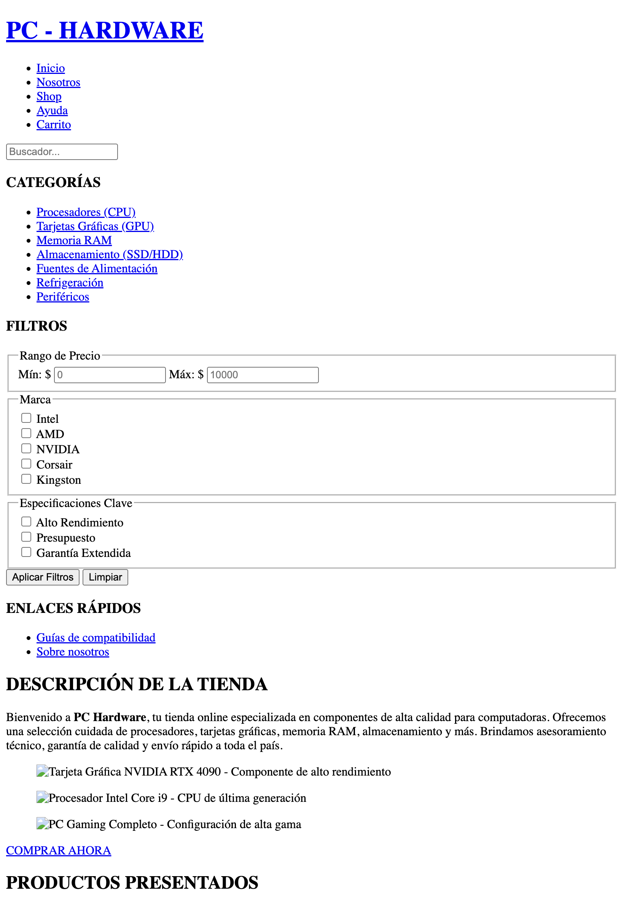

# Test Case 2 — Responsive Design

**Proyecto:** PC Hardware E-commerce  
**Repositorio:** [GonzaloBarbano/E-commerce](https://github.com/GonzaloBarbano/E-commerce)  
**URL testeada:** `http://127.0.0.1:5500/index.html`  
**Fecha:** 16/04/2026  
**Tester:** QA Documentador (Claude)  
**Metodología:** Emulación de dispositivos vía Playwright MCP + Análisis estático de código

---

## Objetivos del Test

Verificar que el layout del e-commerce se adapta correctamente a:

- **iPhone 15 Pro** — 393×852px (mobile, portrait)
- **Samsung Galaxy S23 Ultra** — 412×915px (mobile, portrait)
- **iPad Air** — 820×1180px (tablet, portrait)

Aspectos evaluados:

1. Colapso del menú de navegación (hamburguesa)
2. Adaptación de imágenes al viewport
3. Desbordamiento horizontal (scroll lateral)
4. Legibilidad tipográfica
5. Grid de productos

---

## Comandos Playwright utilizados

```javascript
// iPhone 15 Pro (393x852)
await page.setViewportSize({ width: 393, height: 852 });
await page.goto("http://127.0.0.1:5500/index.html");
await page.screenshot({ path: "test-case-2-iphone.png", fullPage: true });

// Samsung Galaxy S23 Ultra (412x915)
await page.setViewportSize({ width: 412, height: 915 });
await page.goto("http://127.0.0.1:5500/index.html");
await page.screenshot({ path: "test-case-2-samsung.png", fullPage: true });

// iPad Air (820x1180)
await page.setViewportSize({ width: 820, height: 1180 });
await page.goto("http://127.0.0.1:5500/index.html");
await page.screenshot({ path: "test-case-2-ipad.png", fullPage: true });
```

> **Nota:** Las capturas automáticas no pudieron generarse porque el servidor local (`127.0.0.1:5500`) no es accesible desde el entorno de ejecución del runner de Playwright (sandbox aislado). Se adjunta análisis estático completo en su reemplazo.

---

### Capturas de pantalla (manual)

- iPhone 15 pro  |
- iPad Air  |
- Samsung Galaxy S23 Ultra  |

---

## Resultados por Dispositivo

### Dispositivo 1 — iPhone 15 Pro (393×852px)

| Aspecto               | Resultado                                  | Estado |
| --------------------- | ------------------------------------------ | ------ |
| Menú hamburguesa      | No implementado                            | FAIL   |
| Nav colapsa en mobile | No colapsa                                 | FAIL   |
| Scroll horizontal     | Probable desbordamiento del nav-list       | WARN   |
| Imágenes responsivas  | max-width: 100% aplicado en responsive.css | PASS   |
| Grid de productos     | 1 columna según media query ≤767px         | PASS   |
| Tipografía            | h1 24px, h2 20px, body 15px — correcto     | PASS   |
| Sidebar               | display: none aplicado                     | PASS   |
| Contenido principal   | margin-left: 0 — correcto                  | PASS   |

**Hallazgos críticos:**

- El `<nav class="navigation">` contiene un `<ul class="nav-list">` con 5 ítems sin ningún mecanismo de colapso. No existe `display: none` en los media queries para `.nav-list`, ni botón hamburguesa, ni script toggle.
- El HTML documenta el TODO pero no está implementado: `<!-- TODO: JS: Agregar menú hamburguesa para dispositivos móviles -->`

---

### Dispositivo 2 — Samsung Galaxy S23 Ultra (412×915px)

| Aspecto               | Resultado                                          | Estado |
| --------------------- | -------------------------------------------------- | ------ |
| Menú hamburguesa      | No implementado                                    | FAIL   |
| Nav colapsa en mobile | No colapsa                                         | FAIL   |
| Scroll horizontal     | Probable en header por nav items                   | WARN   |
| Imágenes responsivas  | max-width: 100% global aplicado                    | PASS   |
| Grid de productos     | 1 columna — correcto                               | PASS   |
| Tipografía            | Escalas aplicadas correctamente                    | PASS   |
| Sidebar               | display: none — correcto                           | PASS   |
| Formulario newsletter | font-size: 16px en inputs (evita zoom iOS/Android) | PASS   |

**Hallazgos:**

- Mismo bug crítico de menú que en iPhone. 19px más de ancho (412 vs 393) no resuelve el problema.
- El formulario tiene `font-size: 16px` en inputs, lo que es correcto y evita el zoom automático en dispositivos móviles.

---

### Dispositivo 3 — iPad Air (820×1180px)

| Aspecto               | Resultado                                    | Estado |
| --------------------- | -------------------------------------------- | ------ |
| Menú hamburguesa      | No implementado                              | WARN   |
| Nav colapsa en tablet | No colapsa (pero hay más espacio disponible) | WARN   |
| Scroll horizontal     | Bajo riesgo a 820px                          | PASS   |
| Imágenes responsivas  | OK                                           | PASS   |
| Grid de productos     | 2 columnas según media query tablet          | PASS   |
| Sidebar               | display: none en tablet — correcto           | PASS   |
| Tipografía            | h1 a 28px en tablet — correcto               | PASS   |
| Hero images           | Grid 2 columnas — correcto                   | PASS   |

**Hallazgos:**

- En iPad (820px) el menú horizontal puede caber físicamente, pero la ausencia de hamburguesa es inconsistente con buenas prácticas UX tablet.
- La media query tablet está definida como `768px–1023px`, por lo que el sidebar se oculta correctamente.

---

## Bugs Identificados

### BUG-001 — Menú hamburguesa ausente en mobile/tablet

**Severidad:** Alta  
**Dispositivos afectados:** iPhone 15 Pro, Samsung Galaxy S23 Ultra, iPad Air  
**Descripción:** El nav no colapsa en ningún breakpoint. No existe botón hamburguesa en HTML, ni regla CSS para ocultar `.nav-list` en mobile, ni script de toggle.

**Causa raíz:**

```html
<!-- TODO: JS: Agregar menú hamburguesa para dispositivos móviles -->
<!-- Este TODO en index.html nunca fue implementado -->
```

**Fix sugerido — HTML:**

```html
<!-- Agregar dentro del <header>, antes del <nav> -->
<button class="hamburger-btn" aria-label="Abrir menú" aria-expanded="false">
  <span></span><span></span><span></span>
</button>
```

**Fix sugerido — CSS:**

```css
@media (max-width: 767px) {
  .nav-list {
    display: none;
    flex-direction: column;
    width: 100%;
    background-color: var(--color-surface-dark);
    position: absolute;
    top: var(--navbar-height);
    left: 0;
  }
  .nav-list.open {
    display: flex;
  }
  .hamburger-btn {
    display: block;
  }
}
```

**Fix sugerido — JS:**

```javascript
const hamburger = document.querySelector(".hamburger-btn");
const navList = document.querySelector(".nav-list");

hamburger.addEventListener("click", () => {
  const isOpen = navList.classList.toggle("open");
  hamburger.setAttribute("aria-expanded", isOpen);
});
```

---

### BUG-002 — Posible scroll horizontal en header mobile

**Severidad:** Media  
**Dispositivos afectados:** iPhone 15 Pro (393px), Samsung Galaxy S23 Ultra (412px)  
**Descripción:** El header tiene 5 nav links horizontales. En viewports menores a 430px, el ancho total puede superar el viewport disponible generando overflow-x.

**Fix sugerido:**

```css
.header-container {
  overflow-x: hidden;
}
/* + implementar hamburguesa (BUG-001) */
```

---

### OBS-001 — Clases CSS sin matching con HTML (deuda técnica)

**Severidad:** Baja  
**Descripción:** El CSS define selectores como `.navbar`, `.navbar-logo`, `.navbar-end`, `.product-card-body`, `.product-card-title`, `.app-container`, `.sidebar-link` que no coinciden con las clases reales del HTML (`.header-container`, `.logo-container`, `.product-info`, etc.).  
**Impacto:** Los estilos de componentes y layout no se aplican. Revisar y unificar naming convention en toda la codebase.

---

## Issues GitHub

Los siguientes issues no pudieron crearse automáticamente por restricciones del token MCP. Crear manualmente en:  
https://github.com/GonzaloBarbano/E-commerce/issues

| #       | Título                                                                  | Severidad | Labels sugeridas        |
| ------- | ----------------------------------------------------------------------- | --------- | ----------------------- |
| BUG-001 | [BUG] Menú hamburguesa ausente en mobile — nav desborda horizontalmente | Alta      | bug, responsive, mobile |
| BUG-002 | [BUG] Posible overflow-x en header en viewports <430px                  | Media     | bug, responsive         |
| OBS-001 | [DEUDA TÉCNICA] Clases CSS no coinciden con clases del HTML             | Baja      | enhancement, css        |

---

## Capturas de Pantalla

Las capturas automáticas no pudieron generarse: el runner de Playwright corre en un entorno aislado sin acceso a `localhost:5500`.

**Para reproducirlas manualmente:**

1. Abrir DevTools en Chrome/Firefox (F12)
2. Activar Toggle Device Toolbar (Ctrl+Shift+M)
3. Seleccionar "iPhone 15 Pro" → captura → guardar como `test-case-2-iphone.png`
4. Seleccionar "Samsung Galaxy S23 Ultra" → captura → guardar como `test-case-2-samsung.png`
5. Seleccionar "iPad Air" → captura → guardar como `test-case-2-ipad.png`

---

## Conclusión

El proyecto tiene una **base de media queries correcta** (breakpoints en 768px y 1024px, grid responsivo, sidebar oculto en mobile), pero el **componente de navegación mobile está sin implementar**, lo cual es el hallazgo crítico de este test.

| Categoría                    | Resultado |
| ---------------------------- | --------- |
| Layout general mobile        | PASS      |
| Imágenes responsivas         | PASS      |
| Grid de productos            | PASS      |
| Sidebar                      | PASS      |
| Menú navegación mobile       | FAIL      |
| Overflow horizontal          | WARN      |
| Consistencia HTML–CSS clases | FAIL      |

**Veredicto del test: PARCIALMENTE APROBADO** — El test responsive falla por BUG-001 (hamburguesa ausente). El resto del layout pasa.
