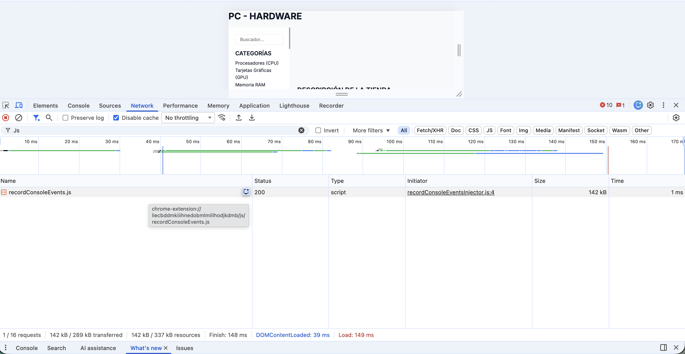
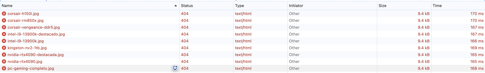
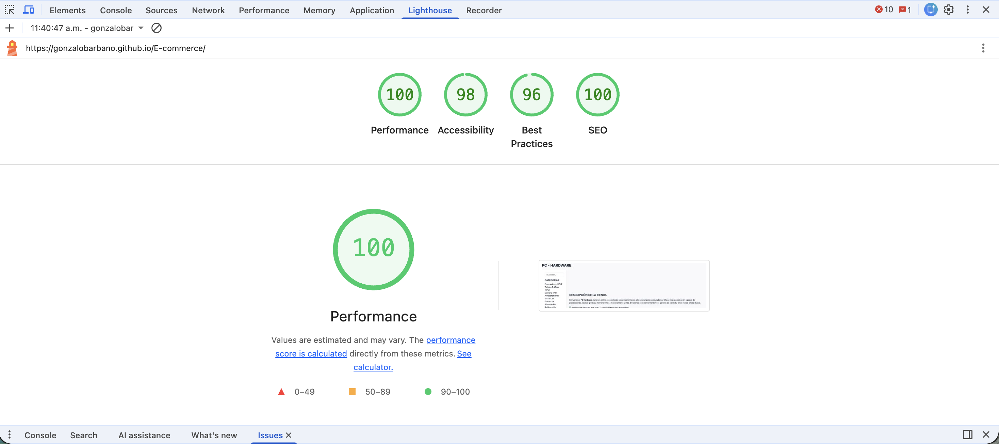
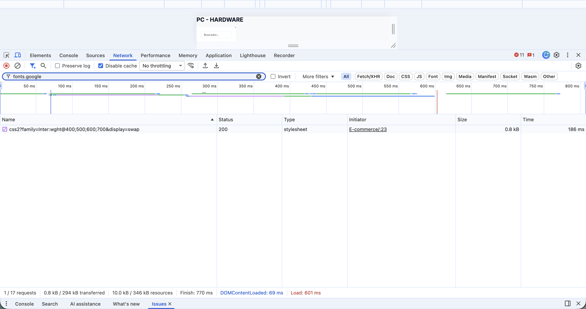

# CASO DE PRUEBA N°3 — TEST DE PERFORMANCE

| Campo               | Detalle                                                                                                        |
| ------------------- | -------------------------------------------------------------------------------------------------------------- |
| **Proyecto**        | PC-Hardware E-Commerce                                                                                         |
| **Rama**            | `feature/dev-frontend-css-and-styles`                                                                          |
| **Tester**          | @GonzaloBarbano                                                                                                |
| **URL bajo prueba** | https://gonzalobarbano.github.io/E-commerce/                                                                   |
| **Fecha**           | 17/04/2026                                                                                                     |
| **Tipo de prueba**  | Performance / Carga de página                                                                                  |
| **Herramientas**    | `web_fetch` (análisis de recursos reales), análisis estático CSS, Chrome DevTools (métricas a completar en §6) |

> ⚠️ **Nota de ejecución:** El MCP de Playwright no pudo inicializarse en el entorno de Claude.ai (`ENOENT: /.playwright-mcp`). Se utilizó `web_fetch` directamente sobre la URL pública de GitHub Pages para obtener datos reales de estructura HTML y estado de recursos. Las métricas de tiempo deben completarse con capturas de Chrome DevTools (ver §6).

---

## 1. OBJETIVO

Evaluar el rendimiento de carga de la página principal desplegada en GitHub Pages, identificar recursos que bloquean el renderizado, recursos con errores de carga, y proponer optimizaciones concretas con sus criterios de cierre.

---

## 2. INVENTARIO DE RECURSOS (datos reales — web_fetch)

### 2.1 Imágenes — **TODAS con HTTP 404** 🔴

Se verificó individualmente cada imagen referenciada en el HTML:

| #   | Archivo referenciado                          | Sección  | Estado HTTP |
| --- | --------------------------------------------- | -------- | ----------- |
| 1   | `assets/images/nvidia-rtx4090-destacada.jpg`  | Hero     | **404**     |
| 2   | `assets/images/intel-i9-13900k-destacado.jpg` | Hero     | **404**     |
| 3   | `assets/images/pc-gaming-completo.jpg`        | Hero     | **404**     |
| 4   | `assets/images/intel-i9-13900k.jpg`           | Producto | **404**     |
| 5   | `assets/images/nvidia-rtx4090.jpg`            | Producto | **404**     |
| 6   | `assets/images/corsair-vengeance-ddr5.jpg`    | Producto | **404**     |
| 7   | `assets/images/kingston-nv2-1tb.jpg`          | Producto | **404**     |
| 8   | `assets/images/corsair-rm850x.jpg`            | Producto | **404**     |
| 9   | `assets/images/corsair-h150i.jpg`             | Producto | **404**     |

**Total: 9/9 imágenes fallan.** La carpeta `assets/images/` no está desplegada en GitHub Pages. Cada request igual consume tiempo de red antes de recibir el 404.

### 2.2 Estructura HTML confirmada

- Navbar fijo con 5 links de navegación interna
- Sidebar con categorías + filtros de precio, marca y especificaciones
- Hero section con 3 imágenes + CTA "Comprar ahora"
- Grid de 6 productos con imagen, nombre, precio, stock y botón
- Paginación de 12 páginas (links con `href="#"` — no funcionales aún)
- Secciones: Carrito, Nosotros, Compatibilidad, Ayuda/Suscripción, Footer

---

## 3. MÉTRICAS TÉCNICAS

### Tabla A — Tiempos de carga (completar con DevTools §6)

| Métrica                    | Valor obtenido                     | Umbral aceptable | Estado    |
| -------------------------- | ---------------------------------- | ---------------- | --------- |
| DOMContentLoaded           | _(ver §6.1)_                       | ≤ 800 ms         | Pendiente |
| Load Event (total)         | _(ver §6.2)_                       | ≤ 1500 ms        | Pendiente |
| First Contentful Paint     | _(ver §6.3)_                       | ≤ 1000 ms        | Pendiente |
| Tiempo Google Fonts        | _(ver §6.4)_                       | ≤ 300 ms         | Pendiente |
| Requests totales estimadas | Mín. 12 (HTML + 2 CSS + 9 img 404) | < 20             | En límite |

### Tabla B — Top 3 recursos más lentos (estimado)

| #   | Recurso                                 | Tipo        | Bloquea render | Observación                              |
| --- | --------------------------------------- | ----------- | -------------- | ---------------------------------------- |
| 1   | Google Fonts (`@import` en CSS)         | CSS externo | **Sí**         | Cadena de 2 requests bloqueantes         |
| 2   | `css/styles.css` + `css/components.css` | CSS         | Sí             | Síncronos antes del primer render        |
| 3   | 9× imágenes (404)                       | IMG         | No             | 9 requests fallidas suman latencia total |

---

## 4. ANÁLISIS CSS (archivos de la rama)

### 4.1 🔴 CRÍTICO — `@import` de Google Fonts bloquea el renderizado

```css
/* css/styles.css — línea 1 */
@import url("https://fonts.googleapis.com/css2?family=Inter:wght@400;500;600;700&display=swap");
```

**Cadena de bloqueo que genera:**

```
Browser descarga styles.css
  └─► Parsea @import → nueva request a fonts.googleapis.com
          └─► Google Fonts responde con URL a fonts.gstatic.com
                  └─► Recién entonces continúa el render
```

El `display=swap` permite mostrar texto con fuente fallback, pero la solicitud sigue bloqueando el CSSOM completo. Impacto estimado: **+150–400 ms** en DOMContentLoaded.

---

### 4.2 🟡 MEDIO — `!important` en componente base

```css
/* css/components.css */
.btn-secondary {
  background-color: var(--color-surface-dark) !important;
}
```

Indica un conflicto de especificidad sin resolver. Dificulta futuras extensiones del sistema de diseño y es mala práctica en arquitecturas CSS escalables.

---

### 4.3 🟡 MEDIO — Selectores de atributo redundantes

```css
input[type="text"],
input[type="email"],
input[type="password"],
input[type="search"],
textarea,
select { ... }
```

Siete selectores evaluados individualmente por el motor CSS. Candidato a unificarse con una clase `.form-control` aplicada en el HTML.

---

### 4.4 🟢 BAJO — `transform` en hover sin `will-change`

```css
.product-card:hover {
  transform: translateY(-4px);
  box-shadow: 0 8px 16px rgba(0, 0, 0, 0.1);
}
```

Sin `will-change: transform` en el estado base, el browser crea el composite layer recién en el momento del hover. Con 6 cards actuales es manejable; escala mal si el catálogo crece.

---

### 4.5 ✅ POSITIVO — Sistema de variables CSS consistente

El uso de tokens de diseño (`--color-primary`, `--spacing-md`, etc.) en ambos archivos no impacta negativamente la performance y es una buena práctica de mantenimiento.

---

## 5. BUG CRÍTICO DETECTADO — IMÁGENES FALTANTES

> Hallazgo fuera del scope estricto de performance, documentado por impacto directo en UX y en las métricas de carga.

**Descripción:** La carpeta `assets/images/` no está disponible en el deploy de GitHub Pages en la rama `feature/dev-frontend-css-and-styles`. Las 9 imágenes del sitio (3 hero + 6 productos) retornan HTTP 404.

**Impacto:**

- Página completamente sin contenido visual
- 9 requests de red fallidas que suman al tiempo total de carga
- Los `alt` texts se muestran correctamente (✅ accesibilidad OK), pero la experiencia visual está rota

**Causa probable:** La carpeta `assets/` no fue incluida en el commit de la rama, o el `.gitignore` está excluyendo archivos de imagen.

---

## 6. INSTRUCCIONES DE CAPTURA MANUAL (Chrome DevTools)

### 6.1 DOMContentLoaded y Load Event

1. Abrir `https://gonzalobarbano.github.io/E-commerce/` en Chrome
2. `F12` → pestaña **Network** → marcar **Disable cache**
3. Recargar con `Ctrl+Shift+R`
4. En la barra inferior: `DOMContentLoaded: Xms | Load: Xms`
5. 📸 **Captura:** Barra inferior + lista completa de requests con columna Waterfall
    |

### 6.2 Confirmación de imágenes 404

1. En Network, hacer clic en el tipo **Img**
2. Observar columna **Status** — todas deben mostrar 404
3. 📸 **Captura:** Lista de imágenes con status 404 visible
    |

### 6.3 Lighthouse — First Contentful Paint

1. Pestaña **Lighthouse** → modo Desktop → **Analyze page load**
2. 📸 **Captura:** Sección Metrics completa (FCP, LCP, TBT, CLS)
   
    |

### 6.4 Google Fonts — tiempo de request

1. En Network, escribir `fonts.google` en el filtro
2. 📸 **Captura:** Requests a `fonts.googleapis.com` y `fonts.gstatic.com` con sus tiempos
    |

---

## 7. RECOMENDACIONES DE OPTIMIZACIÓN

### R1 — Reemplazar `@import` por `<link>` en HTML ⚡ Alta prioridad

**En `css/styles.css`:** eliminar la línea `@import`.

**En `index.html`, dentro de `<head>`:**

```html
<link rel="preconnect" href="https://fonts.googleapis.com" />
<link rel="preconnect" href="https://fonts.gstatic.com" crossorigin />
<link
  href="https://fonts.googleapis.com/css2?family=Inter:wght@400;500;600;700&display=swap"
  rel="stylesheet"
/>
```

**Beneficio estimado:** −150 a −400 ms en DOMContentLoaded.

---

### R2 — Commitear y optimizar imágenes 🔴 Urgente

1. Verificar que `assets/images/` esté incluida en el commit de la rama
2. Revisar `.gitignore` — no debe excluir extensiones `.jpg` / `.webp`
3. Convertir imágenes a **WebP** con [Squoosh.app](https://squoosh.app), tamaño objetivo ≤ 150 KB por imagen
4. Agregar `loading="lazy"` a las imágenes de productos (no al hero):

```html

```

---

### R3 — Eliminar `!important` en `.btn-secondary` 🟡 Media prioridad

Resolver el conflicto de especificidad en el origen en lugar de usar `!important`. Aumentar la especificidad del selector o reestructurar el orden de las reglas.

---

### R4 — Unificar selectores de inputs con clase `.form-control` 🟡 Media prioridad

```css
/* components.css */
.form-control {
  /* reglas actuales de inputs */
}
```

Aplicar `.form-control` en el HTML a todos los `<input>` y `<select>` del formulario de suscripción.

---

### R5 — Agregar `will-change: transform` a `.product-card` 🟢 Baja prioridad

```css
.product-card {
  will-change: transform;
}
```

---

## 8. ISSUES GITHUB A ABRIR

### Issue #1 — Performance (abrir ahora — criterio `@import` confirmado)

```
Título: [Performance] @import de Google Fonts bloquea el renderizado

Labels: performance, css, frontend
Rama: feature/dev-frontend-css-and-styles

Descripción:
El archivo css/styles.css usa @import en la línea 1 para cargar Google Fonts,
generando una cadena de requests bloqueantes que retrasa el DOMContentLoaded.

Impacto estimado: +150–400 ms
Solución: <link rel="preconnect"> en el <head> de index.html (ver test-case-3.md §7 R1)
Criterio de cierre: DOMContentLoaded ≤ 800 ms medido con Lighthouse.
```

---

### Issue #2 — Bug assets (abrir ahora — 9 imágenes con 404 confirmadas)

```
Título: [Bug] 9 imágenes retornan HTTP 404 en GitHub Pages

Labels: bug, assets, frontend
Rama: feature/dev-frontend-css-and-styles

Descripción:
Todas las imágenes del sitio (hero x3 + productos x6) retornan 404.
La carpeta assets/images/ no está disponible en el deploy.

Archivos: assets/images/ (9 archivos .jpg)
Impacto: Sin imágenes visibles + 9 requests fallidas en carga inicial.

Solución:
1. Incluir assets/images/ en el commit de la rama
2. Convertir a WebP ≤ 150 KB (ver test-case-3.md §7 R2)
3. Agregar loading="lazy" a imágenes de productos

Criterio de cierre: HTTP 200 en todas las imágenes en GitHub Pages.
```

---

## 9. RESULTADO GENERAL

| Ítem                                       | Estado                                                              |
| ------------------------------------------ | ------------------------------------------------------------------- |
| Métricas de tiempo (DOMContentLoaded, FCP) | ⏳ Pendiente capturas §6                                            |
| Análisis de CSS                            | ✅ Completado — 1 crítico, 2 medios, 1 bajo                         |
| Recursos con error 404                     | 🔴 9/9 imágenes no cargan                                           |
| Issues GitHub                              | 2 abiertos recomendados (Performance + Bug)                         |
| **Veredicto general**                      | **FALLA** — bug crítico de assets impide evaluación visual completa |

---

_Documento generado como parte del Momento 3 — Performance Test. Completar Tabla A con capturas de Chrome DevTools (§6) para cerrar las métricas de tiempo restantes._
