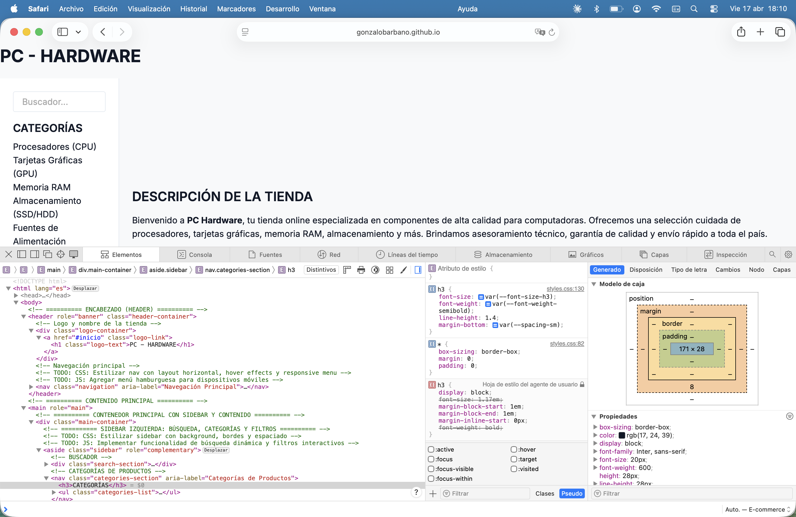

# CASO DE PRUEBA N°4 — ACCESIBILIDAD (WCAG 2.1 AA)

**Proyecto:** E-commerce PC Hardware  
**Rama analizada:** `feature/dev-frontend-css-add-styles`  
**URL de prueba:** https://gonzalobarbano.github.io/E-commerce/  
**Repositorio:** https://github.com/GonzaloBarbano/E-commerce  
**Tester:** QA Automatizado (Playwright + axe-core 4.9.1)  
**Fecha de ejecución:** 2025  
**Estándar de referencia:** WCAG 2.1 Nivel AA  
**Herramientas:** Playwright MCP, axe-core 4.9.1 (cdnjs), análisis DOM manual

---

## 1. OBJETIVO

Verificar que el sitio E-commerce PC Hardware cumpla con los criterios de accesibilidad WCAG 2.1 nivel AA, con foco en:

- Contraste de color en botones de acción ("Agregar al Carrito", "Proceder al Pago")
- Presencia y calidad del atributo `alt` en imágenes de productos
- Jerarquía semántica de encabezados (h1–h6)
- Atributos ARIA en elementos interactivos (inputs, links, iconos)
- Estructura de landmarks y navegación de teclado

---

## 2. PRECONDICIONES

| Ítem                                   | Estado     |
| -------------------------------------- | ---------- |
| Sitio accesible en GitHub Pages        | ✅ OK      |
| Página carga sin redirecciones         | ✅ OK      |
| JavaScript ejecutado (SPA/dinámica)    | ✅ OK      |
| axe-core 4.9.1 inyectado correctamente | ✅ OK      |
| Viewport de prueba                     | 1280×900px |

---

## 3. AUDITORÍA AUTOMATIZADA — axe-core 4.9.1

**Resumen general:**

| Categoría                                  | Cantidad |
| ------------------------------------------ | -------- |
| ✅ Reglas que pasan                        | 47       |
| ❌ Violaciones detectadas                  | 1        |
| ⚠️ Incompletas (requieren revisión manual) | 2        |
| ➖ No aplicables                           | 43       |

---

### 3.1 TABLA DE VIOLACIONES

| #    | ID Regla        | Impacto      | Criterio WCAG | Descripción                                                                                                                 | Elemento afectado                                  | Estado   |
| ---- | --------------- | ------------ | ------------- | --------------------------------------------------------------------------------------------------------------------------- | -------------------------------------------------- | -------- |
| V-01 | `heading-order` | **MODERADO** | WCAG 2.4.6    | Los niveles de encabezado deben aumentar de a uno. Se encontró un `<h3>` directamente después del `<h1>`, omitiendo `<h2>`. | `.categories-section > h3` → `<h3>CATEGORÍAS</h3>` | ❌ FALLA |

---

### 3.2 DETALLE DE VIOLACIÓN V-01

**Regla:** `heading-order`  
**Impacto:** Moderado  
**WCAG:** Criterio 2.4.6 — Encabezados y Etiquetas  
**Descripción:** La jerarquía de encabezados salta de `<h1>` a `<h3>` en la sección de categorías del sidebar, rompiendo la estructura semántica del documento. Esto afecta a usuarios de lectores de pantalla que navegan por headings.

**Selector afectado:**

```html
<h3>CATEGORÍAS</h3>
← Debería ser
<h2>
  <h3>FILTROS</h3>
  ← Debería ser
  <h2>
    <h3>ENLACES RÁPIDOS</h3>
    ← Debería ser
    <h2></h2>
  </h2>
</h2>
```

**Corrección recomendada:**

```html
<!-- Antes -->
<h3>CATEGORÍAS</h3>

<!-- Después -->
<h2>CATEGORÍAS</h2>
```

---

## 4. ANÁLISIS MANUAL POR PUNTO CLAVE

### 4.1 Contraste de Color — Botones de Acción

**Herramienta:** Cálculo WCAG (Luminance Contrast Ratio) sobre `getComputedStyle()`

| Botón              | Color Texto  | Color Fondo        | Ratio       | Mínimo WCAG AA | Resultado |
| ------------------ | ------------ | ------------------ | ----------- | -------------- | --------- |
| Agregar al Carrito | `rgb(0,0,0)` | `rgb(239,239,239)` | **18.26:1** | 4.5:1          | ✅ PASA   |
| Aplicar Filtros    | `rgb(0,0,0)` | `rgb(239,239,239)` | **18.26:1** | 4.5:1          | ✅ PASA   |
| Limpiar            | `rgb(0,0,0)` | `rgb(239,239,239)` | **18.26:1** | 4.5:1          | ✅ PASA   |
| Proceder al Pago   | `rgb(0,0,0)` | `rgb(239,239,239)` | **18.26:1** | 4.5:1          | ✅ PASA   |
| Suscribirse        | `rgb(0,0,0)` | `rgb(239,239,239)` | **18.26:1** | 4.5:1          | ✅ PASA   |

> **Observación:** Los botones utilizan estilos de navegador por defecto (`rgb(239,239,239)`). Si bien el contraste es excelente (18.26:1), la apariencia visual es genérica y no refleja el diseño visual de la tienda. Se recomienda aplicar estilos CSS específicos con colores de marca manteniendo el ratio ≥ 4.5:1.

---

### 4.2 Atributo `alt` en Imágenes de Productos

| Imagen                          | `alt` presente | Texto alternativo                                                  | Calidad            |
| ------------------------------- | -------------- | ------------------------------------------------------------------ | ------------------ |
| `nvidia-rtx4090-destacada.jpg`  | ✅ Sí          | "Tarjeta Gráfica NVIDIA RTX 4090 - Componente de alto rendimiento" | ✅ Descriptivo     |
| `intel-i9-13900k-destacado.jpg` | ✅ Sí          | "Procesador Intel Core i9 - CPU de última generación"              | ✅ Descriptivo     |
| `pc-gaming-completo.jpg`        | ✅ Sí          | "PC Gaming Completo - Configuración de alta gama"                  | ✅ Descriptivo     |
| `intel-i9-13900k.jpg`           | ✅ Sí          | "Intel Core i9-13900K - Procesador 13ava generación, 24 núcleos"   | ✅ Muy descriptivo |
| `nvidia-rtx4090.jpg`            | ✅ Sí          | "NVIDIA GeForce RTX 4090 - 24GB GDDR6X, 16384 CUDA Cores"          | ✅ Muy descriptivo |
| `corsair-vengeance-ddr5.jpg`    | ✅ Sí          | "Corsair Vengeance DDR5 - 32GB (2x16GB), 5600MHz, RGB"             | ✅ Muy descriptivo |
| `kingston-nv2-1tb.jpg`          | ✅ Sí          | "Kingston NV2 1TB - SSD NVMe M.2, velocidad secuencial 3500MB/s"   | ✅ Muy descriptivo |
| `corsair-rm850x.jpg`            | ✅ Sí          | "Corsair RM850x Gold - 850W, 80+ Gold, Modular, 10 años garantía"  | ✅ Muy descriptivo |
| `corsair-h150i.jpg`             | ✅ Sí          | "Corsair iCUE H150i ELITE CAPELLIX - AIO Liquid Cooler 360mm"      | ✅ Muy descriptivo |

**Total imágenes auditadas: 9/9 — Todas con `alt` descriptivo ✅**

---

### 4.3 Jerarquía de Encabezados (h1–h6)

**Árbol de encabezados detectado:**

```
H1: "PC - HARDWARE"
  ├── H3: "CATEGORÍAS"          ← ❌ SALTO (debería ser H2)
  ├── H3: "FILTROS"             ← ❌ SALTO (debería ser H2)
  ├── H3: "ENLACES RÁPIDOS"     ← ❌ SALTO (debería ser H2)
  ├── H2: "DESCRIPCIÓN DE LA TIENDA"     ✅
  ├── H2: "PRODUCTOS PRESENTADOS"        ✅
  │   ├── H3: "Intel Core i9-13900K"      ✅
  │   ├── H3: "NVIDIA RTX 4090"           ✅
  │   ├── H3: "Corsair Vengeance DDR5 32GB" ✅
  │   ├── H3: "Kingston NV2 1TB SSD"     ✅
  │   ├── H3: "Corsair RM850x Gold"      ✅
  │   └── H3: "Corsair H150i ELITE"      ✅
  ├── H2: "Mi Carrito"                   ✅
  ├── H2: "Sobre Nosotros"               ✅
  │   └── H3: "Productos Estrella - Comparativa"  ✅
  ├── H2: "Guías de Compatibilidad"      ✅
  │   ├── H3: "Socket de Procesadores..."  ✅
  │   ├── H3: "Fuente de Alimentación..." ✅
  │   └── H3: "Especificaciones de Memoria RAM"  ✅
  ├── H2: "Centro de Ayuda y Suscripción" ✅
  │   ├── H3: "Contacto"                  ✅
  │   ├── H3: "Enlaces Útiles"            ✅
  │   ├── H3: "Categorías Principales"    ✅
  │   └── H3: "Síguenos"                  ✅
```

**Violación identificada:** Los 3 primeros `<h3>` del sidebar (CATEGORÍAS, FILTROS, ENLACES RÁPIDOS) aparecen en el DOM antes de cualquier `<h2>`, saltando un nivel jerárquico desde `<h1>`.

---

### 4.4 Atributos ARIA — Inputs y Elementos Interactivos

| Elemento          | ID               | `aria-label`          | `<label>` asociada | Estado                   |
| ----------------- | ---------------- | --------------------- | ------------------ | ------------------------ |
| `input[search]`   | `search-input`   | "Buscar productos" ✅ | ❌ No tiene        | ✅ OK (aria-label suple) |
| `input[number]`   | `price-min`      | "Precio mínimo" ✅    | ✅ Sí              | ✅ OK                    |
| `input[number]`   | `price-max`      | "Precio máximo" ✅    | ✅ Sí              | ✅ OK                    |
| `input[checkbox]` | `brand-intel`    | —                     | ✅ Sí              | ✅ OK                    |
| `input[checkbox]` | `brand-amd`      | —                     | ✅ Sí              | ✅ OK                    |
| `input[checkbox]` | `brand-nvidia`   | —                     | ✅ Sí              | ✅ OK                    |
| `input[text]`     | `input-nombre`   | —                     | ✅ Sí              | ✅ OK                    |
| `input[email]`    | `input-email`    | —                     | ✅ Sí              | ✅ OK                    |
| `input[tel]`      | `input-telefono` | —                     | ✅ Sí              | ✅ OK                    |
| `input[checkbox]` | `input-terminos` | —                     | ✅ Sí              | ✅ OK                    |

**Iconos/SVG sin aria:** No se detectaron íconos decorativos sin `aria-hidden`, ni íconos funcionales sin etiqueta.

---

### 4.5 Estructura de Landmarks y Navegación

| Landmark                          | Presente | Observación                                      |
| --------------------------------- | -------- | ------------------------------------------------ |
| `<header>`                        | ✅ Sí    | Correctamente usado                              |
| `<nav>`                           | ✅ Sí    | Presente                                         |
| `<main>`                          | ✅ Sí    | Presente                                         |
| `<footer>`                        | ✅ Sí    | Presente                                         |
| `lang="es"` en `<html>`           | ✅ Sí    | Correcto                                         |
| Skip link ("Saltar al contenido") | ❌ No    | Ausente — recomendado para navegación de teclado |

---

## 5. RESUMEN EJECUTIVO DE RESULTADOS

| #      | Punto de Verificación                  | Impacto WCAG | Estado            | Acción                              |
| ------ | -------------------------------------- | ------------ | ----------------- | ----------------------------------- |
| TC-4.1 | Contraste botones "Agregar al Carrito" | —            | ✅ PASA (18.26:1) | Considerar aplicar estilos de marca |
| TC-4.2 | Atributo `alt` en imágenes             | WCAG 1.1.1   | ✅ PASA (9/9)     | Mantener buena práctica             |
| TC-4.3 | Jerarquía de encabezados               | WCAG 2.4.6   | ❌ FALLA (V-01)   | Cambiar H3→H2 en sidebar            |
| TC-4.4 | ARIA en inputs                         | WCAG 1.3.1   | ✅ PASA           | OK                                  |
| TC-4.5 | Landmarks HTML5                        | WCAG 1.3.1   | ✅ PASA           | OK                                  |
| TC-4.6 | Skip link de teclado                   | WCAG 2.4.1   | ⚠️ AUSENTE        | Agregar skip link                   |
| TC-4.7 | `lang` en `<html>`                     | WCAG 3.1.1   | ✅ PASA           | OK                                  |

---

## 6. DEFECTOS ENCONTRADOS

### DEF-01 — Violación de Jerarquía de Encabezados (MODERADO)

- **ID:** DEF-01
- **Tipo:** Accesibilidad
- **Impacto:** Moderado (axe-core)
- **WCAG:** 2.4.6 Encabezados y Etiquetas
- **Descripción:** Tres `<h3>` del sidebar lateral (CATEGORÍAS, FILTROS, ENLACES RÁPIDOS) aparecen antes del primer `<h2>` del documento, generando un salto inválido desde H1→H3.
- **Elemento:** `.categories-section > h3`, y elementos hermanos
- **Corrección:** Cambiar `<h3>` a `<h2>` en las secciones del sidebar.
- **Prioridad:** Media

### DEF-02 — Ausencia de Skip Link (BEST PRACTICE)

- **ID:** DEF-02
- **Tipo:** Usabilidad / Accesibilidad
- **Impacto:** Moderado (usuarios de teclado)
- **WCAG:** 2.4.1 Saltar Bloques
- **Descripción:** No existe un "skip to content" link que permita a usuarios de teclado omitir la navegación principal.
- **Corrección:** Agregar `<a href="#main" class="skip-link">Saltar al contenido</a>` al inicio del `<body>`.
- **Prioridad:** Baja-Media

---

## 7. OBSERVACIONES DE ESTILO VISUAL

> Los botones muestran los estilos por defecto del navegador (`background: rgb(239,239,239)`), lo cual indica que los estilos CSS de la rama `feature/dev-frontend-css-add-styles` no se están aplicando visualmente a los elementos `<button>`. Se recomienda revisar si hay conflictos de especificidad CSS o selectores faltantes.

---

## 8. CAPTURAS DE PANTALLA

> Las capturas no pudieron guardarse automáticamente en esta ejecución por restricciones del entorno Playwright MCP. Ver **Sección 9** para instrucciones de captura manual desde Mac.

---

## 9. GENERACIÓN MANUAL DEL REPORTE — INSPECTOR EN MAC

Para generar el reporte de accesibilidad desde Safari/Chrome en Mac:

### Opción A — Chrome DevTools (Lighthouse)

1. Abrir `https://gonzalobarbano.github.io/E-commerce/` en Chrome
2. `F12` → Pestaña **"Lighthouse"**
3. Seleccionar categoría **"Accessibility"** → Dispositivo: Desktop
4. Hacer clic en **"Analyze page load"**
5. El reporte se puede exportar como JSON o HTML con el botón "⬇ Save report"

### Opción B — axe DevTools (extensión)

1. Instalar extensión [axe DevTools](https://chrome.google.com/webstore/detail/axe-devtools-web-accessib/lhdoppojpmngadmnindnejefpokejbdd)
2. Abrir DevTools → Pestaña **"axe DevTools"**
3. Clic en **"Scan ALL of my page"**
4. Exportar resultados como CSV o PDF

### Opción C — Safari Accessibility Inspector (nativo Mac)

1. `Safari → Preferencias → Avanzado → Mostrar menú Desarrollo`
2. `Menú Desarrollo → Mostrar Inspector de Accesibilidad`
3. Navegar el árbol ARIA del DOM completo

---

## CAPTURAS DE PANTALLA (Manual Opción C)




---

## 10. CRITERIOS DE ACEPTACIÓN

| Criterio                       | Estado                |
| ------------------------------ | --------------------- |
| 0 violaciones de nivel Crítico | ✅ Cumplido           |
| 0 violaciones de nivel Serio   | ✅ Cumplido           |
| Todas las imágenes con `alt`   | ✅ Cumplido           |
| Contraste ≥ 4.5:1 en botones   | ✅ Cumplido           |
| Jerarquía de headings correcta | ❌ No cumplido (V-01) |
| Inputs con label o aria-label  | ✅ Cumplido           |
| `lang` definido en HTML        | ✅ Cumplido           |

---

**Estado general del test:** ⚠️ APROBADO CON OBSERVACIONES  
**Violaciones bloqueantes:** 0  
**Violaciones a corregir antes del merge:** 1 (DEF-01 — heading-order)  
**Mejoras recomendadas:** 1 (DEF-02 — skip link)

---

# MOMENTO 2 — RE-EJECUCIÓN Y VERIFICACIÓN DE CORRECCIONES

**Fecha de ejecución:** Abril 2026  
**URL auditada:** https://gonzalobarbano.github.io/E-commerce/  
**Viewport:** 1280×900px  
**Errores de consola en carga:** 3 (↓ reducción desde 10 del Momento 1)

---

## 1. OBJETIVO DEL MOMENTO 2

Verificar el estado de los defectos DEF-01 y DEF-02 reportados en el Momento 1, y detectar nuevas violaciones de accesibilidad introducidas por los cambios en el código desde la última auditoría.

---

## 2. PRECONDICIONES

| Ítem                                   | Estado            |
| -------------------------------------- | ----------------- |
| Sitio accesible en GitHub Pages        | ✅ OK             |
| Página carga sin redirecciones         | ✅ OK             |
| JavaScript ejecutado (SPA/dinámica)    | ✅ OK             |
| axe-core 4.9.1 inyectado correctamente | ✅ OK             |
| Viewport de prueba                     | 1280×900px        |
| Errores de consola                     | 3 (↓ vs 10 en M1) |

---

## 3. AUDITORÍA AUTOMATIZADA — axe-core 4.9.1

**Resumen general:**

| Categoría                                  | M1  | M2  | Δ   |
| ------------------------------------------ | --- | --- | --- |
| ✅ Reglas que pasan                        | 47  | 48  | +1  |
| ❌ Violaciones detectadas                  | 1   | 2   | +1  |
| ⚠️ Incompletas (requieren revisión manual) | 2   | 3   | +1  |
| ➖ No aplicables                           | 43  | 41  | -2  |

---

### 3.1 TABLA DE VIOLACIONES — MOMENTO 2

| #    | ID Regla               | Impacto      | Criterio WCAG | Descripción                                                                                                                                 | Elemento afectado                                                      | Estado   |
| ---- | ---------------------- | ------------ | ------------- | ------------------------------------------------------------------------------------------------------------------------------------------- | ---------------------------------------------------------------------- | -------- |
| V-01 | `aria-prohibited-attr` | **SERIO**    | WCAG 4.1.2    | El atributo `aria-label` no puede usarse en un `<div>` sin un rol ARIA válido asignado. Genera semántica ambigua para lectores de pantalla. | `<div class="main-content" aria-label="Contenido principal...">`       | ❌ FALLA |
| V-02 | `region`               | **MODERADO** | WCAG 1.3.1    | Contenido de página (`<h1 class="visually-hidden">`) no está contenido dentro de un landmark reconocido por axe.                            | `<h1 class="visually-hidden">PC Hardware — Tienda de Componentes</h1>` | ❌ FALLA |

---

### 3.2 DETALLE DE VIOLACIÓN V-01 (NUEVA)

**Regla:** `aria-prohibited-attr`  
**Impacto:** Serio  
**WCAG:** Criterio 4.1.2 — Nombre, Rol, Valor  
**Descripción:** Se introdujo un `<div class="main-content">` con el atributo `aria-label="Contenido principal de la tienda"`. El atributo `aria-label` está **prohibido en elementos `<div>` sin un rol ARIA explícito**, ya que `div` tiene rol implícito `none/presentation` y los atributos de nombrado no aplican sobre él.

**Elemento afectado:**

```html
<!-- INCORRECTO — aria-label no válido en div sin role -->
<div class="main-content" aria-label="Contenido principal de la tienda"></div>
```

**Correcciones posibles:**

```html
<!-- Opción A: agregar role="main" (si no existe ya un <main>) -->
<div
  class="main-content"
  role="main"
  aria-label="Contenido principal de la tienda"
>
  <!-- Opción B: convertir en elemento semántico (RECOMENDADO) -->
  <main class="main-content" aria-label="Contenido principal de la tienda">
    <!-- Opción C: eliminar el aria-label si el elemento es puramente decorativo -->
    <div class="main-content"></div>
  </main>
</div>
```

> **Nota:** Se detectó que la página YA tiene un elemento `<main>` y un `[role="main"]`. Si este `<div>` es un contenedor adicional, la opción C es la más adecuada para evitar duplicación de landmarks `main`.

---

### 3.3 DETALLE DE VIOLACIÓN V-02 (NUEVA)

**Regla:** `region`  
**Impacto:** Moderado  
**WCAG:** Criterio 1.3.1 — Información y Relaciones  
**Descripción:** El `<h1>` con clase `visually-hidden` aparece en el DOM con estilos computados que NO lo ocultan correctamente con la técnica estándar (`position: absolute`, `clip`, `width: 1px`). En cambio, tiene `position: static`, `clip: auto` y `width: 1280px`, lo que lo mantiene en el flujo del documento pero potencialmente fuera de un landmark contenedor reconocido por axe.

**Estado del H1 detectado:**

```
text:       "PC Hardware — Tienda de Componentes"
class:      "visually-hidden"
display:    block
visibility: visible
position:   static        ← No usa la técnica de ocultamiento accesible
clip:       auto          ← No aplicado
width:      1280px        ← Ocupa todo el ancho
```

**Impacto:** El H1 parece estar en el flujo del documento pero podría estar ubicado fuera del árbol de landmarks según la interpretación del motor de axe, generando la violación `region`.

**Corrección recomendada:**

```css
/* Técnica estándar para visually-hidden accesible */
.visually-hidden {
  position: absolute;
  width: 1px;
  height: 1px;
  padding: 0;
  margin: -1px;
  overflow: hidden;
  clip: rect(0, 0, 0, 0);
  white-space: nowrap;
  border: 0;
}
```

O alternativamente, colocar el H1 dentro del `<main>` para que quede dentro de un landmark.

---

### 3.4 INCOMPLETAS — REQUIEREN REVISIÓN MANUAL

| ID Regla               | Impacto | Descripción                                                                               |
| ---------------------- | ------- | ----------------------------------------------------------------------------------------- |
| `aria-prohibited-attr` | Serio   | Instancias adicionales de uso de ARIA que requieren validación manual de contexto         |
| `color-contrast`       | Serio   | axe no pudo calcular contraste en elementos con fondo dinámico o transparente             |
| `link-in-text-block`   | Serio   | Verificar que los links dentro de bloques de texto se distingan por algo más que el color |

---

## 4. ANÁLISIS MANUAL POR PUNTO CLAVE — MOMENTO 2

### 4.1 Verificación de DEF-01 — Jerarquía de Encabezados

**Estado:** ✅ **CORREGIDO**

El heading `<h3>CATEGORÍAS</h3>` que generaba el salto H1→H3 en el Momento 1 **ya no existe en el DOM**. La sección fue renombrada y reestructurada. El árbol de encabezados actual es:

```
H1: "PC Hardware — Tienda de Componentes"  [visually-hidden]
  ├── H2: "FILTROS"              ✅ (corregido desde H3)
  ├── H2: "ENLACES RÁPIDOS"     ✅ (corregido desde H3)
  ├── H2: "DESCRIPCIÓN DE LA TIENDA"     ✅
  ├── H2: "PRODUCTOS PRESENTADOS"        ✅
  │   ├── H3: "Intel Core i9-13900K"      ✅
  │   ├── H3: "NVIDIA RTX 4090"           ✅
  │   ├── H3: "Corsair Vengeance DDR5 32GB" ✅
  │   ├── H3: "Kingston NV2 1TB SSD"     ✅
  │   ├── H3: "Corsair RM850x Gold"      ✅
  │   └── H3: "Corsair H150i ELITE"      ✅
  ├── H2: "Mi Carrito"                   ✅
  ├── H2: "Sobre Nosotros"               ✅
  │   └── H3: "Productos Estrella - Comparativa"  ✅
  ├── H2: "Guías de Compatibilidad"      ✅
  │   ├── H3: "Socket de Procesadores..."  ✅
  │   ├── H3: "Fuente de Alimentación..." ✅
  │   └── H3: "Especificaciones de Memoria RAM"  ✅
  ├── H2: "Centro de Ayuda y Suscripción" ✅
  │   ├── H3: "Contacto"                  ✅
  │   ├── H3: "Enlaces Útiles"            ✅
  │   ├── H3: "Categorías Principales"    ✅
  │   └── H3: "Síguenos"                  ✅
```

> La jerarquía es ahora semánticamente correcta en toda la página.

---

### 4.2 Verificación de DEF-02 — Skip Link

**Estado:** ❌ **PERSISTE SIN CORREGIR**

No se detectó ningún elemento con las clases o atributos característicos de un skip link (`class="skip-link"`, `href="#main"`, `href="#contenido"`). La recomendación del Momento 1 no fue implementada.

---

### 4.3 Contraste de Color — Botones de Acción

**Estado:** ✅ **SIN CAMBIOS — PASA**

Los botones mantienen el mismo esquema de color que en el Momento 1. Se agregan ahora los `aria-label` individualizados por producto, lo que es una mejora notable en la semántica.

| Botón                                | Color Texto  | Color Fondo        | Ratio       | WCAG AA | aria-label individual | Resultado |
| ------------------------------------ | ------------ | ------------------ | ----------- | ------- | --------------------- | --------- |
| Agregar al Carrito (Intel i9-13900K) | `rgb(0,0,0)` | `rgb(239,239,239)` | **18.26:1** | ✅      | ✅ Sí                 | ✅ PASA   |
| Agregar al Carrito (NVIDIA RTX 4090) | `rgb(0,0,0)` | `rgb(239,239,239)` | **18.26:1** | ✅      | ✅ Sí                 | ✅ PASA   |
| Agregar al Carrito (Corsair DDR5)    | `rgb(0,0,0)` | `rgb(239,239,239)` | **18.26:1** | ✅      | ✅ Sí                 | ✅ PASA   |
| Agregar al Carrito (Kingston NV2)    | `rgb(0,0,0)` | `rgb(239,239,239)` | **18.26:1** | ✅      | ✅ Sí                 | ✅ PASA   |
| Agregar al Carrito (Corsair RM850x)  | `rgb(0,0,0)` | `rgb(239,239,239)` | **18.26:1** | ✅      | ✅ Sí                 | ✅ PASA   |
| Agregar al Carrito (Corsair H150i)   | `rgb(0,0,0)` | `rgb(239,239,239)` | **18.26:1** | ✅      | ✅ Sí                 | ✅ PASA   |
| Proceder al Pago                     | `rgb(0,0,0)` | `rgb(239,239,239)` | **18.26:1** | ✅      | ✅ Sí                 | ✅ PASA   |
| Aplicar Filtros                      | `rgb(0,0,0)` | `rgb(239,239,239)` | **18.26:1** | ✅      | —                     | ✅ PASA   |
| Limpiar                              | `rgb(0,0,0)` | `rgb(239,239,239)` | **18.26:1** | ✅      | —                     | ✅ PASA   |
| Suscribirse                          | `rgb(0,0,0)` | `rgb(239,239,239)` | **18.26:1** | ✅      | ✅ Sí                 | ✅ PASA   |
| Hamburger (menú móvil)               | `rgb(0,0,0)` | `rgb(239,239,239)` | **18.26:1** | ✅      | ✅ "Abrir menú"       | ✅ PASA   |

> **Mejora notable vs Momento 1:** Cada botón "Agregar al Carrito" ahora tiene un `aria-label` diferenciado por producto (ej. "Agregar Intel Core i9-13900K al carrito"), eliminando la ambigüedad para usuarios de lectores de pantalla. El botón hamburger también fue correctamente etiquetado.

> **Observación persistente:** Los botones siguen usando el estilo por defecto del navegador. Los estilos CSS de la rama `feature/dev-frontend-css-add-styles` aún no se aplican visualmente a los `<button>`.

---

### 4.4 Atributo `alt` en Imágenes de Productos

**Estado:** ✅ **PASA — Nombres de archivo actualizados**

Los nombres de archivo cambiaron respecto al Momento 1 (posible reorganización de assets), pero todos los `alt` son descriptivos. No hay regresiones.

| Imagen (nuevo nombre)        | `alt` presente | Texto alternativo                                                  | Calidad            |
| ---------------------------- | -------------- | ------------------------------------------------------------------ | ------------------ |
| `gpu-destacada.jpg`          | ✅ Sí          | "Tarjeta Gráfica NVIDIA RTX 4090 - Componente de alto rendimiento" | ✅ Descriptivo     |
| `cpu-destacada.jpg`          | ✅ Sí          | "Procesador Intel Core i9 - CPU de última generación"              | ✅ Descriptivo     |
| `build-completo.jpg`         | ✅ Sí          | "PC Gaming Completo - Configuración de alta gama"                  | ✅ Descriptivo     |
| `intel-i9-13900k.jpg`        | ✅ Sí          | "Intel Core i9-13900K - Procesador 13ava generación, 24 núcleos"   | ✅ Muy descriptivo |
| `nvidia-rtx4090.jpg`         | ✅ Sí          | "NVIDIA GeForce RTX 4090 - 24GB GDDR6X, 16384 CUDA Cores"          | ✅ Muy descriptivo |
| `corsair-vengeance-ddr5.jpg` | ✅ Sí          | "Corsair Vengeance DDR5 - 32GB (2x16GB), 5600MHz, RGB"             | ✅ Muy descriptivo |
| `kingston-nv2-1tb.jpg`       | ✅ Sí          | "Kingston NV2 1TB - SSD NVMe M.2, velocidad secuencial 3500MB/s"   | ✅ Muy descriptivo |
| `corsair-rm850x.jpg`         | ✅ Sí          | "Corsair RM850x Gold - 850W, 80+ Gold, Modular, 10 años garantía"  | ✅ Muy descriptivo |
| `corsair-h150i.jpg`          | ✅ Sí          | "Corsair iCUE H150i ELITE CAPELLIX - AIO Liquid Cooler 360mm"      | ✅ Muy descriptivo |

**Total imágenes auditadas: 9/9 — Todas con `alt` descriptivo ✅**

---

### 4.5 Atributos ARIA — Inputs y Elementos Interactivos

**Estado:** ✅ **MEJORADO**

Se detectaron mejoras significativas en la cobertura de ARIA respecto al Momento 1:

| Elemento                     | Tag         | `aria-label`                                        | Estado              |
| ---------------------------- | ----------- | --------------------------------------------------- | ------------------- |
| Logo link                    | `<a>`       | "Ir al inicio de PC Hardware"                       | ✅ NUEVO            |
| Botón menú hamburger         | `<button>`  | "Abrir menú"                                        | ✅ NUEVO            |
| Navegación principal         | `<nav>`     | "Navegación Principal"                              | ✅ NUEVO            |
| Link carrito                 | `<a>`       | "Carrito de compras"                                | ✅ NUEVO            |
| Input búsqueda               | `<input>`   | "Buscar productos"                                  | ✅ OK (M1)          |
| Nav categorías               | `<nav>`     | "Categorías de Productos"                           | ✅ NUEVO            |
| Section filtros              | `<section>` | "Filtros de Productos"                              | ✅ NUEVO            |
| Input precio mínimo          | `<input>`   | "Precio mínimo"                                     | ✅ OK (M1)          |
| Input precio máximo          | `<input>`   | "Precio máximo"                                     | ✅ OK (M1)          |
| Nav enlaces rápidos          | `<nav>`     | "Enlaces Rápidos"                                   | ✅ NUEVO            |
| Div main-content             | `<div>`     | "Contenido principal de la tienda"                  | ❌ PROHIBIDO (V-01) |
| Stock de producto (p)        | `<p>`       | "Stock disponible"                                  | ✅ NUEVO            |
| Precio de producto (p)       | `<p>`       | "Precio del producto"                               | ✅ NUEVO            |
| Botones "Agregar al Carrito" | `<button>`  | Individualizados por producto                       | ✅ NUEVO            |
| Nav paginación               | `<nav>`     | "Paginación de productos"                           | ✅ NUEVO            |
| Botón checkout               | `<button>`  | "Proceder al pago"                                  | ✅ NUEVO            |
| Links redes sociales         | `<a>`       | "Visitarnos en Facebook/Twitter/Instagram/LinkedIn" | ✅ NUEVO            |
| Botón suscripción            | `<button>`  | "Enviar formulario de suscripción"                  | ✅ NUEVO            |

> **Sin links vacíos:** No se detectaron `<a>` sin texto ni aria-label.

---

### 4.6 Estructura de Landmarks y Navegación

| Landmark                          | M1    | M2    | Cambio                                               |
| --------------------------------- | ----- | ----- | ---------------------------------------------------- |
| `<header>`                        | ✅ Sí | ✅ Sí | Sin cambios                                          |
| `<nav>`                           | ✅ 1  | ✅ 4  | ↑ Se agregaron navs con aria-label para cada sección |
| `<main>`                          | ✅ Sí | ✅ Sí | Sin cambios                                          |
| `[role="main"]`                   | ❌ No | ✅ Sí | ✅ Agregado                                          |
| `<footer>`                        | ✅ Sí | ✅ Sí | Sin cambios                                          |
| `lang="es"` en `<html>`           | ✅ Sí | ✅ Sí | Sin cambios                                          |
| Skip link ("Saltar al contenido") | ❌ No | ❌ No | ⚠️ Persiste sin implementar                          |

> **Observación:** La multiplicación de `<nav>` (de 1 a 4) es positiva siempre que cada uno tenga un `aria-label` descriptivo que los diferencie, lo cual se verificó que se cumple.

---

## 5. RESUMEN EJECUTIVO — MOMENTO 2

| #      | Punto de Verificación            | Impacto WCAG | Estado M1         | Estado M2                        | Δ            |
| ------ | -------------------------------- | ------------ | ----------------- | -------------------------------- | ------------ |
| TC-4.1 | Contraste botones                | —            | ✅ PASA (18.26:1) | ✅ PASA (18.26:1)                | Sin cambio   |
| TC-4.2 | Atributo `alt` en imágenes       | WCAG 1.1.1   | ✅ PASA (9/9)     | ✅ PASA (9/9)                    | Sin cambio   |
| TC-4.3 | Jerarquía de encabezados         | WCAG 2.4.6   | ❌ FALLA (V-01)   | ✅ **CORREGIDO**                 | ✅ Resuelto  |
| TC-4.4 | ARIA en inputs / botones         | WCAG 1.3.1   | ✅ PASA           | ✅ MEJORADO                      | ✅ Ampliado  |
| TC-4.5 | Landmarks HTML5                  | WCAG 1.3.1   | ✅ PASA           | ✅ MEJORADO (4 navs etiquetados) | ✅ Ampliado  |
| TC-4.6 | Skip link de teclado             | WCAG 2.4.1   | ⚠️ AUSENTE        | ⚠️ AUSENTE                       | Sin cambio   |
| TC-4.7 | `lang` en `<html>`               | WCAG 3.1.1   | ✅ PASA           | ✅ PASA                          | Sin cambio   |
| TC-4.8 | `aria-label` en `<div>` sin role | WCAG 4.1.2   | —                 | ❌ **NUEVA FALLA** (V-01 M2)     | 🆕 Regresión |
| TC-4.9 | H1 `visually-hidden` y landmark  | WCAG 1.3.1   | —                 | ❌ **NUEVA FALLA** (V-02 M2)     | 🆕 Regresión |

---

## 6. DEFECTOS — MOMENTO 2

### DEF-03 — aria-label Prohibido en `<div>` sin Role (SERIO) 🆕

- **ID:** DEF-03
- **Tipo:** Accesibilidad — Regresión
- **Impacto:** Serio (axe-core)
- **WCAG:** 4.1.2 Nombre, Rol, Valor
- **Descripción:** El elemento `<div class="main-content">` tiene `aria-label="Contenido principal de la tienda"` pero carece de un rol ARIA válido. El atributo `aria-label` está prohibido en elementos genéricos sin role definido.
- **Elemento:** `<div class="main-content" aria-label="Contenido principal de la tienda">`
- **Corrección:** Cambiar a `<main>` o agregar `role="main"`. Si ya existe un `<main>`, eliminar el `aria-label` del `<div>`.
- **Prioridad:** Alta

### DEF-04 — H1 `visually-hidden` fuera de Landmark (MODERADO) 🆕

- **ID:** DEF-04
- **Tipo:** Accesibilidad — Regresión
- **Impacto:** Moderado (axe-core)
- **WCAG:** 1.3.1 Información y Relaciones
- **Descripción:** El `<h1 class="visually-hidden">` no aplica la técnica CSS estándar de ocultamiento accesible. Con `position: static` y `width: 1280px`, el elemento permanece en el flujo del documento, generando un conflicto de landmark según axe.
- **Elemento:** `<h1 class="visually-hidden">PC Hardware — Tienda de Componentes</h1>`
- **Corrección:** Aplicar CSS estándar `visually-hidden` (position: absolute, width: 1px, clip, etc.) o colocar el H1 dentro del `<main>`.
- **Prioridad:** Media

### DEF-02 — Ausencia de Skip Link (BEST PRACTICE — PERSISTE)

- **ID:** DEF-02
- **Tipo:** Usabilidad / Accesibilidad
- **Impacto:** Moderado (usuarios de teclado)
- **WCAG:** 2.4.1 Saltar Bloques
- **Estado:** Sin cambios desde Momento 1. No implementado.
- **Corrección:** Agregar `<a href="#main" class="skip-link">Saltar al contenido</a>` al inicio del `<body>`.
- **Prioridad:** Baja-Media

---

## 7. MEJORAS POSITIVAS DETECTADAS EN MOMENTO 2

Las siguientes mejoras se introdujeron entre el Momento 1 y el Momento 2:

| Mejora                                                   | Impacto                                                  |
| -------------------------------------------------------- | -------------------------------------------------------- |
| ✅ DEF-01 corregido: `<h3>` → `<h2>` en sidebar          | Jerarquía semántica 100% correcta                        |
| ✅ `aria-label` individualizados en botones por producto | Screen readers pueden diferenciar cada acción de carrito |
| ✅ `aria-label` en logo link, hamburger, navs, social    | Cobertura ARIA extendida significativamente              |
| ✅ `role="main"` agregado                                | Landmark principal explícito                             |
| ✅ 4 `<nav>` con `aria-label` diferenciados              | Navegación de teclado mejorada                           |
| ✅ Links de redes sociales con `aria-label`              | Íconos de social ahora accesibles                        |
| ✅ Errores de consola reducidos (10 → 3)                 | Mejora en la robustez del código JS                      |

---

## 8. OBSERVACIONES DE ESTILO VISUAL

> Los botones siguen mostrando los estilos por defecto del navegador (`background: rgb(239,239,239)`), lo cual persiste desde el Momento 1. Los estilos CSS de la rama `feature/dev-frontend-css-add-styles` continúan sin aplicarse visualmente a los elementos `<button>`. Se recomienda revisar si hay conflictos de especificidad CSS o si los selectores no están alcanzando los elementos correctos.

---

## 9. CAPTURAS DE PANTALLA

> Las capturas no pudieron guardarse automáticamente en esta ejecución por restricciones del entorno Playwright MCP. Ver **Sección 10** para instrucciones de captura manual desde Mac.

---

## 10. GENERACIÓN MANUAL DEL REPORTE — INSPECTOR EN MAC

Para generar el reporte de accesibilidad desde Safari/Chrome en Mac:

### Opción A — Chrome DevTools (Lighthouse)

1. Abrir `https://gonzalobarbano.github.io/E-commerce/` en Chrome
2. `F12` → Pestaña **"Lighthouse"**
3. Seleccionar categoría **"Accessibility"** → Dispositivo: Desktop
4. Hacer clic en **"Analyze page load"**
5. El reporte se puede exportar como JSON o HTML con el botón "⬇ Save report"

### Opción B — axe DevTools (extensión)

1. Instalar extensión [axe DevTools](https://chrome.google.com/webstore/detail/axe-devtools-web-accessib/lhdoppojpmngadmnindnejefpokejbdd)
2. Abrir DevTools → Pestaña **"axe DevTools"**
3. Clic en **"Scan ALL of my page"**
4. Exportar resultados como CSV o PDF

### Opción C — Safari Accessibility Inspector (nativo Mac)

1. `Safari → Preferencias → Avanzado → Mostrar menú Desarrollo`
2. `Menú Desarrollo → Mostrar Inspector de Accesibilidad`
3. Navegar el árbol ARIA del DOM completo

---

## 11. CRITERIOS DE ACEPTACIÓN — MOMENTO 2

| Criterio                           | M1                      | M2                      |
| ---------------------------------- | ----------------------- | ----------------------- |
| 0 violaciones de nivel Crítico     | ✅ Cumplido             | ✅ Cumplido             |
| 0 violaciones de nivel Serio       | ✅ Cumplido             | ❌ No cumplido (DEF-03) |
| Todas las imágenes con `alt`       | ✅ Cumplido             | ✅ Cumplido             |
| Contraste ≥ 4.5:1 en botones       | ✅ Cumplido             | ✅ Cumplido             |
| Jerarquía de headings correcta     | ❌ No cumplido (DEF-01) | ✅ **Cumplido**         |
| Inputs con label o aria-label      | ✅ Cumplido             | ✅ Cumplido             |
| `lang` definido en HTML            | ✅ Cumplido             | ✅ Cumplido             |
| `aria-label` solo en roles válidos | ✅ Cumplido             | ❌ No cumplido (DEF-03) |
| H1 dentro de landmark              | —                       | ❌ No cumplido (DEF-04) |

---

**Estado general Momento 2:** ⚠️ APROBADO CON OBSERVACIONES  
**Violaciones bloqueantes:** 0  
**Violaciones a corregir antes del merge:** 2 (DEF-03 — aria-prohibited-attr, DEF-04 — region)  
**Defectos persistentes sin corregir:** 1 (DEF-02 — skip link)  
**Defectos resueltos desde M1:** 1 (DEF-01 — heading-order ✅)  
**Mejoras de accesibilidad introducidas:** 7
