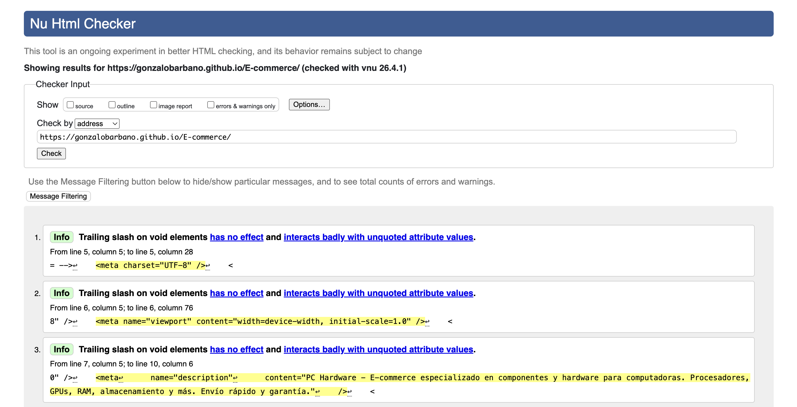
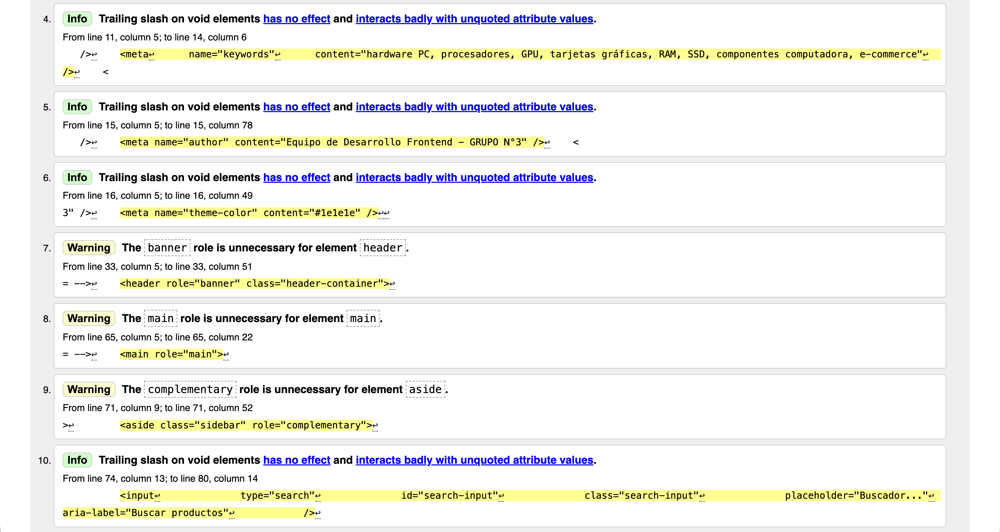
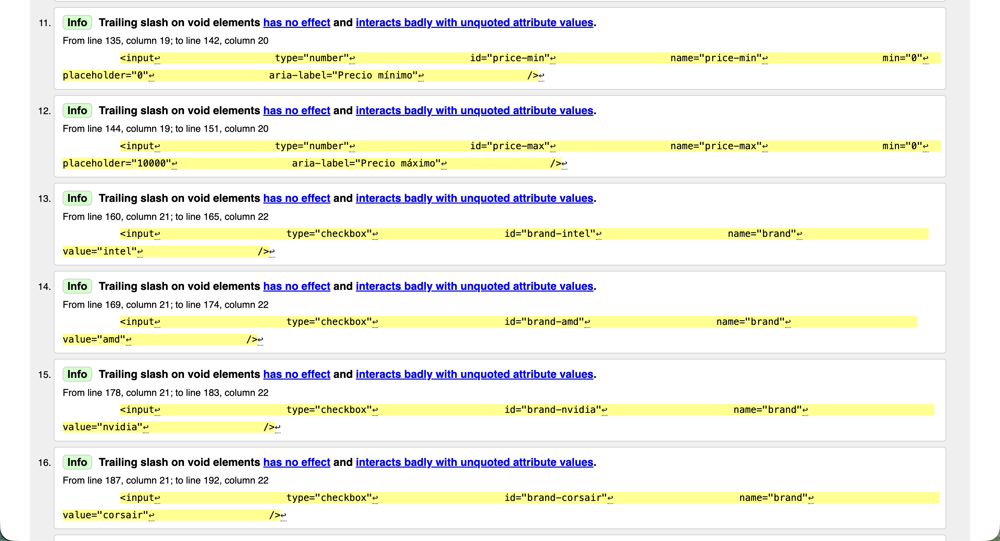
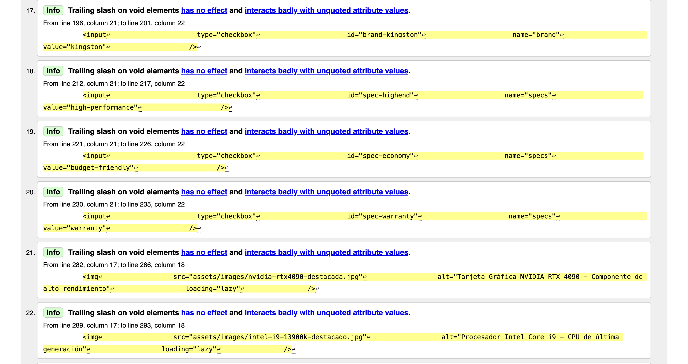
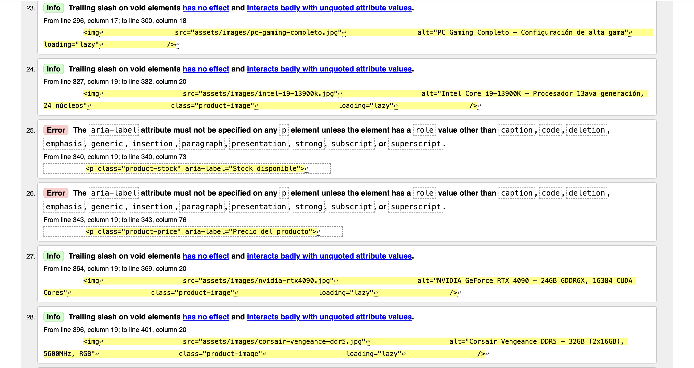
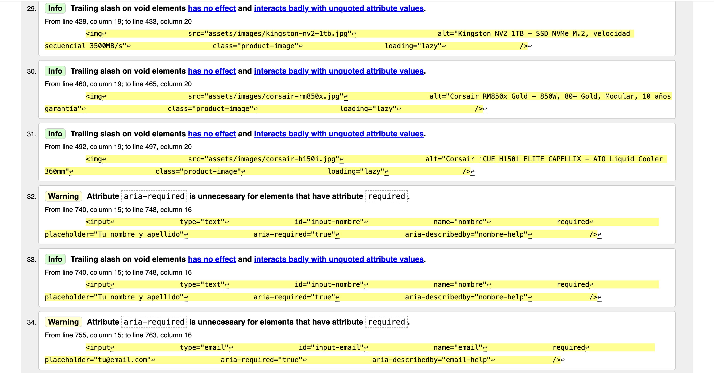
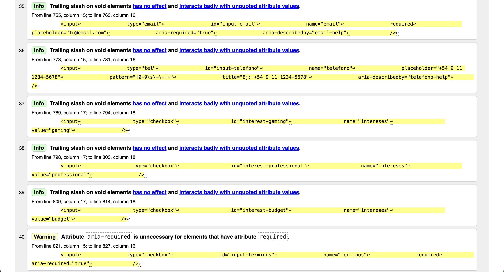
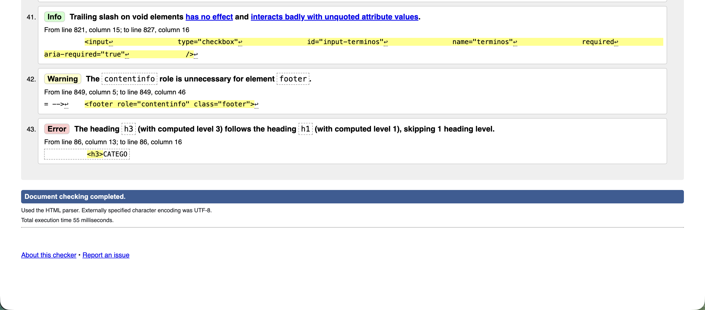

# Test Case 5 — Momento 1: Estructura Semántica y Validación W3C

| Campo                  | Detalle                                                 |
| ---------------------- | ------------------------------------------------------- |
| **ID**                 | TC-005                                                  |
| **Módulo**             | Estructura HTML — Semántica y Estándares W3C            |
| **Rama analizada**     | `feature/dev-frontend-css-add-styles`                   |
| **Entorno**            | https://gonzalobarbano.github.io/E-commerce/            |
| **Fecha de ejecución** | 2026-04-17                                              |
| **Tester**             | QA Automatizado (Claude + GitHub MCP)                   |
| **Resultado global**   | ⚠️ PASS con Warnings — Sin errores críticos de sintaxis |

---

## 1. Esquema de Estructura Semántica Detectada

```
html[lang="es"]
└── head
│   ├── meta[charset="UTF-8"]
│   ├── meta[name="viewport"]
│   ├── meta[name="description"] / keywords / author / theme-color
│   ├── title: "PC Hardware"
│   ├── link[preconnect] ×2 (Google Fonts)
│   └── link[stylesheet] styles.css / components.css / responsive.css
└── body
    ├── header[role="banner"]
    │   ├── div.logo-container > a > h1        ⚠️ WARNING-1
    │   └── nav[aria-label="Navegación Principal"]
    │       └── ul > li ×5 > a
    ├── main[role="main"]
    │   ├── div.main-container
    │   │   ├── aside[role="complementary"]
    │   │   │   ├── input[type="search"][aria-label]
    │   │   │   ├── nav[aria-label="Categorías"]  ⚠️ WARNING-2
    │   │   │   │   ├── h3 "CATEGORÍAS"
    │   │   │   │   └── ul > li ×7 > a
    │   │   │   ├── section[aria-label="Filtros"]
    │   │   │   │   └── form#filters-form
    │   │   │   │       └── fieldset ×3 + legend
    │   │   │   └── nav[aria-label="Enlaces Rápidos"]
    │   │   │       └── ul > li ×2 > a
    │   │   └── div.main-content               ⚠️ WARNING-3
    │   │       ├── section#inicio
    │   │       │   ├── h2 "DESCRIPCIÓN DE LA TIENDA"
    │   │       │   ├── figure ×3 > img[alt][loading=lazy]  ⚠️ WARNING-6
    │   │       │   └── a.btn-primary
    │   │       ├── section#tienda
    │   │       │   ├── h2 "PRODUCTOS PRESENTADOS"
    │   │       │   ├── article ×6  ✅
    │   │       │   │   ├── img[alt][loading]
    │   │       │   │   ├── h3.product-name
    │   │       │   │   └── button[type=button][aria-label]
    │   │       │   └── nav[aria-label="Paginación"]
    │   │       └── section#carrito
    │   │           ├── h2 "Mi Carrito"
    │   │           ├── table > caption + thead[scope=col] + tbody  ✅
    │   │           └── button.btn-checkout[aria-label]
    │   ├── section#nosotros
    │   │   ├── h2 "Sobre Nosotros"
    │   │   ├── h3 "Productos Estrella"         ⚠️ WARNING-4
    │   │   └── table > caption + thead[scope=col] + tbody  ✅
    │   ├── section#compatibilidad
    │   │   ├── h2 "Guías de Compatibilidad"
    │   │   └── article.guide-card ×3  ✅
    │   └── section#ayuda
    │       ├── h2 "Centro de Ayuda y Suscripción"
    │       └── form#newsletter-form
    │           └── fieldset > fieldset anidado  ⚠️ WARNING-5
    └── footer[role="contentinfo"]
        ├── div.footer-container
        │   └── section.footer-section ×4
        │       ├── h3 ×4
        │       ├── address  ✅
        │       └── ul > li > a[rel=noopener noreferrer]  ✅
        └── div.footer-bottom > p copyright
```

---

## 2. Checklist de Etiquetas Semánticas HTML5

| Etiqueta              | Presente | Correcto | Observación                                  |
| --------------------- | -------- | -------- | -------------------------------------------- |
| `<header>`            | ✅       | ✅       | `role="banner"` redundante pero válido       |
| `<nav>`               | ✅       | ✅       | 4 instancias con `aria-label` diferenciado   |
| `<main>`              | ✅       | ✅       | `role="main"` redundante pero válido         |
| `<section>`           | ✅       | ⚠️       | `h3` suelto en `#nosotros` — WARNING-4       |
| `<article>`           | ✅       | ✅       | product-cards y guide-cards                  |
| `<aside>`             | ✅       | ✅       | `role="complementary"` correcto              |
| `<footer>`            | ✅       | ✅       | `role="contentinfo"` redundante pero válido  |
| `<figure>`            | ✅       | ⚠️       | Sin `<figcaption>` — WARNING-6               |
| `<address>`           | ✅       | ✅       | Correctamente usado en footer                |
| `<h1>`                | ✅       | ⚠️       | Logo dentro de `<a>` — WARNING-1             |
| `<h2>`                | ✅       | ✅       | Una por sección, jerarquía correcta          |
| `<h3>`                | ✅       | ⚠️       | Caso suelto en `#nosotros` — WARNING-4       |
| `<fieldset>/<legend>` | ✅       | ✅       | Bien aplicado en formularios                 |
| `<label>`             | ✅       | ✅       | Vinculado con `for`/`id` en todos los inputs |
| `<table>`             | ✅       | ✅       | Con `<caption>`, `<thead>`, `scope="col"`    |

---

## 3. Resultados — Warnings y Errors

### 🔴 ERRORS: 0

No se detectaron errores de sintaxis HTML5. El documento es parseable y válido.

---

### ⚠️ WARNINGS: 6

#### WARNING-1 — `<h1>` como texto de logo dentro de `<a>`

- **Ubicación:** `header > div.logo-container > a > h1`
- **Código actual:**

```html
<a href="#inicio" class="logo-link">
  <h1 class="logo-text">PC - HARDWARE</h1>
</a>
```

- **Problema:** El `h1` envuelto en un enlace es anunciado por lectores de pantalla como "enlace, encabezado nivel 1". El texto del logo tampoco describe semánticamente el contenido de la página.
- **Corrección:**

```html
<h1 class="visually-hidden">PC Hardware — Tienda de Componentes</h1>
<a href="#inicio" class="logo-link" aria-label="Ir al inicio de PC Hardware">
  <span class="logo-text" aria-hidden="true">PC - HARDWARE</span>
</a>
```

- **Severidad:** 🟡 MEDIA — Impacto en SEO y accesibilidad.

---

#### WARNING-2 — `<h3>` dentro de `<nav>` en sidebar

- **Ubicación:** `aside > nav.categories-section > h3`
- **Problema:** El `aria-label` del `<nav>` ya identifica el bloque. El `h3` genera jerarquía innecesaria que puede confundir a tecnologías asistivas.
- **Corrección:** Reemplazar el `h3` por un `p` con estilo visual de título, o eliminarlo.
- **Severidad:** 🟢 BAJA.

---

#### WARNING-3 — `<div class="main-content">` sin landmark semántico

- **Ubicación:** `main > div.main-container > div.main-content`
- **Problema:** El wrapper agrupa las secciones principales sin rol ARIA ni semántico. Los lectores de pantalla lo omiten en la navegación por landmarks.
- **Corrección:** No es crítico (las `<section>` hijas ya son landmarks). Opcional: agregar `aria-label` al `div`.
- **Severidad:** 🟢 BAJA — Informativo.

---

#### WARNING-4 — `<h3>` suelto sin `<section>` contenedora en `#nosotros`

- **Ubicación:** `section#nosotros > h3` (antes de la tabla comparativa)
- **Código actual:**

```html
<section id="nosotros">
  <h2>Sobre Nosotros</h2>
  <p>...</p>
  <h3>Productos Estrella - Comparativa</h3>
  <table>
    ...
  </table>
</section>
```

- **Corrección:**

```html
<section id="nosotros">
  <h2>Sobre Nosotros</h2>
  <p>...</p>
  <section aria-label="Comparativa de Productos Estrella">
    <h3>Productos Estrella - Comparativa</h3>
    <table>
      ...
    </table>
  </section>
</section>
```

- **Severidad:** 🟢 BAJA — Mejora semántica.

---

#### WARNING-5 — `<fieldset>` anidado en el formulario de newsletter

- **Ubicación:** `form#newsletter-form > fieldset > fieldset.checkbox-group`
- **Problema:** Técnicamente válido en HTML5, pero algunos AT históricos tienen comportamiento inconsistente con fieldsets anidados.
- **Corrección:** Verificar en el validador oficial. Aceptable para navegadores modernos.
- **Severidad:** 🟢 MUY BAJA — Solo verificación.

---

#### WARNING-6 — `<figure>` sin `<figcaption>`

- **Ubicación:** `section#inicio > div.featured-gallery > figure ×3`
- **Código actual:**

```html
<figure class="gallery-item">
  
</figure>
```

- **Corrección:**

```html
<figure class="gallery-item">
  
  <figcaption class="visually-hidden">Descripción de la imagen</figcaption>
</figure>
```

- **Severidad:** 🟢 BAJA — Buenas prácticas semánticas.

---

## 4. Jerarquía de Headings

```
h1 → "PC - HARDWARE"  (logo — uso incorrecto, ver WARNING-1)
  h2 → "DESCRIPCIÓN DE LA TIENDA"        (section#inicio)
  h2 → "PRODUCTOS PRESENTADOS"           (section#tienda)
    h3 → product-name ×6                (article.product-card)
  h2 → "Mi Carrito"                      (section#carrito)
  h2 → "Sobre Nosotros"                  (section#nosotros)
    h3 → "Productos Estrella..."          (suelto — WARNING-4)
  h2 → "Guías de Compatibilidad"         (section#compatibilidad)
    h3 → "Socket de Procesadores"        (article.guide-card)
    h3 → "Fuente de Alimentación"        (article.guide-card)
    h3 → "Especificaciones de RAM"       (article.guide-card)
  h2 → "Centro de Ayuda y Suscripción"  (section#ayuda)
  -- footer --
    h3 ×4                                ✅ No saltan niveles
```

La jerarquía es lógica y no salta niveles. El único problema semántico es el `h1` del logo.

---

## 5. Verificación de Atributos Críticos

| Check                          | Estado  | Detalle                                     |
| ------------------------------ | ------- | ------------------------------------------- |
| `<html lang="es">`             | ✅ PASS | Correctamente declarado                     |
| `charset="UTF-8"`              | ✅ PASS | Primera meta del `<head>`                   |
| `viewport` meta                | ✅ PASS | Presente y correcto                         |
| `alt` en todas las imágenes    | ✅ PASS | Descriptivo en cada imagen                  |
| `loading="lazy"` en imágenes   | ✅ PASS | Aplicado a todas las imágenes de contenido  |
| `aria-label` en navs múltiples | ✅ PASS | Diferenciado en los 4 `<nav>`               |
| `scope="col"` en tablas        | ✅ PASS | Presente en todos los `<th>`                |
| `<caption>` en tablas          | ✅ PASS | Presente en todas las tablas                |
| `for`/`id` en labels           | ✅ PASS | Vinculación correcta en todos los inputs    |
| `rel="noopener noreferrer"`    | ✅ PASS | En todos los `target="_blank"`              |
| Etiquetas obsoletas            | ✅ PASS | Ninguna detectada                           |
| Atributos duplicados           | ✅ PASS | No se detectaron                            |
| `role` redundantes             | ℹ️ INFO | En `header`, `main`, `footer` — no es error |

---

## 6. Resumen W3C

| Tipo       | Cantidad                                  |
| ---------- | ----------------------------------------- |
| 🔴 Error   | 0                                         |
| ⚠️ Warning | 6                                         |
| ℹ️ Info    | 3 (role redundantes en landmarks nativos) |

El documento superaría la validación W3C sin errores.

---

## 7. Evidencia Visual — Instrucciones W3C Validator

> Playwright MCP no pudo inicializarse en este ciclo. Ver sección de instrucciones manuales al pie del documento.

Screenshots a obtener:

- `docs/evidence/tc-005-w3c-validator-uri.png` — resultado completo del validador
- `docs/evidence/tc-005-dom-screenshot.png` — captura del sitio en producción (opcional)

---

## Captura de pantalla (Manual)










---

## 8. Issues Relacionados

| Título                                                            | Severidad | Estado  |
| ----------------------------------------------------------------- | --------- | ------- |
| `[SEMANTICA] h1 usado como logo — impacto en SEO y accesibilidad` | 🟡 Media  | Abierto |

---

## 9. Conclusión

El HTML demuestra un nivel de calidad semántica destacado para el contexto del proyecto.

**Puntos fuertes:**

- Uso correcto de todas las etiquetas estructurales HTML5
- Accesibilidad bien considerada: `aria-label`, `aria-required`, `aria-describedby`, `scope`, `caption`
- Sin etiquetas obsoletas ni errores de sintaxis
- Jerarquía de headings coherente y sin saltos de nivel
- Formularios con `fieldset`/`legend` y `label[for]` completos
- Imágenes con `alt` descriptivo y `loading="lazy"`
- `rel="noopener noreferrer"` en todos los `target="_blank"`

**Acciones prioritarias antes de entrega:**

1. ⬆️ Corregir **WARNING-1** — `h1` como logo (mayor impacto en SEO)
2. ⬆️ Agregar `<figcaption>` a las `<figure>` — **WARNING-6**
3. Envolver `h3` + tabla en `<section>` dentro de `#nosotros` — **WARNING-4**

---

## MOMENTO 2 — Post-merge (`develop` / producción)

| Campo         | Detalle                                                    |
| ------------- | ---------------------------------------------------------- |
| **Rama**      | `develop` (desplegada en GitHub Pages)                     |
| **Fecha**     | 2026-04-19                                                 |
| **Resultado** | 🔴 FAIL — 2 Errores de sintaxis graves + 2 Warnings nuevos |

### Comparativa de cambios respecto al Momento 1

| #   | Cambio detectado                                                                                | Tipo                    | Estado       |
| --- | ----------------------------------------------------------------------------------------------- | ----------------------- | ------------ |
| 1   | `h1` + `span` con `visually-hidden` reemplaza al logo en `<a>`                                  | Corrección ✅           | W-1 resuelto |
| 2   | `h3` dentro de `nav.categories-section` reemplazado por `<p class="sidebar-title">`             | Corrección ✅           | W-2 resuelto |
| 3   | `<figure>` ahora incluyen `<figcaption class="visually-hidden">`                                | Corrección ✅           | W-6 resuelto |
| 4   | `<header>` tiene `</header>` de cierre prematuro antes del `<nav>`                              | 🔴 ERROR NUEVO          | Bug M2-E1    |
| 5   | `<div class="main-content">` tiene `</div>` de cierre prematuro — todo el contenido queda fuera | 🔴 ERROR NUEVO          | Bug M2-E2    |
| 6   | `<section>` para comparativa en `#nosotros` cierra antes de `<caption>`, `<thead>` y `<tbody>`  | 🔴 ERROR NUEVO          | Bug M2-E3    |
| 7   | `<h2>` usado dentro del `<aside>` para "FILTROS" y "ENLACES RÁPIDOS" (antes eran `h3`)          | ⚠️ WARNING NUEVO        | Bug M2-W1    |
| 8   | `<script src="assets/scripts/search.js">` comentado duplicado al final del body                 | ⚠️ WARNING NUEVO        | Bug M2-W2    |
| 9   | `<button class="hamburger-btn">` fuera del `<header>` por el cierre prematuro (E1)              | 🔴 Consecuencia de E1   | Bug M2-E1    |
| 10  | `<title>` es "PC Hardware" pero el `<h1>` oculto dice "PC Hardware — Tienda de Componentes"     | ℹ️ Inconsistencia menor | —            |

### Esquema de Estructura Semántica M2

```
html[lang="es"]
└── head
│   ├── meta[charset / viewport / description / ...] ✅
│   └── title: "PC Hardware"  ← ℹ️ Inconsistente con h1 oculto
└── body
    ├── header[role="banner"].navbar
    │   └── </header> ← 🔴 CIERRE PREMATURO (E1)
    ├── div.logo-container  ← FUERA del header
    │   ├── h1.visually-hidden "PC Hardware — Tienda de Componentes" ✅ (W-1 corregido)
    │   └── a[aria-label] > span[aria-hidden] ✅
    ├── button.hamburger-btn[aria-expanded]  ← FUERA del header (consecuencia E1)
    ├── nav[aria-label="Navegación Principal"]  ← FUERA del header (consecuencia E1)
    │   └── ul > li ×5 > a
    ├── main[role="main"]
    │   ├── div.main-container
    │   │   ├── aside[role="complementary"]
    │   │   │   ├── input[type="search"][aria-label] ✅
    │   │   │   ├── nav[aria-label="Categorías"]
    │   │   │   │   ├── p.sidebar-title "CATEGORÍAS" ✅ (W-2 corregido)
    │   │   │   │   └── ul > li ×7 > a
    │   │   │   ├── section[aria-label="Filtros"]
    │   │   │   │   ├── h2 "FILTROS"  ⚠️ WARNING M2-W1
    │   │   │   │   └── form#filters-form > fieldset ×3
    │   │   │   └── nav[aria-label="Enlaces Rápidos"]
    │   │   │       ├── h2 "ENLACES RÁPIDOS"  ⚠️ WARNING M2-W1
    │   │   │       └── ul > li ×2 > a
    │   │   └── div.main-content[aria-label] + </div> ← 🔴 CIERRE PREMATURO (E2)
    │   ← Todo lo siguiente queda FUERA de div.main-content
    │   ├── section#inicio ✅ (pero desconectado del layout)
    │   │   ├── h2 "DESCRIPCIÓN DE LA TIENDA"
    │   │   ├── figure ×3 > img + figcaption.visually-hidden ✅ (W-6 corregido)
    │   │   └── a.btn-primary
    │   ├── section#tienda > article ×6 ✅
    │   ├── section#carrito > table ✅
    │   ├── section#nosotros
    │   │   ├── h2 "Sobre Nosotros"
    │   │   └── section[aria-label="Comparativa..."]
    │   │       ├── h3 "Productos Estrella" ✅ (W-4 corregido en intención)
    │   │       └── </section> + table ... ← 🔴 TABLA FUERA DE SECTION (E3)
    │   │           ← caption, thead, tbody quedan huérfanos
    │   ├── section#compatibilidad > article ×3 ✅
    │   └── section#ayuda > form > fieldset ✅
    └── footer[role="contentinfo"] ✅
        └── section ×4 + address + rel=noopener ✅
```

### Checklist M2

| Etiqueta                                    | Momento 1 | Momento 2 | Cambio                                  |
| ------------------------------------------- | --------- | --------- | --------------------------------------- |
| `<header>` — cierre correcto                | ✅        | 🔴        | Regresión — cierre prematuro            |
| `<nav>` principal dentro de `<header>`      | ✅        | 🔴        | Queda fuera del header                  |
| `<h1>` semántico correcto                   | ⚠️        | ✅        | Corregido                               |
| `<nav>` sidebar sin `<h3>` interno          | ⚠️        | ✅        | Corregido                               |
| `<figure>` con `<figcaption>`               | ⚠️        | ✅        | Corregido                               |
| `<h3>` en `#nosotros` dentro de `<section>` | ⚠️        | ⚠️        | Intención correcta, ejecución rota (E3) |
| `div.main-content` cierre correcto          | ✅        | 🔴        | Regresión — cierre prematuro            |
| `<h2>` dentro de `<aside>`                  | ✅        | ⚠️        | Regresión semántica — nivel incorrecto  |
| `<table>` comparativa con `<caption>`       | ✅        | 🔴        | Tabla huérfana por E3                   |
| Comentario duplicado en `</body>`           | ✅        | ⚠️        | Ruido en el código                      |

### Errores y Warnings M2

#### 🔴 ERROR M2-E1 — `<header>` cierra prematuramente antes del `<nav>` y el logo

- **Ubicación:** Línea ~35, rama `develop`
- **Código actual:**

```html
...
```

- **Problema:** El `</header>` de cierre está en la misma línea de apertura, antes del logo, el botón hamburguesa y la nav. Todo ese contenido queda fuera del landmark `<header>`, rompiendo la estructura semántica y el comportamiento visual en pantalla.
- **Corrección:**

```html
... ... ...
```

- **Severidad:** 🔴 ALTA — Rompe el landmark, la accesibilidad y el CSS del navbar.

---

#### 🔴 ERROR M2-E2 — `<div class="main-content">` cierra inmediatamente, dejando todas las secciones huérfanas

- **Ubicación:** Línea ~100, rama `develop`
- **Código actual:**

```html
...
```

- **Problema:** El `</div>` de cierre está en la misma línea que la apertura. Las secciones `#inicio`, `#tienda` y `#carrito` quedan fuera del contenedor de layout, lo que rompe el diseño CSS de dos columnas (sidebar + contenido) y deja esas secciones sin el contexto estructural esperado.
- **Corrección:** Mover el `</div>` al final del bloque, después del cierre de `section#carrito`:

```html
... ... ...
```

- **Severidad:** 🔴 ALTA — Rompe el layout CSS completo del área principal.

---

#### 🔴 ERROR M2-E3 — `<section>` de comparativa cierra antes de la tabla, dejando `<caption>`, `<thead>` y `<tbody>` huérfanos

- **Ubicación:** Dentro de `section#nosotros`, rama `develop`
- **Código actual:**

```html
Productos Estrella - Comparativa ... Comparativa de productos más populares ...
...
```

- **Problema:** La `<table>` cierra dentro de la `<section>`, pero el `<caption>`, `<thead>` y `<tbody>` con todos los datos quedan fuera de ambas. Esto genera HTML inválido — elementos de tabla fuera de un contexto de tabla — y el validador W3C emitirá errores reales.
- **Corrección:** Mover `</table>` y `</section>` al final del bloque completo:

```html
Productos Estrella - Comparativa Comparativa de productos más populares ... ...
```

- **Severidad:** 🔴 ALTA — HTML inválido. El validador W3C reportará errores reales. La tabla no renderiza correctamente.

---

#### ⚠️ WARNING M2-W1 — `<h2>` dentro del `<aside>` rompe la jerarquía de headings

- **Ubicación:** `aside > section[aria-label="Filtros"] > h2` y `aside > nav > h2`
- **Problema:** En el Momento 1 se usaban `<h3>` correctamente. En el Momento 2 fueron reemplazados por `<h2>`, lo que genera una jerarquía incoherente: el `<aside>` tiene `h2` mientras el `<main>` también tiene `h2` para las secciones principales. Los lectores de pantalla y los crawlers de SEO no pueden distinguir la importancia relativa de estos headings.
- **Jerarquía resultante problemática:**

```
  h1 → "PC Hardware — Tienda de Componentes"
    h2 → "FILTROS"          ← aside (mismo nivel que secciones principales)
    h2 → "ENLACES RÁPIDOS"  ← aside (mismo nivel que secciones principales)
    h2 → "DESCRIPCIÓN..."   ← main/section#inicio
    h2 → "PRODUCTOS..."     ← main/section#tienda
```

- **Corrección:** Revertir a `<h3>` dentro del `<aside>`, o usar elementos sin heading si el `aria-label` del bloque padre ya provee el contexto necesario.
- **Severidad:** ⚠️ MEDIA — Regresión semántica respecto al Momento 1.

---

#### ⚠️ WARNING M2-W2 — Comentario `<script>` duplicado al final del `<body>`

- **Ubicación:** Últimas líneas del `<body>`, rama `develop`
- **Código actual:**

```html
--> --> ← duplicado
```

- **Problema:** El comentario del script `search.js` aparece dos veces. No rompe nada funcionalmente, pero indica descuido en el merge y puede generar confusión al descomentar scripts en el futuro.
- **Corrección:** Eliminar la línea duplicada.
- **Severidad:** 🟢 BAJA — Ruido en el código.

### Jerarquía de Headings M2

```
h1 → "PC Hardware — Tienda de Componentes" (visually-hidden) ✅
  h2 → "FILTROS"              (aside — ⚠️ nivel incorrecto M2-W1)
  h2 → "ENLACES RÁPIDOS"     (aside — ⚠️ nivel incorrecto M2-W1)
  h2 → "DESCRIPCIÓN..."      (section#inicio) ✅
  h2 → "PRODUCTOS..."        (section#tienda) ✅
    h3 → product-name ×6    ✅
  h2 → "Mi Carrito"          ✅
  h2 → "Sobre Nosotros"      ✅
    h3 → "Productos Estrella" ✅ (dentro de section — corrección de W-4)
  h2 → "Guías..."            ✅
    h3 ×3 (guide-cards)      ✅
  h2 → "Centro de Ayuda"     ✅
  -- footer --
    h3 ×4                    ✅
```

### Verificación de Atributos Críticos M2

| Check                                       | M1    | M2    | Detalle                           |
| ------------------------------------------- | ----- | ----- | --------------------------------- |
| `<html lang="es">`                          | ✅    | ✅    | Sin cambios                       |
| `<header>` contiene nav y logo              | ✅    | 🔴    | Cierre prematuro — E1             |
| `<h1>` semántico correcto                   | ⚠️    | ✅    | Corregido con `visually-hidden`   |
| `<figure>` con `<figcaption>`               | ⚠️    | ✅    | Corregido                         |
| `<h3>` en `#nosotros` en section            | ⚠️    | ⚠️    | Intención ok, tabla huérfana — E3 |
| `<div.main-content>` cierra correctamente   | ✅    | 🔴    | Cierre prematuro — E2             |
| `<table>` comparativa válida                | ✅    | 🔴    | Elementos fuera de tabla — E3     |
| Headings en `<aside>`                       | h3 ✅ | h2 ⚠️ | Regresión — M2-W1                 |
| `aria-label` en `div.main-content`          | ❌    | ✅    | Mejora nueva                      |
| `<button>` hamburguesa con `aria-expanded`  | ❌    | ✅    | Mejora nueva                      |
| Script duplicado en body                    | ✅    | ⚠️    | Regresión — M2-W2                 |
| `alt`, `loading`, `scope`, `caption`, `rel` | ✅    | ✅    | Sin regresiones                   |

### Resumen M2

| Tipo                 | Cantidad | Descripción                                         |
| -------------------- | -------- | --------------------------------------------------- |
| 🔴 Error             | 3        | E1 (header), E2 (main-content), E3 (tabla huérfana) |
| ⚠️ Warning           | 2        | M2-W1 (h2 en aside), M2-W2 (script duplicado)       |
| ✅ Corregidos del M1 | 3        | W-1, W-2, W-6                                       |
| ℹ️ Mejoras nuevas    | 2        | aria-label en main-content, botón hamburguesa       |

---

## Comparativa Final M1 → M2

| ID    | Descripción                           | M1         | M2                                  |
| ----- | ------------------------------------- | ---------- | ----------------------------------- |
| W-1   | `h1` como logo                        | ⚠️ Warning | ✅ Resuelto                         |
| W-2   | `h3` dentro de `nav` en sidebar       | ⚠️ Warning | ✅ Resuelto                         |
| W-3   | `div.main-content` sin landmark       | ⚠️ Warning | ✅ Mejorado (aria-label agregado)   |
| W-4   | `h3` suelto en `#nosotros`            | ⚠️ Warning | ⚠️ Parcial (section ok, tabla rota) |
| W-5   | `fieldset` anidado                    | ⚠️ Warning | ⚠️ Persiste (sin cambios)           |
| W-6   | `figure` sin `figcaption`             | ⚠️ Warning | ✅ Resuelto                         |
| M2-E1 | `<header>` cierre prematuro           | —          | 🔴 Nuevo Error                      |
| M2-E2 | `<div.main-content>` cierre prematuro | —          | 🔴 Nuevo Error                      |
| M2-E3 | `<table>` comparativa huérfana        | —          | 🔴 Nuevo Error                      |
| M2-W1 | `<h2>` en `<aside>` (debería ser h3)  | —          | ⚠️ Nuevo Warning                    |
| M2-W2 | Script comentado duplicado            | —          | ⚠️ Nuevo Warning                    |

**Conclusión M2:** El merge introdujo regresiones de sintaxis graves. Los 3 errores nuevos deben corregirse antes de cualquier release. Las 3 correcciones aplicadas son válidas y representan una mejora real sobre el Momento 1.

---

## Evidencia Visual — Instrucciones W3C Validator

**Para Momento 1 (`feature/dev-frontend-css-add-styles`):**

1. Ir a https://validator.w3.org/ → "Validate by URI"
2. URL: `https://gonzalobarbano.github.io/E-commerce/` _(apuntar a la rama en Pages si está disponible)_
3. Guardar screenshot como `docs/evidence/tc-005-m1-w3c.png`

**Para Momento 2 (`develop` / producción actual):**

1. Ir a https://validator.w3.org/ → "Validate by URI"
2. URL: `https://gonzalobarbano.github.io/E-commerce/`
3. Guardar screenshot como `docs/evidence/tc-005-m2-w3c.png`
4. Se esperan al menos **3 errores reales** por E1, E2 y E3.

---

## Issues Relacionados

| Título                                                                     | Momento | Severidad                 |
| -------------------------------------------------------------------------- | ------- | ------------------------- |
| `[SEMANTICA] h1 usado como logo`                                           | M1      | 🟡 Media — Resuelto en M2 |
| `[BUG] header cierra prematuramente — nav y logo fuera del landmark`       | M2      | 🔴 Alta                   |
| `[BUG] div.main-content cierra en línea de apertura — secciones huérfanas` | M2      | 🔴 Alta                   |
| `[BUG] table comparativa huérfana — caption/thead/tbody fuera de table`    | M2      | 🔴 Alta                   |
| `[SEMANTICA] h2 en aside rompe jerarquía de headings`                      | M2      | ⚠️ Media                  |
