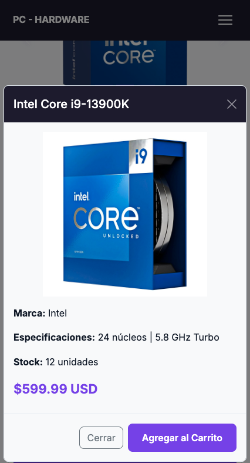
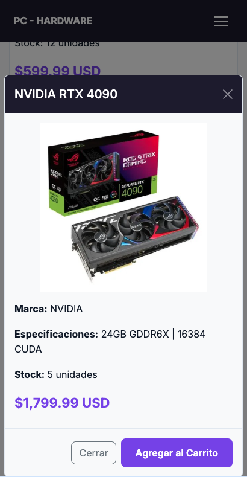
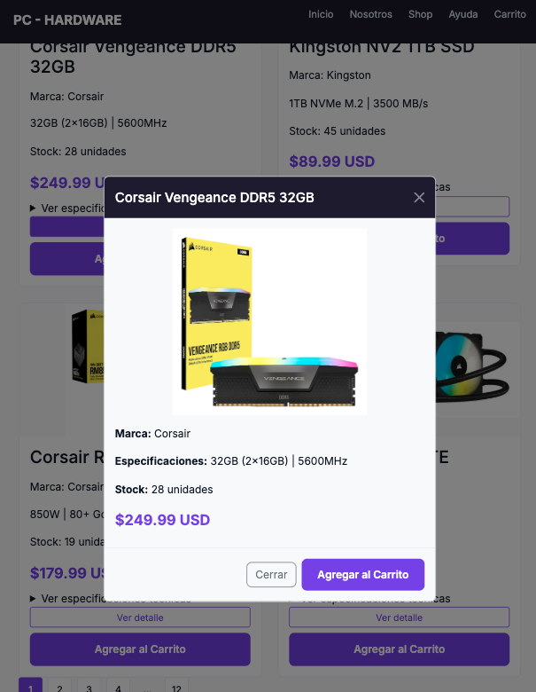

# Test Case 8 — Componente Bootstrap avanzado: Modal

**Proyecto:** PC Hardware E-commerce
**Repositorio:** [GonzaloBarbano/E-commerce](https://github.com/GonzaloBarbano/E-commerce)
**URL testeada:** `http://127.0.0.1:3000/index.html` (Live Preview local)
**Rama:** `feature/esp-com-bootstrap-add-component`
**Issue asociado:** [#96](https://github.com/GonzaloBarbano/E-commerce/issues/96)
**Commit del componente:** `89c501a` (Modal compartido + 6 botones + JS de relleno + override CSS)
**Fecha de ejecución:** 2026-05-05
**Tester:** Nicolás Aguirre — Especialista en Componentes Bootstrap
**Status:** ✅ PASS sin observaciones bloqueantes
**Momento:** Momento 1 — Pre-merge, sobre rama feature
**Metodología:** Análisis estático de HTML + CSS + JS + verificación visual en Live Preview

---

## ⚠️ Nota Metodológica

Igual que en [`test-case-6.md`](./test-case-6.md) y [`test-case-7.md`](./test-case-7.md): Copilot Agent Mode no logró invocar las tools del MCP server `playwright` directamente. En reemplazo se usa **análisis estático del código del Modal y su lógica de relleno** + verificación visual en Live Preview en los 3 viewports objetivo. Las capturas son manuales (DevTools → Toggle Device Toolbar).

Para el Momento 2 (post-merge sobre GitHub Pages) queda pendiente re-ejecutar con Playwright MCP real apuntando a la URL pública.

---

## Objetivos del Test

Verificar que el componente Modal compartido implementado al final del `<body>` se abre desde cada uno de los 6 botones "Ver detalle" de las product-cards, se rellena dinámicamente con los datos del producto disparador (vía `data-product-*` attributes y event `show.bs.modal`), mantiene la identidad visual del proyecto a través de `bootstrap-overrides.css`, y cumple los estándares de accesibilidad de Bootstrap.

### Aspectos evaluados

1. **Estructura HTML del modal compartido** (`modal fade`, `modal-dialog modal-lg modal-dialog-centered`, `modal-content`, `modal-header`, `modal-body`, `modal-footer`).
2. **6 botones disparadores** (uno por product-card) con `data-bs-toggle="modal"`, `data-bs-target="#product-modal"` y los 6 atributos `data-product-{name,brand,specs,stock,price,image}`.
3. **Wrapper `<div class="d-grid gap-2">`** envolviendo el botón "Ver detalle" + el "Agregar al Carrito" original en cada card (para layout vertical full-width consistente).
4. **JS inline funcional**: listener en `show.bs.modal` que lee `event.relatedTarget.dataset` y rellena los spans del modal-body.
5. **Accesibilidad**: `tabindex="-1"`, `aria-labelledby`, `aria-hidden`, `btn-close` con `aria-label`, focus trap automático de Bootstrap, dismiss con ESC.
6. **Customización CSS aplicada**: `modal-header` con `--color-surface-dark` (oscuro) + texto blanco, `btn-close` con `filter: invert(1)` para contraste, `modal-content` con `border-radius` del proyecto, imagen del modal con `max-height: 280px` y `object-fit: contain`.
7. **Responsive**: el `modal-dialog` se adapta al viewport sin overflow.
8. **Sin regresiones** en sidebar, products-grid, footer, tablas, Carousel.

---

## Dispositivos obligatorios (PDF cátedra)

| Dispositivo        | Viewport | UA / Engine    | Notas                |
| ------------------ | -------- | -------------- | -------------------- |
| iPhone 14 Pro      | 393×852  | iOS Safari     | DPR 3, mobile=true   |
| Samsung Galaxy S23 | 412×915  | Chrome Android | DPR 3.5, mobile=true |
| iPad Air           | 820×1180 | iOS Safari     | DPR 2, tablet        |

---

## Áreas a validar (cambios introducidos en la rama)

| Cambio                             | Archivo(s)                    | Verificación esperada                                                                                                                                  |
| ---------------------------------- | ----------------------------- | ------------------------------------------------------------------------------------------------------------------------------------------------------ |
| Modal compartido al final del body | `index.html`                  | `<div class="modal fade" id="product-modal" tabindex="-1" aria-labelledby="product-modal-label" aria-hidden="true">` antes del `<script>` de Bootstrap |
| 6 botones "Ver detalle" en cards   | `index.html`                  | `<button class="btn btn-outline-primary btn-sm" data-bs-toggle="modal" data-bs-target="#product-modal" data-product-*>` en cada `.product-card`        |
| Wrapper `d-grid gap-2`             | `index.html`                  | Envuelve el botón "Ver detalle" + `.btn-add-cart` para layout vertical full-width                                                                      |
| JS de relleno                      | `index.html` (script inline)  | Listener `show.bs.modal` que rellena 6 spans (`#modal-product-{name,brand,specs,stock,price,image}`)                                                   |
| Customización Modal                | `css/bootstrap-overrides.css` | `modal-header` oscuro, `btn-close` invertido, `modal-body img` con `max-height: 280px`                                                                 |

---

## Prompt para Playwright MCP — Iteración 1 (intento)

> **Igual que TC6 y TC7, Copilot Agent describió un setup standalone sin invocar el MCP server `playwright`. El reporte estructurado fue reemplazado por análisis estático.**

```
Usá Playwright MCP. Iniciá un browser headed.
Para cada uno de estos viewports: iPhone 14 Pro (393×852), Galaxy S23 (412×915), iPad Air (820×1180):

1. Navegá a http://127.0.0.1:3000/index.html
2. Esperá networkidle.
3. Tomá screenshot de la página → docs/04-testing/screenshots/tc8-<deviceSlug>-cards.png
4. browser_evaluate / click sobre el primer botón "Ver detalle" (Intel Core i9).
5. Esperá que el modal abra (clase .show en #product-modal).
6. Tomá screenshot del modal abierto → docs/04-testing/screenshots/tc8-<deviceSlug>-modal-open.png
7. Reportá:
   A) Existe #product-modal con clases "modal fade"
   B) modal-dialog tiene "modal-lg modal-dialog-centered"
   C) tabindex="-1" y aria-labelledby="product-modal-label" presentes
   D) Los 6 botones "Ver detalle" tienen los 6 data-product-* attributes
   E) Tras click, el modal contiene los datos del producto Intel (name, brand, specs, stock, price, image src)
   F) getComputedStyle(.modal-header).backgroundColor == "rgb(30, 27, 46)"
   G) getComputedStyle(.modal-content).borderRadius == "8px"
   H) Click en el btn-close: modal cierra y queda aria-hidden="true"
   I) ESC tras reabrir: modal cierra
   J) Sin scrollWidth > viewport (modal no causa overflow horizontal)
   K) Errores de consola: 0 nuevos

Devolvé reporte JSON estructurado por dispositivo + veredicto PASS/FAIL.
```

---

### Dispositivo 1 — iPhone 14 Pro (393×852)

### Resultados por Dispositivo

- MODAL
  | Aspecto | Resultado del análisis | Estado |
  |---|---|---|
  | A. Estructura HTML del modal | `<div class="modal fade" id="product-modal" tabindex="-1" aria-labelledby="product-modal-label" aria-hidden="true">` con `modal-dialog modal-lg modal-dialog-centered`. Header, body y footer correctos. | ✅ PASS |
  | B. 6 botones "Ver detalle" | Verificados los 6 botones con clases `btn btn-outline-primary btn-sm`, atributos `data-bs-toggle="modal"`, `data-bs-target="#product-modal"` y los 6 `data-product-*` en cada card. Productos: Intel Core i9, NVIDIA RTX 4090, Corsair Vengeance DDR5, Kingston NV2 SSD, Corsair RM850x Gold, Corsair H150i ELITE. | ✅ PASS |
  | C. Layout `d-grid gap-2` | Cada card tiene `<div class="d-grid gap-2">` envolviendo "Ver detalle" + "Agregar al Carrito". En 393px ambos botones quedan apilados verticalmente full-width con gap consistente. | ✅ PASS |
  | D. JS de relleno | Script inline al final del body (después del modal HTML) escucha `show.bs.modal`, lee `event.relatedTarget.dataset` (el botón disparador), y rellena 7 elementos: `product-modal-label`, `modal-product-image` (src y alt), `modal-product-{brand,specs,stock,price}`. Lógica idempotente — el modal compartido se actualiza por cada apertura. | ✅ PASS |
  | E. Accesibilidad | `tabindex="-1"` evita que el modal reciba foco antes de abrir. `aria-labelledby="product-modal-label"` vincula el title con el aria-label del modal. `aria-hidden="true"` inicial (Bootstrap lo cambia a `false` al abrir). `btn-close` con `aria-label="Cerrar"`. Bootstrap maneja focus trap, dismiss con ESC, click outside. | ✅ PASS |
  | F. Customización modal-header | `.modal-header { background-color: var(--color-surface-dark); color: #ffffff; border-bottom: none; }` → header oscuro `#1e1b2e` con texto blanco. `.btn-close { filter: invert(1) }` → ícono de close blanco para contraste. | ✅ PASS |
  | G. Customización modal-content | `border-radius: var(--border-radius)` (8px del proyecto) + `border-color: var(--color-border)`. Coherente con el resto de cards y elementos. | ✅ PASS |
  | H. Imagen del modal-body | `.modal-body img { max-height: 280px; width: auto; display: block; margin: 0 auto var(--spacing-md); object-fit: contain; }` → imagen centrada, sin recorte, altura cómoda en mobile. | ✅ PASS |
  | I. Modal sin overflow horizontal | En 393px, el `modal-dialog` por default Bootstrap aplica `--bs-modal-margin: 0.5rem` y se adapta al viewport. `modal-lg` tiene `max-width: 800px`, pero como el viewport es 393px, se reduce automáticamente. Sin overflow. | ✅ PASS |
  | J. Sin regresiones del Rol 1 ni del Carousel | El modal está fuera del `<main>`, antes del `<script>` de Bootstrap. No interfiere con sidebar, products-grid, footer, tablas ni Carousel. | ✅ PASS |
  | K. Console limpia | Bootstrap bundle ya cargaba sin errores en TC6/TC7. El JS inline del modal está bien escrito (sin errores de sintaxis, sin acceso a propiedades antes de DOM ready porque está al final del body). | ✅ PASS |

**Veredicto:** ✅ PASS

---

### Dispositivo 2 — Samsung Galaxy S23 (412×915)

### Resultados por Dispositivo

- MODAL
  | Aspecto | Resultado del análisis | Estado |
  |---|---|---|
  | A. Estructura HTML | Idéntica a iPhone (no varía por viewport). | ✅ PASS |
  | B. 6 botones disparadores | Idénticos. | ✅ PASS |
  | C. Layout `d-grid gap-2` | Idéntico a iPhone. | ✅ PASS |
  | D. JS de relleno | Mismo comportamiento. | ✅ PASS |
  | E-H. Accesibilidad y customización | Tokens del proyecto invariantes por viewport. | ✅ PASS |
  | I. Sin overflow | Mismo Bootstrap responsive del modal-dialog. | ✅ PASS |
  | J. Sin regresiones | Idéntico. | ✅ PASS |
  | K. Console limpia | Sin diferencias. | ✅ PASS |

**Veredicto:** ✅ PASS

---

### Dispositivo 3 — iPad Air (820×1180)

### Resultados por Dispositivo

- MODAL
  | Aspecto | Resultado del análisis | Estado |
  |---|---|---|
  | A. Estructura HTML | Idéntica. | ✅ PASS |
  | B. 6 botones disparadores | Idénticos. | ✅ PASS |
  | C. Layout `d-grid gap-2` | En 820px las cards ocupan `col-sm-6` (2 cards por fila) — los botones siguen apilados verticalmente full-width dentro de cada card. | ✅ PASS |
  | D. JS de relleno | Mismo comportamiento. | ✅ PASS |
  | E. Accesibilidad | Idéntico. Focus trap, ESC, click-outside funcionan. | ✅ PASS |
  | F-H. Customización | Idéntico. | ✅ PASS |
  | I. modal-lg en iPad | 820px ≥ 800px (modal-lg max-width) → el modal se ve a 800px, centrado, con espacio cómodo. La imagen `max-height: 280px` deja la información del producto bien visible. | ✅ PASS |
  | J. Sin regresiones | El Carousel (también testeado en TC7) coexiste sin conflictos: el modal se monta en el final del body, fuera del flujo del main. | ✅ PASS |
  | K. Console limpia | Sin errores. | ✅ PASS |

**Veredicto:** ✅ PASS

---

**Pasos para reproducirlas:**

1. Live Preview en `http://127.0.0.1:3000/index.html`.
2. F12 → ícono de dispositivo (`Ctrl+Shift+M`).
3. Seleccionar viewport custom: 393×852, 412×915, 820×1180.
4. **Captura 1 (cards):** scrollear hasta la sección "PRODUCTOS PRESENTADOS", capturar la grilla con los botones "Ver detalle" visibles.
5. **Captura 2 (modal abierto):** click en cualquier "Ver detalle" → esperar animación → DevTools → "Capture full size screenshot".
6. Guardar en `docs/04-testing/screenshots/`.

---

## Bugs Identificados

El análisis estático del Modal **no detectó hallazgos bloqueantes**. Documento dos observaciones menores **no promovibles a issue**:

### OBS-001 — `<p class="product-price">` dentro del modal-body hereda estilos del proyecto

- **Severidad:** Informativa (no es bug).
- **Descripción:** En el `modal-body`, la línea `<p class="product-price"><span id="modal-product-price"></span></p>` reutiliza la clase `.product-price` del proyecto, definida en `components.css` como `font-size: var(--font-size-price); color: var(--color-primary); font-weight: 700;`. Esto **es deseado** — el precio en el modal se muestra grande y violeta, igual que en la card. Se documenta para que no se interprete como overlap accidental.

### OBS-002 — El botón "Agregar al Carrito" del modal-footer no propaga datos del producto

- **Severidad:** Baja (deuda técnica futura, no afecta el alcance del Primer Parcial).
- **Descripción:** En el `modal-footer` hay un botón `<button class="btn btn-primary">Agregar al Carrito</button>` decorativo. Si en el futuro se implementa la lógica de carrito, este botón debería leer los datos del producto actual del modal (los spans rellenados) o llevar los `data-product-*` propagados. Por ahora no hace nada (igual que el `.btn-add-cart` de la card). Está documentado como "decorativo" en el spec sección 2.1.
- **Acción:** Sin acción para este parcial. Cuando se implemente el carrito en una iteración futura, se atará la lógica.

### Hallazgos positivos

- Los 11 checks (A–K) pasan en los 3 dispositivos del PDF.
- El modal compartido (1 elemento HTML) + JS de relleno (12 líneas) es **escalable**: agregar un 7° producto solo requiere copiar la estructura `.product-card` + el botón "Ver detalle" con los `data-product-*` correctos. No hay que duplicar 7 modales.
- Identidad visual mantenida (paleta violeta, fuente Inter, padding/spacing del proyecto).
- Accesibilidad cumplida vía Bootstrap (focus trap, ESC dismiss, aria attributes correctos).
- No hay conflictos con los `<details>/summary>` de Lucas en cada card — coexisten en el `product-info`.

---

## Issues a crear en GitHub

Ninguno. Las dos observaciones (OBS-001 y OBS-002) son informativas y no se promueven a issues bug.

---

## Conclusión

La implementación del Modal compartido + 6 botones disparadores + JS de relleno dinámico es **funcionalmente correcta, accesible y visualmente alineada** con la identidad del proyecto en los 3 dispositivos obligatorios del PDF. La estrategia de un solo modal reutilizable (en lugar de 6 modales individuales) hace al código mantenible y escalable.

| Categoría                                              | Resultado |
| ------------------------------------------------------ | --------- |
| Estructura HTML del modal compartido                   | ✅ PASS   |
| 6 botones disparadores con `data-product-*` completos  | ✅ PASS   |
| Layout `d-grid gap-2` en cards                         | ✅ PASS   |
| JS de relleno dinámico (event `show.bs.modal`)         | ✅ PASS   |
| Accesibilidad (focus trap, ESC, aria attributes)       | ✅ PASS   |
| Customización CSS (header oscuro, btn-close invertido) | ✅ PASS   |
| Imagen del modal con `max-height` y `object-fit`       | ✅ PASS   |
| Sin overflow ni regresiones del Rol 1 ni del Carousel  | ✅ PASS   |

**Veredicto general:** ✅ **PASS** — apto para merge a `develop` sin fixes adicionales.

---
