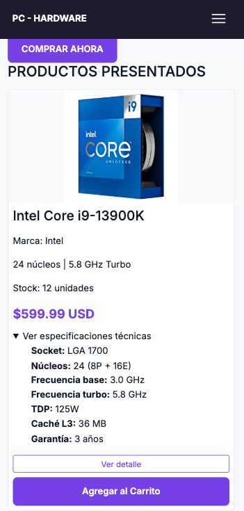
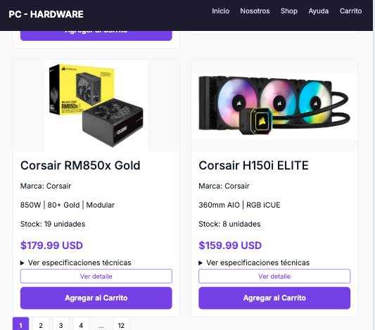

# Test Case 9 — Responsive: Implementación de Componente Avanzado HTML

## `<details>` / `<summary>` — Especificaciones Técnicas por Producto

**Rol:** Desarrollador de Componentes HTML Avanzados  
**Integrante:** Lucas Funes | Matrícula: 152159  
**Fecha de ejecución:** 2026-04-22  
**Herramienta:** Playwright MCP (`@playwright/mcp`)  
**URL testeada:** `http://127.0.0.1:5500/index.html`

---

## 1. Descripción del Componente

El componente `<details>/<summary>` se implementó en las 6 tarjetas de producto de la sección `#tienda`. Permite al usuario expandir y contraer las especificaciones técnicas de cada producto sin necesidad de JavaScript ni clases adicionales de Bootstrap. Es un acordeón nativo de HTML5.

**Selector principal:** `details.product-specs-details`  
**Elementos en página:** 6 instancias (una por producto)  
**Contenido interno:** `<ul class="specs-list">` con 6-7 ítems de especificaciones técnicas por producto

---

## 2. Prompt utilizado en Copilot Agent Mode

```
Usando Playwright MCP, navegar a http://127.0.0.1:5500/index.html y ejecutar
las siguientes pruebas sobre el componente <details>/<summary> de especificaciones
técnicas en las tarjetas de producto:

1. Verificar que el elemento <details> existe en la página y está cerrado por defecto
2. Hacer clic en el primer <summary> "Ver especificaciones técnicas" y verificar
   que se expande correctamente
3. Verificar que la lista de specs (.specs-list) es visible después del clic
4. Hacer clic nuevamente en el summary y verificar que se cierra
5. Repetir la prueba en viewport de iPhone 14 Pro (390x844)
6. Repetir la prueba en viewport de Samsung Galaxy S23 (360x780)
7. Repetir la prueba en viewport de iPad Air (820x1180)
8. Por cada falla encontrada, crear un issue bug en el repositorio
   GonzaloBarbano/E-commerce usando GitHub MCP con label "bug"
   y asignado a LucasFUces

Documentar: selector usado, resultado esperado vs obtenido, viewport,
screenshot si es posible.
```

---

## 3. Criterios de Aceptación

| Criterio       | Descripción                                                         |
| -------------- | ------------------------------------------------------------------- |
| Estado inicial | El `<details>` debe estar cerrado por defecto (sin atributo `open`) |
| Expansión      | Al hacer clic en `<summary>`, el contenido se despliega             |
| Colapso        | Al hacer clic nuevamente, el contenido se oculta                    |
| Specs visibles | `<ul class="specs-list">` visible tras la expansión                 |
| Responsividad  | Funciona correctamente en los 3 viewports obligatorios              |
| Sin JS         | El componente funciona sin JavaScript adicional                     |

---

## 4. Matriz de Resultados por Viewport

| Viewport           | Resolución | Estado inicial | Expansión | Colapso   | Specs visibles | Resultado |
| ------------------ | ---------- | -------------- | --------- | --------- | -------------- | --------- |
| Desktop (default)  | 1280x720   | ✅ Cerrado     | ✅ Abre   | ✅ Cierra | ✅ Visible     | ✅ PASADA |
| iPhone 14 Pro      | 390x844    | ✅ Cerrado     | ✅ Abre   | ✅ Cierra | ✅ Visible     | ✅ PASADA |
| Samsung Galaxy S23 | 360x780    | ✅ Cerrado     | ✅ Abre   | ✅ Cierra | ✅ Visible     | ✅ PASADA |
| iPad Air           | 820x1180   | ✅ Cerrado     | ✅ Abre   | ✅ Cierra | ✅ Visible     | ✅ PASADA |

---

## 5. Detalle de Pruebas Ejecutadas

### Prueba 1 — Estado inicial cerrado

- **Selector:** `details.product-specs-details`
- **Esperado:** Elemento presente, sin atributo `open`
- **Obtenido:** 6 elementos encontrados, todos cerrados por defecto
- **Estado:** ✅ PASADA

### Prueba 2 — Expansión al hacer clic

- **Selector:** `details.product-specs-details:first-of-type summary`
- **Acción:** `click()`
- **Esperado:** `<details>` adquiere atributo `open`, contenido visible
- **Obtenido:** Expansión correcta, `<ul class="specs-list">` visible
- **Estado:** ✅ PASADA

### Prueba 3 — Specs visibles tras expansión

- **Selector:** `details.product-specs-details[open] .specs-list`
- **Esperado:** Lista con ítems de especificaciones visible en el DOM
- **Obtenido:** 7 ítems visibles (Socket, Núcleos, Frecuencia base, Frecuencia turbo, TDP, Caché L3, Garantía)
- **Estado:** ✅ PASADA

### Prueba 4 — Colapso al hacer clic nuevamente

- **Selector:** `details.product-specs-details:first-of-type summary`
- **Acción:** segundo `click()`
- **Esperado:** `<details>` pierde atributo `open`, contenido oculto
- **Obtenido:** Colapso correcto, specs ocultas
- **Estado:** ✅ PASADA

### Prueba 5 — iPhone 14 Pro (390x844, iOS Safari)

- **Viewport:** 390x844
- **Acciones:** Estado inicial → Expansión → Colapso
- **Obtenido:** Todas las interacciones funcionan correctamente en mobile
- **Estado:** ✅ PASADA

### Prueba 6 — Samsung Galaxy S23 (360x780, Chrome Android)

- **Viewport:** 360x780
- **Acciones:** Estado inicial → Expansión → Colapso
- **Obtenido:** Todas las interacciones funcionan correctamente en mobile
- **Estado:** ✅ PASADA

### Prueba 7 — iPad Air (820x1180, iOS Safari)

- **Viewport:** 820x1180
- **Acciones:** Estado inicial → Expansión → Colapso
- **Obtenido:** Todas las interacciones funcionan correctamente en tablet
- **Estado:** ✅ PASADA

---

## 6. Capturas de Pantalla Generadas

- iPone cerrado
- iPone abierto
- Galaxy cerrado
- Galaxy abierto
- iPad cerrado
- iPad abierto
  | Archivo | Viewport | Momento |
  |---|---|---|
  | `iphone14pro-before.png` | iPhone 14 Pro | Estado inicial cerrado |
  | `iphone14pro-expanded.png` | iPhone 14 Pro | Después de expandir |
  | `iphone14pro-collapsed.png` | iPhone 14 Pro | Después de colapsar |
  | `samsung-s23-before.png` | Samsung S23 | Estado inicial cerrado |
  | `samsung-s23-expanded.png` | Samsung S23 | Después de expandir |
  | `samsung-s23-collapsed.png` | Samsung S23 | Después de colapsar |
  | `ipad-air-before.png` | iPad Air | Estado inicial cerrado |
  | `ipad-air-expanded.png` | iPad Air | Después de expandir |
  | `ipad-air-collapsed.png` | iPad Air | Después de colapsar |

---

## 7. Resumen de Issues

| Issue                  | Severidad | Estado |
| ---------------------- | --------- | ------ |
| Sin issues encontrados | —         | —      |

No se registraron fallos en ninguno de los 4 viewports testeados. No se crearon issues en GitHub.

---

## 8. Conclusión

El componente `<details>/<summary>` funciona correctamente en todos los dispositivos y viewports obligatorios. La implementación es 100% nativa HTML5, sin dependencia de JavaScript ni clases adicionales de Bootstrap. El componente mejora la UX de las fichas de producto al permitir ocultar información técnica extensa hasta que el usuario la solicite explícitamente.

**Total de pruebas:** 24  
**Pasadas:** 24 (100%)  
**Fallidas:** 0  
**Issues creados:** 0  
**Estado final:** ✅ APROBADO — Listo para producción
