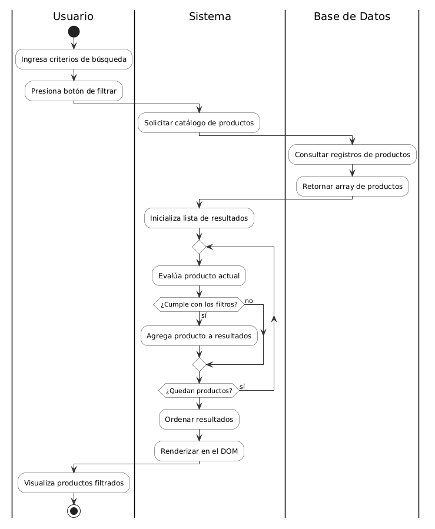
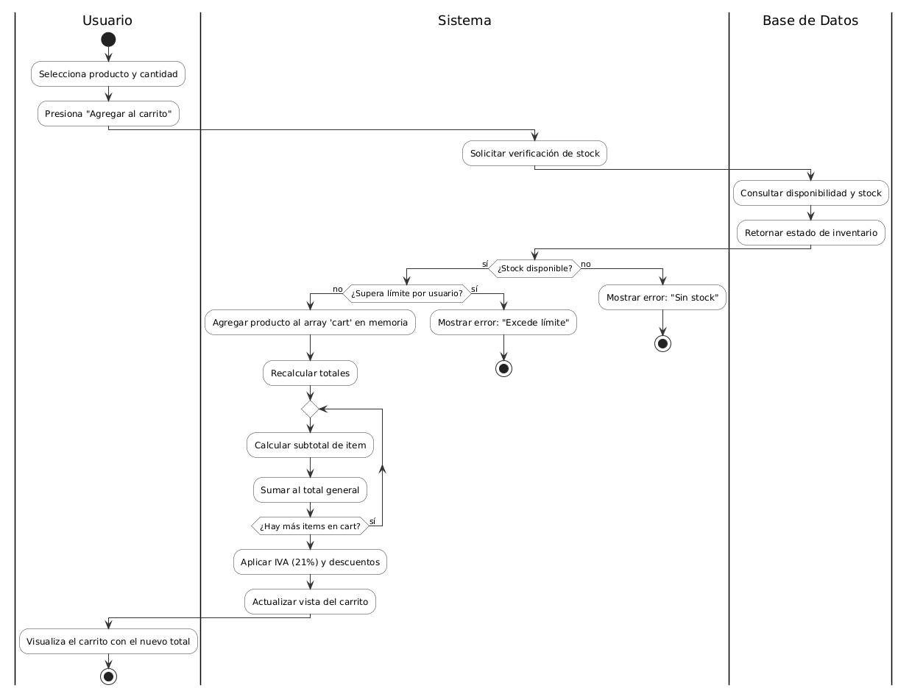
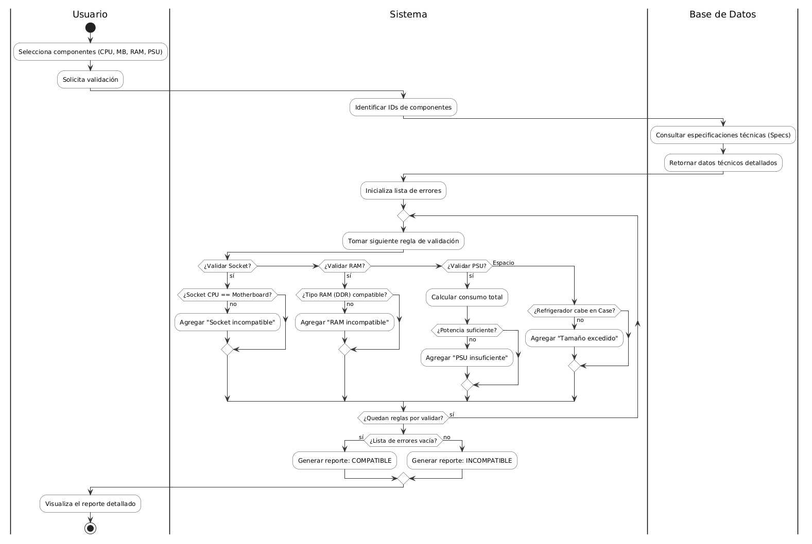
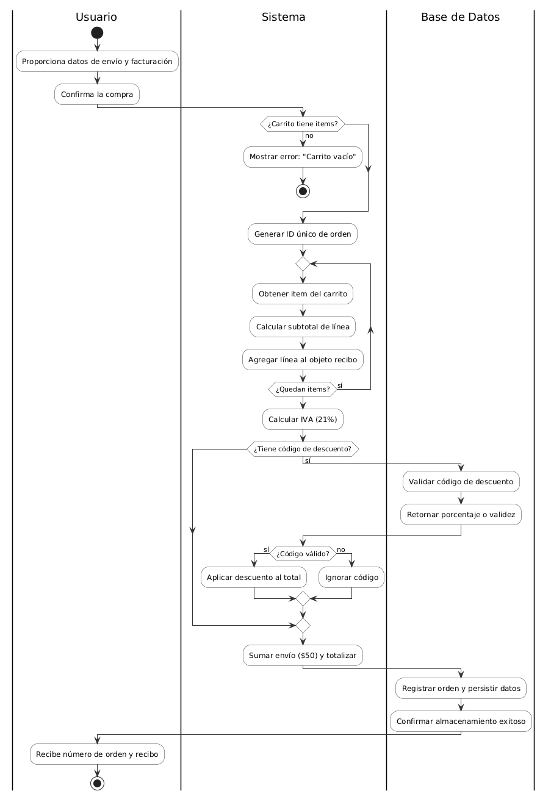
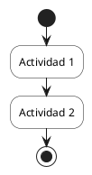

# 📊 Diagramas de Actividades - E-commerce de Hardware

**Proyecto:** E-commerce de Componentes Hardware para PC  
**Módulo:** Diagramas UML de Actividades  
**Fecha:** 12 de mayo de 2026  
**Estado:** Actualizado - Con 3 Actores (Usuario | Sistema | Base de Datos)

---

## 📑 Índice de Diagramas

1. [Flujo 1: Búsqueda y Filtrado de Productos](/docs/05-diagramas/01-diagrama-de-actividades/actividad-flujo-1-busqueda.puml)
2. [Flujo 2: Gestión de Carrito y Cálculo de Precio](/docs/05-diagramas/01-diagrama-de-actividades/actividad-flujo-2-carrito.puml)
3. [Flujo 3: Validación de Compatibilidad de Componentes](/docs/05-diagramas/01-diagrama-de-actividades/actividad-flujo-3-compatibilidad.puml)
4. [Flujo 4: Generación de Recibo y Resumen de Orden](/docs/05-diagramas/01-diagrama-de-actividades/actividad-flujo-4-recibo.puml)

---

## 🏗️ Arquitectura de 3 Actores

Todos los diagramas de actividades siguen una arquitectura de **3 swimlanes (particiones)** que representan los 3 actores principales del sistema:

### 👤 **Usuario**

- **Responsabilidad:** Entrada de datos e interacción con la UI
- **Acciones:** Ingresa criterios, selecciona productos, confirma compras
- **Comunicación:** Envía solicitudes al Sistema

### ⚙️ **Sistema**

- **Responsabilidad:** Lógica de negocio, orquestación, procesamiento
- **Acciones:** Valida reglas, calcula valores, coordina solicitudes
- **Comunicación:** Recibe del Usuario, consulta Base de Datos, retorna resultados

### 🗄️ **Base de Datos**

- **Responsabilidad:** Persistencia de datos, consultas y registros
- **Acciones:** Consulta registros, retorna datos técnicos, registra transacciones
- **Comunicación:** Responde consultas del Sistema

### 📊 Flujo General de Comunicación

```
┌──────────────────────────────────────────────────────────────┐
│  USUARIO   →   SISTEMA   ↔   BASE DE DATOS                   │
│                                                               │
│  (entrada)  (lógica &       (persistencia &                  │
│             orquestación)    consultas)                       │
└──────────────────────────────────────────────────────────────┘
```

Esta separación de responsabilidades es fundamental para:

- ✅ **Claridad**: Cada actor tiene un rol bien definido
- ✅ **Mantenibilidad**: Facilita traducción a código JavaScript
- ✅ **Realismo**: Refleja arquitectura real de aplicaciones web modernas
- ✅ **Educación**: Enseña separación de concerns en software

---

## Flujo 1: Búsqueda y Filtrado de Productos

### 📝 Descripción

**Propósito:** Permitir al usuario buscar productos en el catálogo aplicando múltiples criterios de filtrado (marca, rango de precio, especificaciones).

**Flujo Lógico:**

- 👤 **Usuario:** Ingresa criterios de búsqueda (marca, rango de precio, tipo de componente, especificaciones)
- ⚙️ **Sistema:** Solicita el catálogo de productos a la base de datos
- 🗄️ **Base de Datos:** Consulta registros de productos y retorna array
- ⚙️ **Sistema:** Accede al catálogo e itera sobre cada producto
- ⚙️ **Sistema:** Para cada producto, valida si coincide con:
  - ✅ La marca especificada
  - ✅ El rango de precio solicitado
  - ✅ Las especificaciones técnicas requeridas
- ⚙️ **Sistema:** Agrupa y ordena los resultados, renderiza en el DOM
- 👤 **Usuario:** Recibe la lista de productos filtrados

**Caso de Uso Real:**

```
Usuario: "Quiero GPUs NVIDIA entre $800 y $1500"
↓
Sistema: Filtra catálogo → Socket === NVIDIA && precio >= 800 && precio <= 1500
↓
Resultado: [RTX 4080, RTX 4090, RTX 5090]
```

**Componentes HTML Relacionados:**

- `#search-input` — Campo de búsqueda con datalist
- `#price-range-min` / `#price-range-max` — Sliders de rango de precio
- `.categories-list` — Selector de categorías
- `#filters-form` — Checkboxes de marca y especificaciones
- `.btn-apply-filters` — Botón aplicar filtros

**Conceptos Técnicos Practicados:**

- ✅ Arrays (catálogo de productos)
- ✅ Funciones de filtrado (filter/search)
- ✅ Condicionales if/else
- ✅ Ciclos for/while
- ✅ Swimlanes Usuario | Sistema | Base de Datos
- ✅ Consultas a base de datos
- ✅ Persistencia de datos

### 📸 Visualización



---

## Flujo 2: Gestión de Carrito y Cálculo de Precio

### 📝 Descripción

**Propósito:** Gestionar la adición de productos al carrito, validar stock disponible y calcular el total con impuestos y descuentos.

**Flujo Lógico:**

- 👤 **Usuario:** Selecciona un producto y especifica la cantidad deseada
- ⚙️ **Sistema:** Solicita verificación de stock a la base de datos
- 🗄️ **Base de Datos:** Consulta disponibilidad e inventario, retorna estado
- ⚙️ **Sistema:** Valida que:
  - ✅ El stock esté disponible para la cantidad solicitada
  - ✅ La cantidad no supera el límite de compra por usuario
- ⚙️ **Sistema:** Agrega el producto al array de carrito (en memoria)
- ⚙️ **Sistema:** Itera sobre todos los items del carrito:
  - Calcula subtotal (precio × cantidad)
  - Acumula en el total
- ⚙️ **Sistema:** Calcula impuestos (21%), aplica descuentos, actualiza vista
- 👤 **Usuario:** Visualiza el carrito actualizado con el nuevo total

**Caso de Uso Real:**

```
Usuario: Agrega "RTX 4090" (cantidad: 2)
↓
Sistema: Valida stock (2 >= disponible) → OK
↓
Carrito:
  - 2x NVIDIA RTX 4090 @ $1699 = $3398
  - Subtotal: $3398
  - Impuestos (21%): $713.58
  - Total: $4111.58
```

**Componentes HTML Relacionados:**

- `.product-item` — Tarjetas de productos
- `#search-input` — Búsqueda de productos
- `.add-to-cart-btn` — Botón agregar al carrito
- `#carrito` — Sección del carrito
- Cantidad input — Selector de cantidad

**Conceptos Técnicos Practicados:**

- ✅ Arrays (items en carrito)
- ✅ Objetos (estructura de item)
- ✅ Operadores matemáticos (+, ×, /)
- ✅ Condicionales if (validaciones)
- ✅ Ciclos for (calcular totales)
- ✅ Validación de stock desde base de datos
- ✅ Swimlanes Usuario | Sistema | Base de Datos
- ✅ Consultas de inventario

### 📸 Visualización



---

## Flujo 3: Validación de Compatibilidad de Componentes

### 📝 Descripción

**Propósito:** Validar que los componentes de hardware seleccionados sean compatibles entre sí (socket, RAM, PSU, tamaño físico).

**Flujo Lógico:**

- 👤 **Usuario:** Selecciona componentes (CPU, Motherboard, RAM, PSU, Refrigerador)
- 👤 **Usuario:** Solicita validación de compatibilidad
- ⚙️ **Sistema:** Identifica IDs de componentes
- 🗄️ **Base de Datos:** Consulta especificaciones técnicas detalladas, retorna datos
- ⚙️ **Sistema:** Itera sobre cada regla de validación y valida:
  - ✅ Socket CPU === Socket Motherboard
  - ✅ Tipo de RAM compatible con Motherboard (DDR4/DDR5)
  - ✅ Watts de PSU >= Watts requeridos
  - ✅ Tamaño de refrigerador entra en case
  - ✅ Slots PCIe compatibles
- ⚙️ **Sistema:** Si hay incompatibilidades, las agrega a un array
- ⚙️ **Sistema:** Genera un reporte detallado (COMPATIBLE o INCOMPATIBLE)
- 👤 **Usuario:** Visualiza el reporte con detalles

**Caso de Uso Real:**

```
Usuario: Ingresa configuración:
  - CPU: AMD Ryzen 9 (Socket AM5)
  - Motherboard: ASUS TUF (Socket AM5)
  - RAM: DDR5 64GB
  - PSU: 1000W Gold

↓
Sistema: Valida cada componente
  1. Socket: AM5 === AM5 ✅
  2. RAM: DDR5 compatible ✅
  3. PSU: 1000W >= requerido ✅
  4. Tamaño: Entra en case ✅

Resultado: "COMPATIBLE - Construcción sin problemas"
```

**Componentes HTML Relacionados:**

- `.categories-list` — Selector de categoría (CPU, GPU, RAM, etc.)
- `#search-input` — Búsqueda de componentes específicos
- `.product-specs` — Especificaciones técnicas del producto
- `#compatibilidad` — Sección de validación de compatibilidad

**Conceptos Técnicos Practicados:**

- ✅ Objetos complejos (componentes con múltiples propiedades)
- ✅ Comparadores (===, >, <, >=)
- ✅ Operadores lógicos (&&, ||)
- ✅ Ciclos for (validar cada componente)
- ✅ Arrays (almacenar incompatibilidades)
- ✅ Generación de reportes
- ✅ Swimlanes Usuario | Sistema | Base de Datos
- ✅ Consultas de especificaciones técnicas

### 📸 Visualización



---

## Flujo 4: Generación de Recibo y Resumen de Orden

### 📝 Descripción

**Propósito:** Generar un recibo detallado y número de orden única cuando el usuario confirma la compra.

**Flujo Lógico:**

- 👤 **Usuario:** Revisa carrito final, proporciona datos de envío y facturación
- 👤 **Usuario:** Confirma la intención de compra
- ⚙️ **Sistema:** Valida que:
  - ✅ El carrito contiene al menos un item
  - ✅ Los datos del usuario están completos
- ⚙️ **Sistema:** Genera número único de orden (ej. PO-20260511-0847)
- ⚙️ **Sistema:** Itera sobre cada item del carrito:
  - Obtiene cantidad y precio
  - Calcula subtotal por línea
  - Crea línea de recibo detallada
- ⚙️ **Sistema:** Calcula subtotal acumulado e impuestos (21%)
- ⚙️ **Sistema:** Si usuario ingresó código de descuento:
  - 🗄️ **Base de Datos:** Valida código de descuento, retorna validez/porcentaje
  - ⚙️ **Sistema:** Aplica descuento si es válido
- ⚙️ **Sistema:** Suma envío fijo ($50) y calcula total final
- 🗄️ **Base de Datos:** Registra orden y persistencia de datos
- 👤 **Usuario:** Recibe número de orden y recibo detallado

**Caso de Uso Real:**

```
Usuario: Confirma compra
↓
Sistema: Genera Orden #PO-20260511-0847

Itemización:
  2x NVIDIA RTX 4090 @ $1699 = $3398
  1x AMD Ryzen 9 @ $749 = $749
  1x Corsair DDR5 64GB @ $349 = $349
  ─────────────────────────────────
  Subtotal:      $4,496.00
  Impuestos (21%): $944.16
  Descuento:     -$0.00
  Envío:         $50.00
  ─────────────────────────────────
  TOTAL FINAL:   $5,490.16

Código de orden: PO-20260511-0847
```

**Componentes HTML Relacionados:**

- `#carrito` — Sección del carrito
- `.cart-items` — Lista de items en carrito
- `.btn-checkout` — Botón confirmar compra
- Formulario de datos de envío
- Resumen de orden (total, impuestos, etc.)

**Conceptos Técnicos Practicados:**

- ✅ Arrays y Objetos combinados (carrito → items)
- ✅ Funciones para cálculos complejos
- ✅ Generación de strings formateados (recibo)
- ✅ Ciclos for (itemizar)
- ✅ Condicionales if (validaciones)
- ✅ Swimlanes Usuario | Sistema | Base de Datos
- ✅ Transacciones de datos (crear y persistir orden)
- ✅ Validación de códigos de descuento en BD
- ✅ Integración de todos los conceptos anteriores

### 📸 Visualización



---

## 🛠️ Instrucciones para Editar Diagramas PlantUML

### Opción 1: PlantUML Editor Online (Recomendado para rápidas visualizaciones)

1. **Accede a:** https://www.plantumleditor.com
2. **Abre el diagrama:**
   - Copia el contenido del archivo `.puml` (ej. `actividad-flujo-1-busqueda.puml`)
   - Pégalo en la sección izquierda del editor
3. **Visualiza en tiempo real:**
   - El diagrama se renderiza automáticamente en la sección derecha
4. **Realiza cambios:**
   - Edita el código PlantUML directamente
   - Cambia nombres de actividades, decisiones, colores, swimlanes
5. **Exporta:**
   - Botón "Export" → Descarga como PNG, SVG o PDF

### Opción 2: Extensión VS Code PlantUML (Recomendado para desarrollo local)

#### Instalación:

1. **Abre VS Code**
2. **Accede a Extensiones** (Ctrl+Shift+X / Cmd+Shift+X en Mac)
3. **Busca:** `PlantUML`
4. **Instala:** La extensión oficial de PlantUML (es.kiviok.diagrams o jebbs.plantuml)

#### Uso:

1. **Abre un archivo `.puml`** en VS Code
2. **Vista Previa:**
   - Haz clic en el icono "Preview" (esquina superior derecha)
   - O presiona: `Alt+D`
3. **Edición en tiempo real:**
   - El preview se actualiza mientras escribes
4. **Exportar:**
   - Click derecho en el archivo → "PlantUML: Export Current File"
   - Elige formato (PNG, SVG, PDF)
   - Se guarda automáticamente en la misma carpeta

### Opción 3: Línea de Comandos con PlantUML CLI

#### Instalación:

```bash
# Con Homebrew (Mac)
brew install plantuml

# O descargar desde: https://plantuml.com/download
```

#### Uso:

```bash
# Generar PNG desde archivo .puml
plantuml -Tpng actividad-flujo-1-busqueda.puml

# Generar SVG (vectorial, mejor para zoom)
plantuml -Tsvg actividad-flujo-1-busqueda.puml

# Generar PDF
plantuml -Tpdf actividad-flujo-1-busqueda.puml

# Observar cambios en tiempo real
plantuml -Tpng -o ./output/ *.puml -watch
```

---

## 📋 Sintaxis Básica de PlantUML para Diagramas de Actividades

### Estructura Fundamental



### Decisiones (If/Then/Else)

```puml
if (¿Pregunta/Condición?) then (sí)
  :Acción si verdadero;
else (no)
  :Acción si falso;
endif
```

### Ciclos (Repeat/While)

```puml
repeat
  :Acción dentro del ciclo;
repeat while (¿Condición?) is (sí)
```

### Swimlanes (Particiones)

```puml
|Usuario|
start
:Ingresa criterios de búsqueda;

|Sistema|
:Procesa criterios;

|Base de Datos|
:Consulta registros;
:Retorna datos;

|Sistema|
:Filtra resultados;

|Usuario|
:Visualiza resultados;
stop
```

**Nota sobre 3 Swimlanes:**

- **|Usuario|** — Acciones del cliente (entrada de datos, visualización)
- **|Sistema|** — Lógica de negocio, procesamiento, orquestación
- **|Base de Datos|** — Consultas, persistencia, lecturas de registros

Para cambiar de swimlane, simplemente usa `|Nombre del Swimlane|` antes de la actividad.

### Flechas con Etiquetas

```puml
:Actividad A;
--> :Actividad B;
' O con etiqueta
--> "Etiqueta en flecha" :Actividad C;
```

### Colores Personalizados

```puml
!define COLOR_USUARIO #E3F2FD
!define COLOR_SISTEMA #F3E5F5

partition "Usuario" #E3F2FD {
  :Acción del usuario;
}
```

---

## ✅ Checklist de Edición

Cuando edites un diagrama, verifica:

- [ ] **Sintaxis válida** — El diagrama compila sin errores
- [ ] **3 Swimlanes claros** — Usuario, Sistema y Base de Datos bien diferenciados
- [ ] **Decisiones lógicas** — if/then/else representan validaciones reales
- [ ] **Ciclos correctos** — repeat/while se usan en iteraciones sobre arrays
- [ ] **Coherencia con HTML** — Las actividades reflejan elementos del `index.html`
- [ ] **Flujo realista** — Entrada → Proceso → Salida tiene sentido empresarial
- [ ] **Interacciones BD** — Las consultas a base de datos están mapeadas
- [ ] **Etiquetas claras** — Cada actividad tiene nombre descriptivo
- [ ] **Exportación PNG** — Se genera correctamente para documentación

---

## 🔗 Referencias Rápidas

| Recurso                        | URL                                                 |
| ------------------------------ | --------------------------------------------------- |
| Documentación oficial PlantUML | https://plantuml.com/activity-diagram-beta          |
| Editor online                  | https://www.plantumleditor.com                      |
| Descargar PlantUML             | https://plantuml.com/download                       |
| Sintaxis Actividades           | https://plantuml.com/activity-diagram-beta#swimlane |

---

## 📌 Notas Importantes

1. **Naming Convention:** Los archivos `.puml` siguen patrón `actividad-flujo-[N]-[nombre].puml`

2. **Versionado:** Si necesitas cambiar un diagrama:
   - Edita el archivo `.puml` original
   - Regenera la imagen PNG
   - Commit a git con mensaje descriptivo

3. **Sincronización:** Los diagramas deben mantenerse sincronizados con:
   - `spec-arq-diagramas.md` (especificación de requisitos)
   - `index.html` (estructura del proyecto)
   - `plan.md` (roadmap del proyecto)

4. **Validación:** Antes de comprometer cambios, verifica que:
   - El `.puml` compila sin errores
   - La PNG se genera correctamente
   - El flujo es coherente con la especificación

---

**Última actualización:** 12 de mayo de 2026  
**Autor:** @GonzaloBarbano - Grupo N°3  
**Estado:** ✅ Completo con 3 Actores (Usuario | Sistema | Base de Datos)  
**Cambios:** Incluye interacciones con Base de Datos en todos los diagramas
