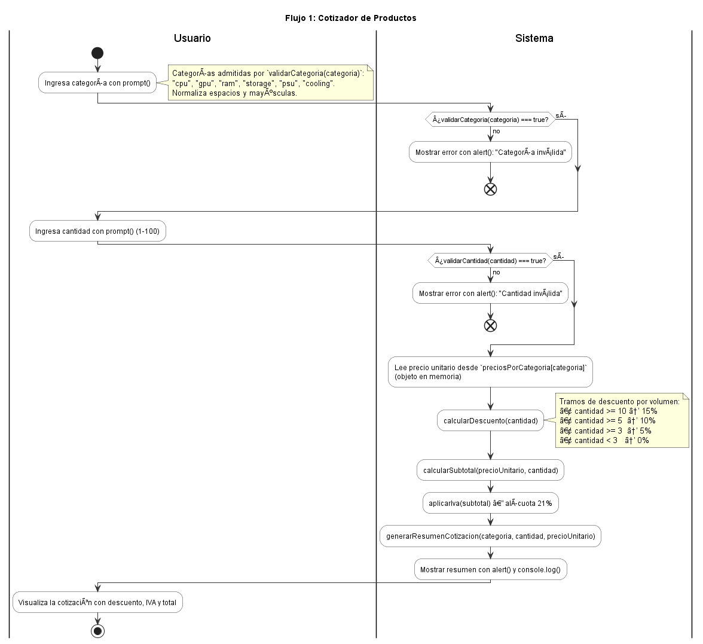
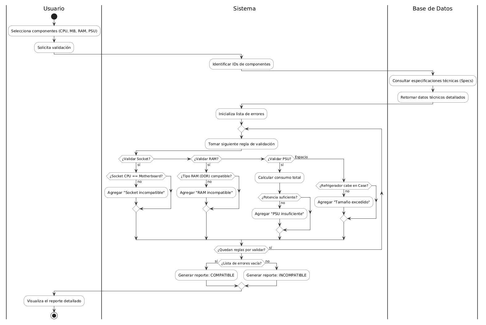
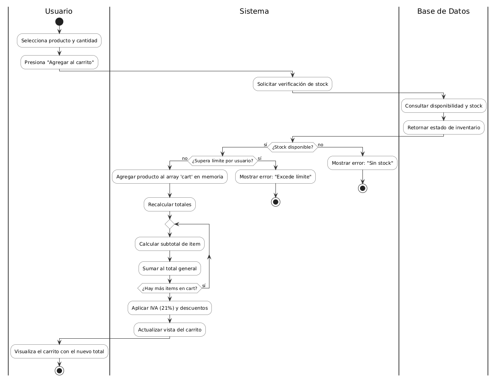
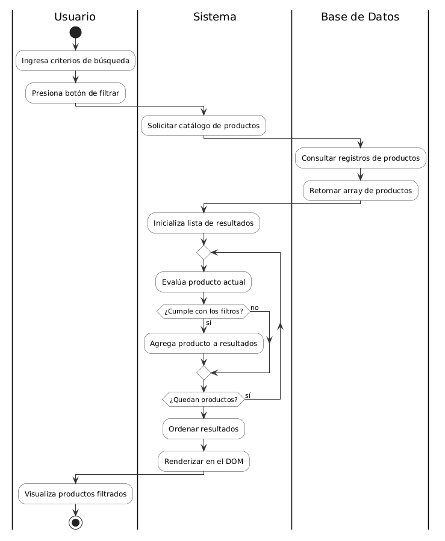
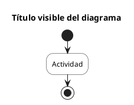

# 📊 Diagramas de Actividades — E-commerce de Hardware

**Proyecto:** E-commerce de Componentes Hardware para PC
**Módulo:** Diagramas UML de Actividades
**Última actualización:** 23 de junio de 2026
**Estado:** Numeración alineada con el menú real de `js/script.js` (post revisión del docente)

---

## 📑 Índice de Diagramas

Los 4 diagramas corresponden uno a uno con las 4 opciones del menú principal de `js/script.js` (`iniciarMenu()`). El número del archivo coincide con el número de la opción del menú que ve el usuario.

| # | Flujo | Archivo `.puml` | Imagen `.png` |
|---|---|---|---|
| 1 | Cotizador de Productos | [actividad-flujo-1-cotizador.puml](/docs/05-diagramas/01-diagrama-de-actividades/actividad-flujo-1-cotizador.puml) | [.png](/docs/05-diagramas/01-diagrama-de-actividades/actividad-flujo-1-cotizador.png) |
| 2 | Verificador de Compatibilidad | [actividad-flujo-2-compatibilidad.puml](/docs/05-diagramas/01-diagrama-de-actividades/actividad-flujo-2-compatibilidad.puml) | [.png](/docs/05-diagramas/01-diagrama-de-actividades/actividad-flujo-2-compatibilidad.png) |
| 3 | Simulador de Carrito | [actividad-flujo-3-carrito.puml](/docs/05-diagramas/01-diagrama-de-actividades/actividad-flujo-3-carrito.puml) | [.png](/docs/05-diagramas/01-diagrama-de-actividades/actividad-flujo-3-carrito.png) |
| 4 | Buscador y Filtrado de Productos | [actividad-flujo-4-buscador.puml](/docs/05-diagramas/01-diagrama-de-actividades/actividad-flujo-4-buscador.puml) | [.png](/docs/05-diagramas/01-diagrama-de-actividades/actividad-flujo-4-buscador.png) |

---

## 🏗️ Arquitectura de 2 Actores

Todos los diagramas usan **2 swimlanes (particiones)** que representan los actores reales del sistema en esta entrega. La consigna prohíbe DOM/eventos y la materia no contempla backend ni base de datos.

### 👤 Usuario

- **Responsabilidad:** entrada de datos vía `prompt()` y visualización de resultados vía `alert()` / `console.log()`.
- **Acciones:** elige opción del menú, ingresa categoría / cantidad / TDP / precio máximo según el flujo.

### ⚙️ Sistema

- **Responsabilidad:** lógica de negocio, validaciones, cálculos y orquestación.
- **Acciones:** valida entradas, aplica reglas (descuentos, IVA, compatibilidad), lee arrays y objetos en memoria (`catalogo`, `preciosPorCategoria`, `fuentesRecomendadas`), construye textos de salida.

> ⚠️ **No hay swimlane "Base de Datos"** en esta entrega. La persistencia se simula con arrays JavaScript en memoria. Las versiones previas de los diagramas incluían un actor `|Base de Datos|` que fue eliminado tras la revisión del docente (RC13, RC18, RC26).

---

## Flujo 1: Cotizador de Productos

**Función orquestadora:** `flujo1Cotizador()` en `js/script.js`.

### Descripción

Permite al usuario cotizar la compra de una cantidad de unidades de una categoría de producto, aplicando un descuento por volumen y el IVA del 21 %.

**Comportamiento del flujo:**

- 👤 El usuario elige una categoría con `prompt()` (`cpu`, `gpu`, `ram`, `storage`, `psu`, `cooling`).
- ⚙️ El sistema valida la categoría con `validarCategoria(categoria)`. Si es inválida, muestra error con `alert()` y termina.
- 👤 El usuario ingresa la cantidad de unidades (1–100) con `prompt()`.
- ⚙️ El sistema valida la cantidad con `validarCantidad(cantidad)`. Si es inválida, muestra error y termina.
- ⚙️ El sistema lee el precio unitario desde `preciosPorCategoria[categoria]` (objeto en memoria).
- ⚙️ Calcula el descuento por volumen con `calcularDescuento(cantidad)` (tramos: 1→0 %, 3→5 %, 5→10 %, 10→15 %).
- ⚙️ Calcula el subtotal con `calcularSubtotal(precioUnitario, cantidad)`.
- ⚙️ Aplica IVA con `aplicarIva(subtotal)` (alícuota 21 %).
- ⚙️ Construye el texto con `generarResumenCotizacion(...)`.
- 👤 Visualiza el resumen vía `alert()` y `console.log()`.

### 📸 Visualización



---

## Flujo 2: Verificador de Compatibilidad de Componentes

**Función orquestadora:** `flujo2Compatibilidad()` en `js/script.js`.

### Descripción

Recibe los TDP (consumo) de CPU y GPU del usuario, calcula el consumo total con margen de seguridad y recomienda una fuente de alimentación del array `fuentesRecomendadas`.

**Comportamiento del flujo:**

- 👤 El usuario ingresa el TDP de la CPU con `prompt()`.
- ⚙️ El sistema valida con `validarTdp(valor)` (rango 1–1000).
- 👤 El usuario ingresa el TDP de la GPU con `prompt()`.
- ⚙️ El sistema valida con `validarTdp(valor)`.
- ⚙️ Calcula el consumo total con `calcularConsumoTotal(tdpCpu, tdpGpu)` aplicando `(tdpCpu + tdpGpu + 100) × 1.2`.
- ⚙️ Llama a `recomendarFuente(consumoWatts)` que busca en `fuentesRecomendadas` la primera fuente con `potencia >= consumo`. Si supera 1000 W devuelve `null`.
- ⚙️ Construye el informe con `generarInformeCompatibilidad(tdpCpu, tdpGpu, fuente)`.
- 👤 Visualiza el informe vía `alert()` y `console.log()`.

### 📸 Visualización



---

## Flujo 3: Simulador de Carrito y Cálculo de Precio

**Función orquestadora:** `flujo3Carrito()` en `js/script.js`.

### Descripción

Permite al usuario agregar productos al carrito eligiendo del catálogo, valida cantidad y stock, y al cerrar muestra el resumen del carrito con subtotal, IVA y total.

**Comportamiento del flujo:**

- 👤 El usuario elige un producto del menú con `prompt()` (opción 1–6 del catálogo).
- ⚙️ El sistema busca el producto con `obtenerProductoPorOpcion(opcion)` (lectura del array `catalogo`).
- 👤 El usuario ingresa la cantidad (1–10).
- ⚙️ El sistema valida que la cantidad sea válida y no supere el stock del producto.
- ⚙️ Llama a `agregarAlCarrito(carrito, producto, cantidad)` (devuelve un nuevo array sin mutar el original; si el producto ya estaba, incrementa cantidad).
- ⚙️ Calcula el total con `calcularTotalCarrito(carrito)` y aplica IVA con `aplicarIva(total)`.
- ⚙️ Construye el resumen con `generarResumenCarrito(carrito)`.
- 👤 Visualiza el resumen vía `alert()` y `console.log()`.

### 📸 Visualización



---

## Flujo 4: Buscador y Filtrado de Productos

**Función orquestadora:** `flujo4Buscador()` en `js/script.js`.

### Descripción

Permite al usuario buscar productos del catálogo filtrando por categoría y precio máximo, devolviendo los resultados ordenados de menor a mayor precio.

**Comportamiento del flujo:**

- 👤 El usuario ingresa la categoría con `prompt()` (acepta `cpu`/`gpu`/`ram`/`storage`/`psu`/`cooling` o `todas` como wildcard).
- 👤 El usuario ingresa el precio máximo con `prompt()` (validado con `parseFloat() > 0`).
- ⚙️ El sistema lee el array `catalogo` en memoria.
- ⚙️ Itera sobre el catálogo, evaluando para cada producto si coincide con la categoría y si su precio es menor o igual al máximo. Acumula los matches en un array `resultado`.
- ⚙️ Llama a `ordenarPorPrecio(resultado)` para ordenar ascendentemente sin mutar el array original.
- ⚙️ Construye el texto con `generarResultadosBusqueda(resultado, categoria, precioMaximo)`.
- 👤 Visualiza los resultados vía `alert()` y `console.log()`.

### 📸 Visualización



---

## 🛠️ Cómo regenerar los `.png`

Después de editar un `.puml` hay que regenerar la imagen para que el `.png` coincida con el contenido actual.

### Opción 1 — Extensión PlantUML en VS Code (recomendada)

1. Instalá la extensión `jebbs.plantuml` desde el marketplace de VS Code.
2. Abrí el archivo `.puml` que quieras regenerar.
3. `Alt + D` para abrir el preview.
4. Click derecho sobre el archivo → `PlantUML: Export Current File` → elegí `png`.
5. El archivo se guarda en la misma carpeta.

### Opción 2 — PlantUML CLI (para automatizar)

```bash
plantuml -Tpng docs/05-diagramas/01-diagrama-de-actividades/*.puml
```

---

## 📋 Sintaxis básica usada

### Estructura general



### Decisiones

```plantuml
if (¿Pregunta?) then (sí)
  :Camino verdadero;
else (no)
  :Camino falso;
  end
endif
```

### Ciclos

```plantuml
repeat
  :Iteración;
repeat while (¿Continuar?) is (sí)
```

### Swimlanes (2 actores)

```plantuml
|Usuario|
:Entrada con prompt();

|Sistema|
:Validación y cálculo;

|Usuario|
:Visualización con alert();
```

### Notas explicativas

```plantuml
:agregarAlCarrito(carrito, producto, cantidad);
note right
  No muta el array original.
  Si el producto ya existe, incrementa cantidad.
end note
```

### Fin de flujos alternativos (`stop` vs `end`)

- `stop` cierra el flujo principal — un solo `stop` por diagrama.
- `end` cierra ramas alternativas (early returns por validación, errores) — pueden existir varios `end`.

---

## ✅ Checklist al editar un diagrama

- [ ] Sintaxis válida (el `.puml` compila sin errores).
- [ ] `title` coincide con el número y nombre del flujo del menú.
- [ ] Solo 2 swimlanes (`|Usuario|` y `|Sistema|`). Sin Base de Datos.
- [ ] Sin referencias a DOM ni eventos (la consigna lo prohíbe).
- [ ] Solo un `stop` (final del flujo principal); usar `end` para ramas alternativas.
- [ ] Cada función nombrada en el diagrama existe realmente en `js/script.js`.
- [ ] `.png` regenerado tras los cambios.

---

## 🔗 Referencias

| Recurso | URL |
|---|---|
| Documentación oficial PlantUML | https://plantuml.com/activity-diagram-beta |
| Editor online | https://www.plantumleditor.com |
| Sintaxis de actividades + swimlanes | https://plantuml.com/activity-diagram-beta#swimlane |

---

**Autor original:** @GonzaloBarbano (Arquitecto de Diagramas en la entrega inicial)
**Mantenedor actual:** @Naguirre0102 (asumió el rol tras la baja de Gonzalo Barbano del grupo el 22 de junio de 2026)
**Estado:** ✅ Numeración alineada con el menú real | 2 actores (Usuario + Sistema) | Sin Base de Datos
