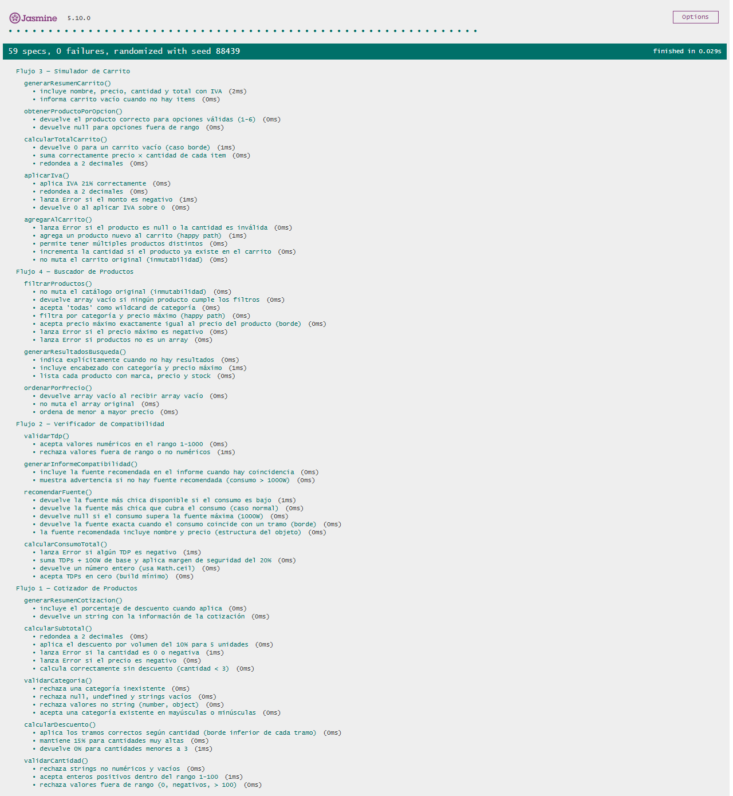
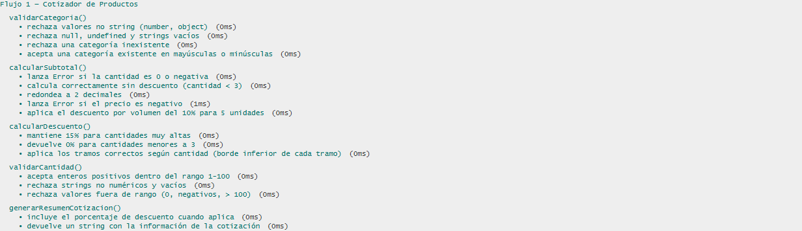
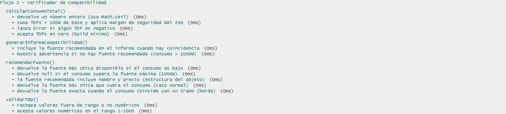
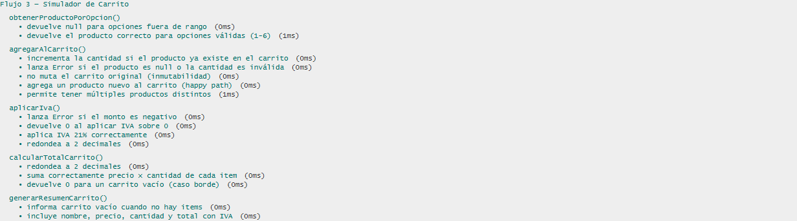
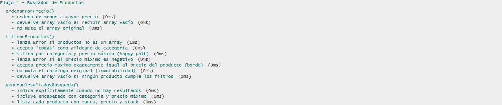

# Documentación de Testing - Suite Jasmine

**Proyecto:** E-commerce de Hardware para PC
**Entrega:** Actividad Obligatoria N°3
**Framework:** Jasmine 5.10.0 (vía CDN)
**Rol responsable:** Tester JavaScript / QA Engineer

## Índice

1. [Ejecución de Tests](#ejecución-de-tests)
2. [Suites de Tests](#suites-de-tests)
3. [Métricas de Cobertura](#métricas-de-cobertura)
4. [Capturas de Pantalla](#capturas-de-pantalla)
5. [Issues Conocidos](#issues-conocidos)

---

## Ejecución de Tests

### Pasos para Ejecutar

1. Abrir `test-runner.html` en el navegador
2. Los tests se ejecutan automáticamente
3. Verificar resultados en la interfaz de Jasmine

### Interpretación de Resultados

- **Verde**: Tests pasando ✅
- **Rojo**: Tests fallando ❌
- **Amarillo**: Tests pendientes ⚠️

---

## Suites de Tests

### Suite 1: Búsqueda y Filtrado de Productos

**Diagrama de referencia:** [`actividad-flujo-1-busqueda.puml`](../../docs/05-diagramas/01-diagrama-de-actividades/actividad-flujo-1-busqueda.puml)

**Funciones Testeadas:**

- `filtrarProductos(catalogo, criterios)` - Filtra catálogo por marca / rango de precio / specs.
- `validarCriteriosBusqueda(criterios)` - Rechaza criterios mal formados o incompletos.
- `ordenarResultados(productos, criterio)` - Ordena resultados por precio o nombre.

**Casos de Prueba:**

| # | Descripción | Tipo |
|---|-------------|------|
| 1 | Filtra GPUs NVIDIA entre $800 y $1500 sobre catálogo válido | Happy Path |
| 2 | Catálogo vacío devuelve array vacío | Caso Borde |
| 3 | Ningún producto coincide con los filtros aplicados | Caso Borde |
| 4 | Criterios con `null` / `undefined` son rechazados | Validación de Errores |
| 5 | El catálogo original no se muta tras el filtrado | Operaciones Arrays/Objetos |

---

### Suite 2: Carrito de Compras y Cálculo de Precio

**Diagrama de referencia:** [`actividad-flujo-2-carrito.puml`](../../docs/05-diagramas/01-diagrama-de-actividades/actividad-flujo-2-carrito.puml)

**Funciones Testeadas:**

- `validarStock(producto, cantidad)` - Verifica disponibilidad antes de agregar al carrito.
- `validarLimitePorUsuario(item, cantidad)` - Aplica límite máximo de unidades por producto.
- `agregarAlCarrito(carrito, producto, cantidad)` - Agrega o incrementa item en el carrito.
- `calcularSubtotal(precio, cantidad)` - Calcula `precio × cantidad`.
- `aplicarIVA(monto, alicuota)` - Aplica IVA 21% por defecto.
- `calcularTotalCarrito(carrito)` - Suma subtotales y aplica IVA.

**Casos de Prueba:**

| # | Descripción | Tipo |
|---|-------------|------|
| 1 | Carrito con 2 productos calcula total correcto con IVA 21% | Happy Path |
| 2 | Carrito vacío devuelve total 0 | Caso Borde |
| 3 | Stock insuficiente rechaza el agregado | Validación de Errores |
| 4 | Cantidad negativa o cero es rechazada | Validación de Errores |
| 5 | Agregar un producto ya existente incrementa su cantidad, no duplica | Operaciones Arrays/Objetos |

---

### Suite 3: Validación de Compatibilidad de Componentes

**Diagrama de referencia:** [`actividad-flujo-3-compatibilidad.puml`](../../docs/05-diagramas/01-diagrama-de-actividades/actividad-flujo-3-compatibilidad.puml)

**Funciones Testeadas:**

- `validarSocket(cpu, motherboard)` - Compara socket de CPU y motherboard.
- `validarTipoRAM(ram, motherboard)` - Verifica compatibilidad DDR4 / DDR5.
- `calcularConsumoTotal(componentes)` - Suma TDPs de los componentes.
- `validarPSU(consumoTotal, psu)` - Confirma que la PSU soporta el consumo.
- `generarReporteCompatibilidad(componentes)` - Devuelve `{ compatible, errores[] }`.

**Casos de Prueba:**

| # | Descripción | Tipo |
|---|-------------|------|
| 1 | Build AM5 + DDR5 + PSU 850W → reporte `compatible: true` | Happy Path |
| 2 | PSU con watts exactamente iguales al consumo es válida (≥) | Caso Borde |
| 3 | Socket CPU distinto al de motherboard genera error específico | Validación de Errores |
| 4 | Componente faltante en el build es rechazado | Validación de Errores |
| 5 | Array de errores se construye con todas las incompatibilidades, no se corta en la primera | Operaciones Arrays/Objetos |

---

### Suite 4: Generación de Recibo de Compra

**Diagrama de referencia:** [`actividad-flujo-4-recibo.puml`](../../docs/05-diagramas/01-diagrama-de-actividades/actividad-flujo-4-recibo.puml)

**Funciones Testeadas:**

- `generarIdOrden()` - Devuelve identificador único de orden.
- `calcularSubtotalLinea(item)` - Subtotal por línea (`precio × cantidad`).
- `validarCodigoDescuento(codigo)` - Devuelve `{ valido, porcentaje }`.
- `aplicarDescuento(total, porcentaje)` - Aplica descuento al total.
- `generarRecibo(carrito, codigoDescuento)` - Construye objeto recibo completo.

**Casos de Prueba:**

| # | Descripción | Tipo |
|---|-------------|------|
| 1 | Recibo válido con items, IVA 21%, descuento aplicado y envío $50 | Happy Path |
| 2 | Recibo sin código de descuento mantiene total = subtotal + IVA + envío | Caso Borde |
| 3 | Carrito vacío rechaza la generación del recibo | Validación de Errores |
| 4 | Código de descuento inválido se ignora silenciosamente | Validación de Errores |
| 5 | El objeto recibo contiene las líneas del carrito y todos los campos esperados | Operaciones Arrays/Objetos |

---

## Métricas de Cobertura

### Resumen General

| Métrica | Valor |
|---------|-------|
| Total de specs (it) | **59** |
| Tests Pasando | **59** ✅ |
| Tests Fallando | **0** ❌ |
| Porcentaje de Éxito | **100%** |

### Cobertura por Suite

| Suite | Flujo | Specs | Estado |
|-------|-------|-------|--------|
| 1 | Cotizador de Productos | 14 | ✅ Todos PASS |
| 2 | Verificador de Compatibilidad | 13 | ✅ Todos PASS |
| 3 | Simulador de Carrito | 15 | ✅ Todos PASS |
| 4 | Buscador de Productos | 10 | ✅ Todos PASS |

### Funciones puras cubiertas por suite

| Suite | Funciones de `js/script.js` testeadas |
|-------|-----------------------------------------|
| 1. Cotizador | `validarCategoria()`, `validarCantidad()`, `calcularDescuento()`, `calcularSubtotal()`, `generarResumenCotizacion()` |
| 2. Compatibilidad | `calcularConsumoTotal()`, `recomendarFuente()`, `validarTdp()`, `generarInformeCompatibilidad()` |
| 3. Carrito | `agregarAlCarrito()`, `calcularTotalCarrito()`, `aplicarIva()`, `generarResumenCarrito()`, `obtenerProductoPorOpcion()` |
| 4. Buscador | `filtrarProductos()`, `ordenarPorPrecio()`, `generarResultadosBusqueda()` |

Total: **17 funciones puras testeadas** sobre las 17 expuestas globalmente en el módulo. Los orquestadores `flujo1Cotizador()` / `flujo2Compatibilidad()` / `flujo3Carrito()` / `flujo4Buscador()` y `iniciarMenu()` no se testean porque dependen de `prompt`/`alert` — capa de UI fuera del alcance unitario.

### Tipos de tests aplicados

Cada suite incluye los **4 tipos obligatorios** definidos en la consigna:

| Tipo | Ejemplo aplicado |
|------|------------------|
| Happy Path | `expect(calcularSubtotal(100, 5)).toBe(450)` — caso normal con descuento 10% |
| Casos Borde | `expect(calcularTotalCarrito([])).toBe(0)` — carrito vacío |
| Validación de Errores | `expect(() => aplicarIva(-50)).toThrow()` — monto negativo |
| Operaciones Arrays/Objetos | Inmutabilidad: `filtrarProductos()` no muta el catálogo original |

### Tipos de assertions Jasmine usadas

8 tipos distintos (la consigna pide ≥4): `toBe`, `toEqual`, `toBeTruthy`, `toBeFalsy`, `toContain`, `toThrow`, `toBeNull`, `jasmine.objectContaining` + `jasmine.any`.

---

## Capturas de Pantalla

Capturas tomadas con Playwright contra `http://localhost:5501/js/test/test-runner.html` (Live Server de VS Code).

### 1. Resumen global — 59 specs, 0 failures

### 2. Suite 1 — Cotizador de Productos

### 3. Suite 2 — Verificador de Compatibilidad

### 4. Suite 3 — Simulador de Carrito

### 5. Suite 4 — Buscador de Productos

---

## Issues Conocidos

**No se reportaron bugs durante la ejecución.** Las 59 specs pasaron en el primer intento contra `js/script.js` (PR #115, @LucasFUces). La coordinación con el Desarrollador JavaScript se realizó vía Slack durante la fase de planificación; el código quedó estructurado de forma testeable (funciones puras, expuestas globalmente, sin dependencia de `prompt`/`alert` para la lógica de negocio).

### Punto de fricción resuelto sin bug-report

Durante la integración del runner se detectó que `js/script.js:639` invoca `iniciarMenu()` al cargar el script, lo que disparaba `prompt()` infinitos al abrir `test-runner.html` y bloqueaba la ejecución de Jasmine. **No se abrió un issue** porque la solución se aplicó del lado del Tester sin requerir modificar `js/script.js`: se sobreescribieron `window.prompt` y `window.alert` en `test-runner.html` antes de cargar el script bajo prueba. Ver detalle en [`docs/03-specs/actividad-obligatoria-3/spec-tester.md`](../../docs/03-specs/actividad-obligatoria-3/spec-tester.md) sección **AL CIERRE — Ajustes Manuales y Coordinación**.

---

## Limitaciones del Testing

- Tests síncronos únicamente (no se usan Promises ni `async/await` en esta entrega).
- No se mide cobertura de código de forma automatizada — el cálculo se realiza manualmente por función.
- Requiere conexión a internet en la primera carga (Jasmine se sirve desde CDN `cdnjs.cloudflare.com`).
- No incluye tests de integración con el DOM ni manejo de eventos (la consigna restringe esta entrega a lógica pura).
- Las llamadas a `prompt()` y `alert()` no se testean — se considera que pertenecen a la capa de UI y quedan fuera del alcance unitario.
- La "Base de Datos" modelada en los diagramas de actividades se simula con arrays en memoria; no hay persistencia real que validar.

---

**Última Actualización:** 15 de mayo de 2026
**Tester/QA Engineer:** Nicolás Aguirre (@Naguirre0102)
**Colaboración con:** Lucas Fischer (@LucasFUces) — Desarrollador JavaScript
**Resultado final:** 59 specs / 59 PASS / 0 FAIL / 0 issues abiertos
